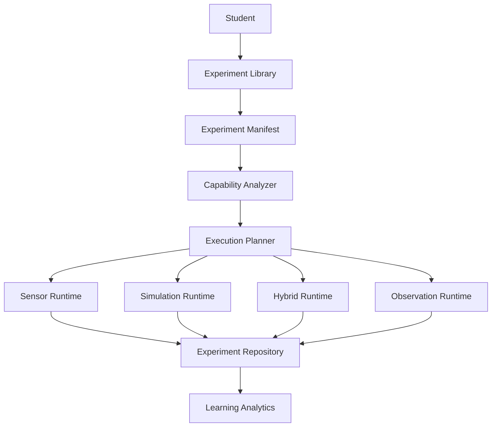
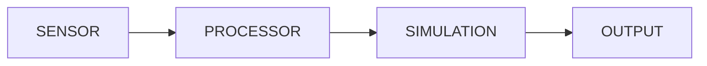
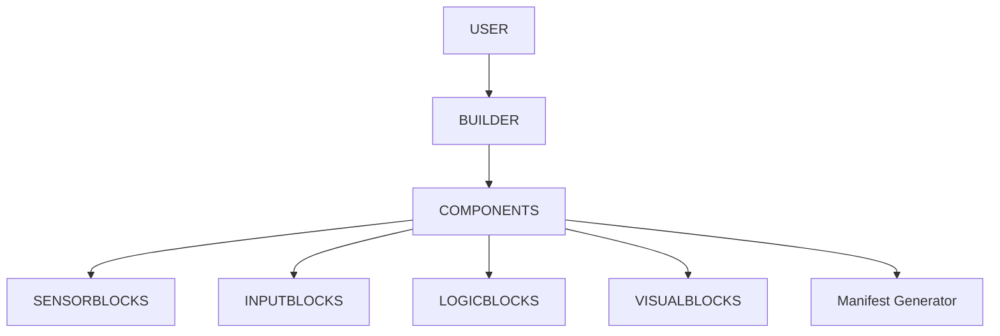

# PIHUB Experiment Engine V1 — Detailed Technical Architecture

Version: 1.0
Status: Architecture Design Phase
Priority: Highest Priority Domain
Target Platform: Flutter + PIHUB Backend
Design Goal: Offline-First, Sensor-Aware, Manifest-Driven, AI-Enhanced Experiment Ecosystem

---

# 1. Vision

The Experiment Engine is not a collection of hardcoded simulations.

It is a generic execution framework capable of running:

* Real-world sensor experiments
* Virtual experiments
* Hybrid experiments
* AI-generated experiments
* Student-created experiments

through a single execution architecture.

The engine must support:

```text
Physics
Chemistry
Biology
Environmental Science
Electronics
IoT
Astronomy
Custom Experiments
```

without writing new Flutter screens for each experiment.

Everything must be driven by Experiment Manifests.

---

# 2. Core Philosophy

Traditional systems:

```text
Experiment
    ↓
Hardcoded Screen
    ↓
Hardcoded Logic
```

PIHUB:

```text
Experiment Manifest
       ↓
Capability Analysis
       ↓
Execution Planning
       ↓
Runtime Selection
       ↓
Renderer
```

This allows unlimited experiments.

---

# 3. Complete Architecture



---

# 4. Domain Structure

Frontend:

```text
features/
 └── experiment/
      ├── presentation/
      ├── application/
      ├── domain/
      ├── data/
      ├── runtime/
      ├── simulation/
      ├── sensors/
      ├── builder/
      ├── storage/
      └── analytics/
```

Backend:

```text
backend/
 └── experiment-service/
      ├── manifests/
      ├── planner/
      ├── ai_generation/
      ├── analytics/
      └── validation/
```

---

# 5. Experiment Manifest

Central object.

Every experiment must be represented using:

```json
{
  "id": "",
  "title": "",
  "subject": "",
  "grade": "",
  "description": "",

  "execution_modes": [
    "sensor",
    "simulation",
    "hybrid",
    "observation"
  ],

  "required_sensors": [],

  "variables": [],

  "steps": [],

  "measurements": [],

  "visualizations": [],

  "outputs": []
}
```

---

# 6. Capability Analyzer

Purpose:

Determine if the experiment can run.

---

## Inputs

```json
{
  "required_sensors": [
    "accelerometer",
    "gyroscope"
  ]
}
```

---

## Device Scan

Checks:

```text
Accelerometer
Gyroscope
Magnetometer
GPS
Microphone
Camera
Light Sensor
Pressure Sensor
Barometer
Bluetooth
WiFi
```

---

## Output

```json
{
  "supported": true,
  "missing": [],
  "recommended_mode": "sensor"
}
```

or

```json
{
  "supported": false,
  "missing": [
    "light_sensor"
  ],
  "recommended_mode": "simulation"
}
```

---

# 7. Execution Planner

Most important component.

Responsible for choosing runtime.

---

## Input

```json
{
  "experiment": "...",
  "capabilities": "..."
}
```

---

## Output

```json
{
  "runtime": "simulation"
}
```

---

## Rules

### Sensor Mode

When:

```text
All required sensors exist
```

Example:

```text
Pendulum
Acceleration
Magnetic Field
```

---

### Simulation Mode

When:

```text
Required sensors unavailable
```

Example:

```text
Optics
Projectile Motion
Atomic Models
```

---

### Hybrid Mode

When:

```text
Some sensors exist
```

Example:

```text
Real pendulum
+
Simulated graph
```

---

### Observation Mode

When:

```text
Experiment cannot be measured
```

Example:

```text
Photosynthesis
Plant Growth
```

---

# 8. Runtime Layer

---

## Runtime Interface

Every runtime implements:

```dart
abstract class ExperimentRuntime {

 initialize()

 start()

 pause()

 stop()

 exportResults()

}
```

---

# 9. Sensor Runtime

Purpose:

Execute real experiments.

---

## Sensors

Flutter packages:

```text
sensors_plus
geolocator
camera
flutter_sound
light
```

---

## Example

Pendulum Experiment

```text
Phone attached to pendulum
↓
Accelerometer
↓
Angular Velocity
↓
Graph
```

---

## Output

```json
{
  "period": 2.3,
  "frequency": 0.43
}
```

---

# 10. Simulation Runtime

Purpose:

Virtual experiment execution.

---

## Recommended Engines

### Physics

```text
Forge2D
Flame
Matter.js
Planck.js
PhysicsJS
```

---

### Circuit Simulation

```text
CircuitJS
Falstad Engine
```

---

### Chemistry

```text
Molecule Viewer
3D Atom Viewer
```

---

### Graphing

```text
fl_chart
syncfusion_flutter_charts
```

---

# 11. Hybrid Runtime

Combines:

```text
Sensor Data
+
Simulation
```

---

Example:

```text
Measure acceleration
↓
Feed to simulation
↓
Predict velocity
```

---

Architecture:



---

# 12. Observation Runtime

Purpose:

Experiments without sensors.

---

Example:

```text
Plant Growth
Evaporation
Weather Observation
```

Student records:

```text
Photos
Text Notes
Measurements
```

---

# 13. Simulation Playground Builder

Most important future feature.

---

Purpose:

Allow students to create experiments.

---

# 14. Builder Architecture



---

# 15. Builder Components

---

## Sensor Block

Examples:

```text
Accelerometer
Camera
GPS
Light Sensor
```

---

## Input Block

Examples:

```text
Slider
Number Input
Dropdown
Button
```

---

## Logic Block

Examples:

```text
Add
Subtract
Average
Compare
Filter
```

---

## Visualization Block

Examples:

```text
Line Graph
Bar Graph
Gauge
Counter
Heatmap
```

---

# 16. Generated Experiment

Builder exports:

```json
{
  "title":"Gravity Experiment",
  "mode":"sensor",
  "sensors":["accelerometer"],
  "blocks":[...]
}
```

No code generation.

Only manifests.

---

# 17. AI Integration

Only when PIHUB backend exists.

---

## AI Experiment Generator

Prompt:

```text
Create grade 8 experiment about gravity
```

AI returns:

```json
Experiment Manifest
```

---

## AI Experiment Assistant

Can:

```text
Explain steps
Generate hypothesis
Explain results
Generate report
```

Cannot:

```text
Execute experiment
Read sensors
Perform calculations
```

---

# 18. Existing PIHUB Integration

Experiment Engine must integrate with:

---

## AI Tutor

Event:

```json
{
 "event":"experiment_question"
}
```

Student asks:

```text
Why did acceleration increase?
```

AI Tutor explains.

---

## Content Packs

Experiment manifests stored in packs.

```text
pack/
 └── experiments.json
```

---

## Progress System

Receives:

```json
{
 "experiment_completed": true
}
```

---

## P2P

Share:

```text
Experiment Manifest
Experiment Results
Experiment Templates
```

---

# 19. Storage Layer

SQLite Tables

---

## experiment_manifests

```text
id
title
subject
grade
manifest_json
```

---

## experiment_runs

```text
run_id
experiment_id
start_time
end_time
mode
```

---

## experiment_measurements

```text
measurement_id
run_id
timestamp
value
```

---

## experiment_results

```text
result_id
run_id
result_json
```

---

## experiment_templates

```text
template_id
manifest_json
author
```

---

# 20. Analytics Integration

Track:

```text
Experiments Started
Experiments Completed
Time Spent
Accuracy
Sensor Usage
```

---

Outputs:

```text
Mastery Score
Practical Skill Score
Experiment Completion Score
```

---

# 21. Performance Architecture

Heavy systems run separately.

---

## Main UI Thread

```text
UI
Navigation
Forms
```

---

## Experiment Isolate

```text
Physics
Simulation
Graphs
```

---

## Sensor Isolate

```text
Sensor Processing
Filtering
Sampling
```

---

## AI Isolate

```text
Tutor
RAG
Inference
```

---

# 22. Event Communication

Uses Event Bus.

---

Examples

```json
{
 "event":"experiment_started"
}
```

```json
{
 "event":"experiment_completed"
}
```

```json
{
 "event":"experiment_shared"
}
```

```json
{
 "event":"experiment_question"
}
```

---

# 23. Core User Flows

---

## Flow 1 — Curriculum Experiment

```mermaid
graph TD

Chapter

--> Experiment

--> Capability Analyzer

--> Planner

--> Runtime

--> Results

--> Progress
```

---

## Flow 2 — Student Created Experiment

```mermaid
graph TD

Builder

--> Manifest

--> Validation

--> Planner

--> Runtime

--> Save Template
```

---

## Flow 3 — AI Generated Experiment

```mermaid
graph TD

Prompt

--> AI Generator

--> Manifest

--> Validation

--> Runtime
```

---

## Flow 4 — P2P Shared Experiment

```mermaid
graph TD

Student A

--> Export Manifest

--> P2P

--> Student B

--> Import

--> Run
```

---

# 24. Recommended Technology Stack

Frontend

```text
Flutter
Riverpod
Isolates
sensors_plus
camera
geolocator
flutter_sound
Forge2D
Flame
fl_chart
```

Backend

```text
FastAPI
SQLite
Qdrant
Pydantic
```

Storage

```text
SQLite
Content Packs
Experiment Manifests
```

---

# 25. Final Vision

The Experiment Engine becomes a universal educational execution platform:

```text
Experiment Definition
        ↓
Capability Analysis
        ↓
Execution Planning
        ↓
Runtime Selection
        ↓
Sensor / Simulation / Hybrid
        ↓
Results
        ↓
Analytics
        ↓
AI Explanation
```

No hardcoded experiments.

No hardcoded screens.

Everything is manifest-driven, offline-first, sensor-aware, AI-assisted, shareable through P2P, and integrated with the existing PIHUB ecosystem.
