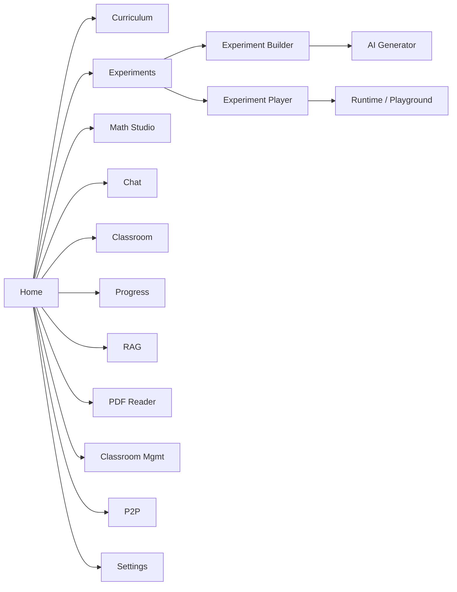
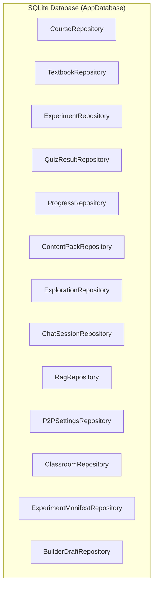

# Frontend Component Map

## Feature Dependencies

```mermaid
graph LR
    A[Home] --> B[Curriculum]
    A --> C[Experiments]
    A --> D[Math Studio]
    A --> E[Chat]
    A --> F[Classroom]
    A --> G[Progress]
    A --> H[RAG]
    A --> I[PDF Reader]
    A --> J[Classroom Mgmt]
    A --> K[P2P]
    A --> L[Settings]
    C --> M[Experiment Builder]
    C --> N[Experiment Player]
    M --> O[AI Generator]
    N --> P[Runtime / Playground]
```

## Repository Dependencies

```mermaid
graph TD
    subgraph "SQLite Database (AppDatabase)"
        B1[CourseRepository]
        B2[TextbookRepository]
        B3[ExperimentRepository]
        B4[QuizResultRepository]
        B5[ProgressRepository]
        B6[ContentPackRepository]
        B7[ExplorationRepository]
        B8[ChatSessionRepository]
        B9[RagRepository]
        B10[P2PSettingsRepository]
        B11[ClassroomRepository]
        B12[ExperimentManifestRepository]
        B13[BuilderDraftRepository]
    end
```

## Service Dependencies

```mermaid
graph TD
    OfflineTutorService --> LocalSearchService
    OfflineTutorService --> PackSyncService
    ExperimentApiService --> BackendApiService
    RagIngestionService --> HybridRetrievalService
    RagIngestionService --> EmbeddingIndexService
    ChapterChatScreen --> TutorInferenceGateway
    TutorInferenceGateway --> LlmAdminChannelService
    TutorInferenceGateway --> LinuxLlmConfigService
    ChapterChatScreen --> ConversationMemoryService
    ConversationMemoryService --> ChatMemoryPolicyRepository
    ExperimentPlayerScreen --> ExperimentExecutionOrchestrator
    ExperimentExecutionOrchestrator --> ExperimentExecutionPlanner
    ExperimentExecutionOrchestrator --> ExperimentCapabilityProvider
    ExperimentCapabilityProvider --> ExperimentDeviceCapabilities
    ExperimentBuilderScreen --> BuilderSuggestionService
    BuilderSuggestionService --> AiExperimentApiService
    SimulationPlaygroundEngine --> SceneLoader
    SimulationPlaygroundEngine --> PlaygroundEventBus
    SimulationPlaygroundEngine --> RuleEngine
    RuleEngine --> VariableStore
    MathStudioHomeScreen --> MathEvaluatorService
```

## Screen Navigation Map

```mermaid
graph TD
    AppShell --> HeroPage
    AppShell --> MainDashboardScreen
    HeroPage --> GradeSelectionScreen
    GradeSelectionScreen --> MainDashboardScreen
    MainDashboardScreen --> CurriculumHomeScreen
    MainDashboardScreen --> ChapterReaderScreen
    MainDashboardScreen --> PdfChapterReaderScreen
    MainDashboardScreen --> VideoPlayerScreen
    MainDashboardScreen --> QuizAssessmentScreen
    MainDashboardScreen --> MathStudioHomeScreen
    MainDashboardScreen --> ExperimentHubScreen
    MainDashboardScreen --> ChapterChatScreen
    MainDashboardScreen --> StudentDashboardScreen
    MainDashboardScreen --> TeacherDashboardScreen
    MainDashboardScreen --> ProgressDashboardScreen
    MainDashboardScreen --> OfflineLearningReportScreen
    MainDashboardScreen --> RagIngestionScreen
    MainDashboardScreen --> P2PScreen
    MainDashboardScreen --> ManageContentScreen
    MainDashboardScreen --> ModelSelectionScreen
    CurriculumHomeScreen --> GradeScreen
    GradeScreen --> SubjectScreen
    SubjectScreen --> ChapterScreen
    ChapterScreen --> TopicScreen
    PdfChapterReaderScreen --> PdfViewerScreen
    QuizAssessmentScreen --> QuizPlayerScreen
    MathStudioHomeScreen --> AlgebraWorkspaceScreen
    MathStudioHomeScreen --> GeometryWorkspaceScreen
    MathStudioHomeScreen --> FunctionsWorkspaceScreen
    MathStudioHomeScreen --> StatisticsWorkspaceScreen
    MathStudioHomeScreen --> FormulaPlaygroundScreen
    MathStudioHomeScreen --> SavedExplorationsScreen
    MathStudioHomeScreen --> ExplorationCatalogScreen
    ExperimentHubScreen --> ExperimentCatalogScreen
    ExperimentHubScreen --> ExperimentBuilderScreen
    ExperimentHubScreen --> TemplateGalleryScreen
    ExperimentHubScreen --> ExperimentHistoryScreen
    ExperimentHubScreen --> ExperimentShareScreen
    ExperimentCatalogScreen --> ExperimentDetailsScreen
    ExperimentDetailsScreen --> ExperimentPlayerScreen
    ExperimentBuilderScreen --> BuilderDraftsScreen
    StudentDashboardScreen --> AssignmentDetailScreen
    TeacherDashboardScreen --> TeacherReviewScreen
    RagIngestionScreen --> DocumentRagIngestionScreen
```