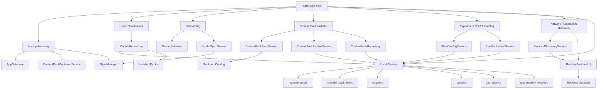
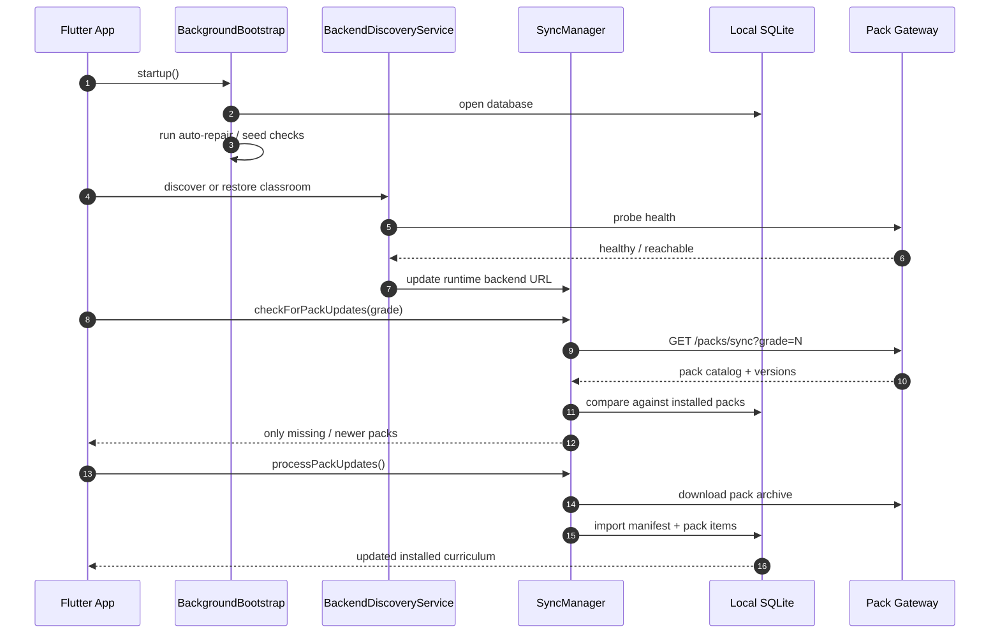
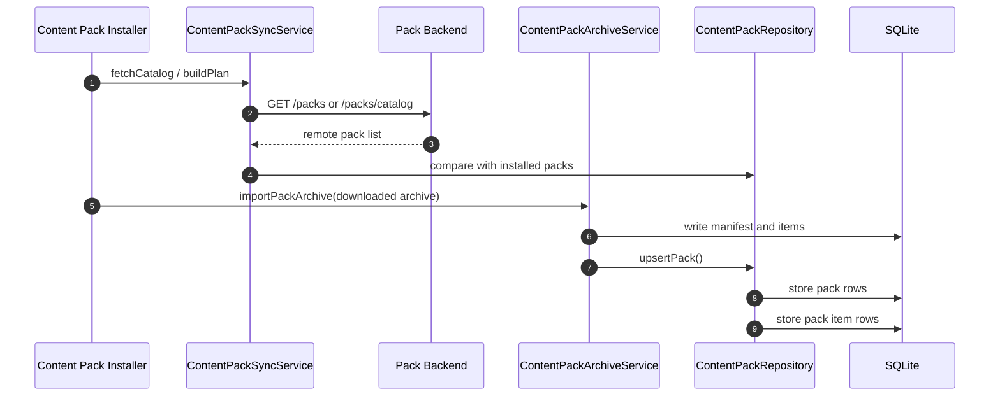
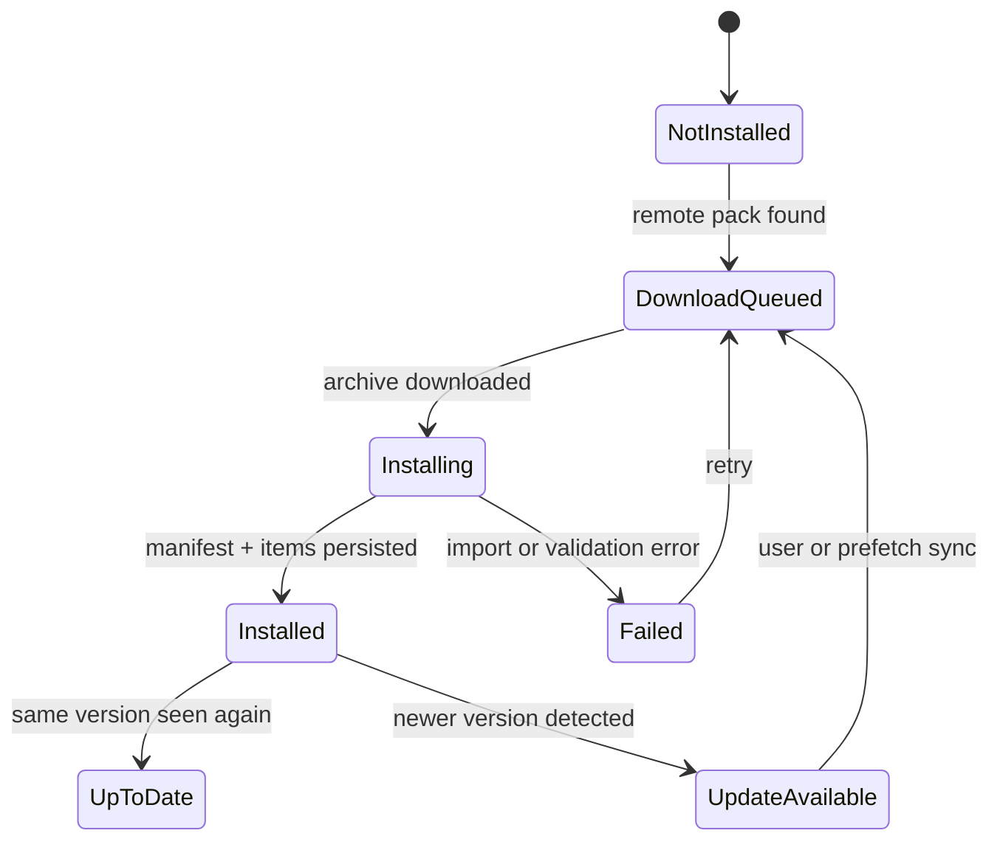
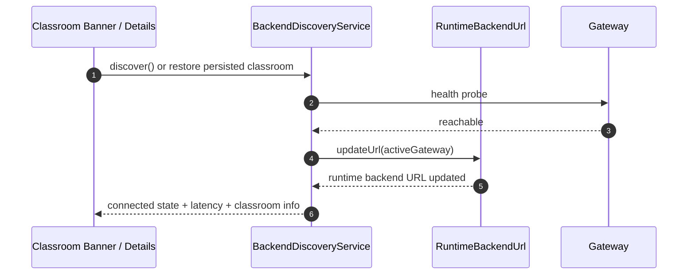
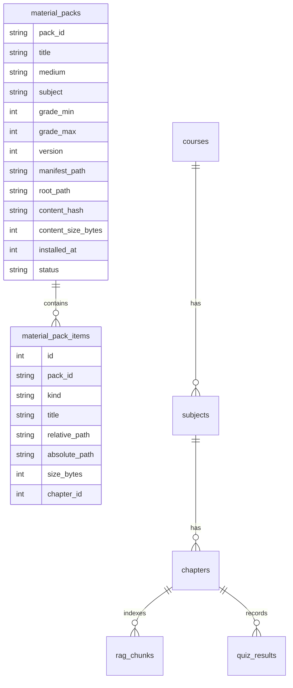

# Frontend Implementation Report

## Overview

This document describes the current frontend implementation of the offline tutor app, how the major screens and services fit together, and how the app integrates with the backend pack/catalog system.

The frontend is organized around four core ideas:

1. App startup discovers or restores the active classroom backend.
2. Curriculum data is rendered from installed local packs, not directly from hardcoded UI lists.
3. Packs are synced from the backend, version-checked, stored locally, and reused on subsequent launches.
4. Experiment and PhET experiences are presented through the same offline-first model, with backend-assisted catalog resolution when available.

## Architecture



### What this means

- The app shell routes users into onboarding, the main dashboard, and content management flows.
- The backend is not the direct source of truth for what the user sees on the dashboard.
- Installed pack metadata in local SQLite is the source of truth for chapter counts and curriculum rendering.
- The backend is the source of truth for the catalog, available pack versions, and downloadable archives.

## Runtime Flow



## UI and Screen Map

### 1. App bootstrap

The app starts with a background bootstrap routine that:

- warms the local database
- repairs missing FTS artifacts
- seeds course and legacy media data
- triggers deferred pack sync
- prepares local AI support on Android

Relevant code paths:

- `lib/bootstrap/background_bootstrap.dart`
- `lib/features/course/data/local/database_auto_repair_service.dart`
- `lib/features/content_packs/application/content_pack_bootstrap_service.dart`

### 2. Onboarding

Onboarding is the first explicit user flow for curriculum setup.

Components:

- `GradeSelectionScreen` lets the learner select a grade.
- `GradeSyncScreen` fetches the backend pack list for that grade.
- `BackgroundPrefetchService` schedules later background sync.

Behavior:

- the selected grade is persisted in shared preferences
- the sync screen asks `SyncManager` for packs for that grade
- only packs that are not already installed or that have a newer version are queued

Relevant files:

- `lib/features/onboarding/presentation/grade_selection_screen.dart`
- `lib/features/onboarding/presentation/grade_sync_screen.dart`
- `lib/features/onboarding/application/background_prefetch_service.dart`

### 3. Main dashboard

The dashboard composes:

- course, subject, and chapter selection
- progress snapshots
- P2P sharing status
- classroom connection banner
- experiment and PhET entry points

Relevant files:

- `lib/features/home/presentation/main_dashboard_screen.dart`
- `lib/features/home/presentation/home_screen.dart`
- `lib/features/network/presentation/classroom_connection_banner.dart`

### 4. Manage content

The content management screen shows:

- installed pack count
- storage usage
- installed grade list
- re-sync and removal actions

Relevant file:

- `lib/features/settings/presentation/manage_content_screen.dart`

## Curriculum Rendering

The most important frontend behavior is the curriculum rendering path.

```mermaid
flowchart LR
  A[Dashboard loads course] --> B[CourseRepository.getCourses()]
  B --> C[CourseRepository.getSubjects()]
  C --> D[CourseRepository.getChapters()]
  D --> E{Installed packs exist?}
  E -- yes --> F[Build chapters from installed packs]
  E -- no --> G[Fallback to seeded chapters]
  F --> H[Subject screen shows chapter cards]
  G --> H
```

### Key components

#### `CourseRepository`

This repository is the primary consumer-facing curriculum source.

Responsibilities:

- reads the local course tree from SQLite
- reads installed content packs from `material_packs`
- resolves chapters for a subject
- localizes labels when Kannada is active

Important behavior:

- if installed packs exist for the subject and grade, they are used in preference to the static seed
- this is what makes the chapter counts reflect real installed content

#### `CurriculumRepository`

This repository builds curriculum views directly from installed pack metadata.

Responsibilities:

- loads installed pack manifests
- normalizes subject names
- groups pack-derived chapters by grade and subject

This is the repository that ties the content-pack system to the curriculum UI.

#### Subject screens

There are two subject views:

- `lib/features/home/presentation/subject_screen.dart`
- `lib/features/educational/presentation/subject_screen.dart`

Both render chapter lists, but one is used in the home/course tree flow and the other is used in the educational pack flow.

## Content Pack System



### `ContentPackSyncService`

This is the catalog intelligence layer.

Responsibilities:

- discovers catalogs from configured and LAN sources
- fetches backend catalog data
- compares remote packs against installed packs
- builds a sync plan
- identifies missing required packs

### `ContentPackArchiveService`

This is the import/export engine for content packs.

Responsibilities:

- extracts `.otpack` or `.zip` archives
- validates pack version order
- persists manifests and pack items
- computes installed pack metadata
- imports PDF / RAG-related content when available

Important behavior:

- older or same-version packs are rejected unless force replace is explicitly requested
- installed archives are stored locally and reused instead of re-downloaded

### `ContentPackRepository`

This repository is the local storage abstraction over content packs.

It exposes:

- installed pack lookup
- pack item lookup
- catalog entry building
- installed pack counts
- pack deletion

Database tables used:

- `material_packs`
- `material_pack_items`

## Sync and Versioning



### `SyncManager`

This is the main educational pack sync coordinator.

Responsibilities:

- checks backend pack updates for a grade
- filters out packs already installed locally
- skips same-version or older packs
- enqueues downloads for packs that actually need installation
- persists downloaded packs through `ContentPackArchiveService`
- indexes pack items for retrieval

Backend endpoints used:

- `GET /packs/sync?grade=N`
- `GET /packs/{packId}/download`
- `POST /packs/sync/{packId}`
- `GET /packs/{packId}/manifest`

Important behavior:

- background prefetch now uses the full grade sync path, not the smaller recommended path
- that change matters because recommended packs may not include all curriculum subjects

### `BackgroundPrefetchService`

This service schedules recurring sync when the device is on Wi-Fi, charging, and idle.

Current behavior:

- reads the selected grade from shared preferences
- syncs the full grade pack list
- avoids downloading content that is already current

## Backend Discovery and Classroom Connection



### `BackendDiscoveryService`

This service manages:

- discovery of available classroom gateways
- persistence of the currently connected classroom
- reconnect attempts and health checks
- propagation of the active URL to `RuntimeBackendUrl`

### `RuntimeBackendUrl`

This is the single source of truth for the active backend URL.

Why it matters:

- all sync services should read this instead of hardcoding environment URLs
- when classroom discovery changes the backend, the frontend updates automatically

### `ClassroomConnectionBanner`

This is the visible UI signal for connection state.

States shown:

- connected
- discovering
- connecting
- reconnecting
- disconnected

## PhET and Experiment Flow

### PhET catalog

PhET simulations are treated like an installable content pack.

Components:

- `PhetCatalogService` loads installed pack catalogs or falls back to the bundled preview catalog
- `PhetPackInstallService` installs the PhET pack and now version-checks before downloading

### Experiment runtime

Experiment runtime itself is separate from pack installation and sync.

It includes:

- builder
- guided runtime
- object and variable runtime
- measurement and observation systems
- sharing/export

The frontend exposes these through dedicated screens and runtime components, but the installation/update mechanics are primarily governed by the content-pack layer.

## Local Storage Model



### `AppDatabase`

The app uses SQLite for:

- courses
- subjects
- chapters
- RAG chunks
- quiz results
- chat/session records
- content packs

This means the frontend can function offline after sync.

## How the App Works With Backend

### Backend responsibilities

The backend provides:

- pack catalog data
- downloadable archives
- version metadata
- classroom discovery / health endpoints

### Frontend responsibilities

The frontend:

- discovers or restores the active backend URL
- requests grade-specific packs
- downloads only missing or newer versions
- stores packs locally
- renders curriculum from local storage

### Practical result

For Grade 10:

- the backend can expose many Science and Social Science packs
- the frontend only shows them after they are synced and indexed locally
- Maths matched because it was already syncing through the old path and had the full set

## Design Examples

### Example 1: Grade sync progress

```text
Curriculum Setup
----------------------------------------
Grade 10 Curriculum
Packs to Install: 80
Subjects Found: SCIENCE, SOCIAL SCIENCE, MATHS

Installing Pack...
[#####-----] 52%
Downloading Pack...
Installing Simulations...
Sync complete
```

### Example 2: Installed content dashboard

```text
Manage Offline Content
----------------------------------------
Storage Usage: 842.1 MB
Installed Packs: 80
RAG Chunks: 12438

Installed Grades
- Grade 10
- Grade 9
- Grade 8
```

### Example 3: Subject view after fixing the sync path

```text
Grade 10 -> Science
----------------------------------------
1. Chemical Reactions
2. Acids, Bases and Salts
3. Life Processes
4. Light Reflection and Refraction
...
41 total chapters
```

```text
Grade 10 -> Social Science
----------------------------------------
1. Resources and Development
2. Political Parties
3. ... 
24 total chapters
```

```text
Grade 10 -> Mathematics
----------------------------------------
1. Real Numbers
2. Polynomials
3. Quadratic Equations
...
15 total chapters
```

## Important Implementation Notes

- The dashboard chapter counts are only as complete as the local installed pack set.
- The previous background sync path used the recommended-pack endpoint, which was too narrow for full curriculum setup.
- The content-pack system already had version gating; the main gap was which endpoint and repository path the frontend used.
- Pack metadata should be treated as the source of truth for offline curriculum views after sync.

## Files That Matter Most

- `lib/features/course/data/local/course_repository.dart`
- `lib/features/content_packs/application/content_pack_sync_service.dart`
- `lib/features/content_packs/application/content_pack_archive_service.dart`
- `lib/features/educational/application/sync_manager.dart`
- `lib/features/onboarding/application/background_prefetch_service.dart`
- `lib/features/network/services/backend_discovery_service.dart`
- `lib/features/home/presentation/main_dashboard_screen.dart`

## Conclusion

The frontend is an offline-first curriculum app with backend-assisted discovery and synchronization. The UI is not a thin mirror of the backend; it is a local curriculum renderer that depends on content packs being synced, stored, and indexed correctly. Once that sync pipeline is correct, the chapter counts, subject lists, and local learning experience line up with the backend catalog.
