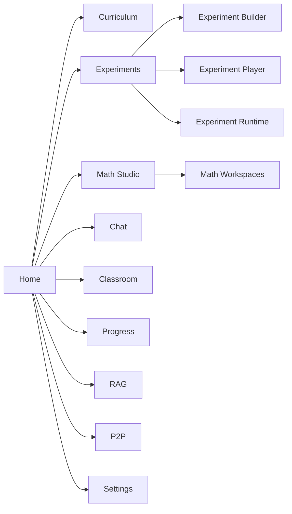
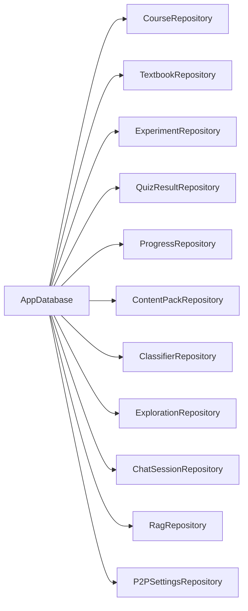
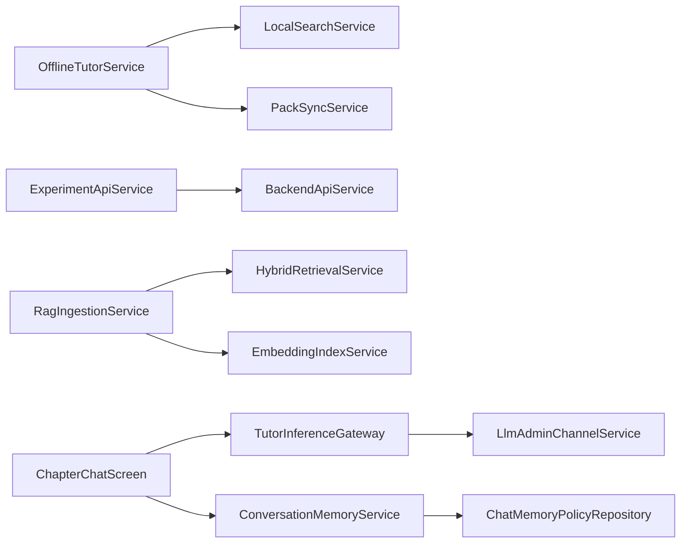

# Frontend Inventory Report

**Generated:** 2026-06-09
**Source:** offline_tutor_app/lib/
**Confidence:** FACT (100%), LIKELY (80–99%), HYPOTHESIS (<80%)

---

## Section 1 — Project Overview

**Purpose of application**
FACT: The application is a cross-platform, offline-first AI tutor app built with Flutter. The primary purpose is to provide educational content (curriculum, experiments, assessments, and a math studio) to students without a reliable internet connection.

**Primary users**
FACT: Students (grade 6–10), teachers, and potentially self-learners needing offline educational tools.

**Major capabilities**
FACT:
- Offline-first curriculum browsing with grade, subject, and chapter hierarchy
- In-app experiment builder and player with simulation and live-sensor support
- Math Studio for algebra, geometry, statistics, and formula visualization
- AI chat tutor with conversation memory and offline inference
- Classroom management for teachers and students
- PDF and video learning material readers
- Progress tracking and analytics
- P2P device sharing and content pack synchronization
- RAG (Retrieval-Augmented Generation) document ingestion

**Educational workflows**
FACT:
1. User selects grade → subject → chapter → topic
2. Accesses learning materials (PDF, videos, summaries)
3. Interacts with AI tutor for questions
4. Takes quizzes and flashcards
5. Builds or runs simulations/experiments

**Offline workflows**
FACT:
- SQLite (sqflite) stores curriculum and user data
- Content packs can be downloaded and managed offline
- Local inference runs on Linux via llama_jni.cpp or platform gateways
- Background prefetch and sync queue management

**Experiment workflows**
FACT:
1. Builder: create experiment manifests with objects, rules, and variables
2. Validation: check compatibility and manifest integrity
3. Player: execute experiments in simulation or sensor mode
4. Runtime: Flame-based physics engine + sensor providers

---

## Section 2 — Folder Structure

| Path | Purpose | Responsibilities |
|------|---------|------------------|
| `lib/bootstrap/` | Application bootstrap | Critical, optional, and background boot services, runtime mode detection, startup coordinator |
| `lib/config/` | App configuration | Environment variables and app constants |
| `lib/core/` | Shared UI foundation | Theme (colors, typography), core widgets, skeleton loaders |
| `lib/features/analytics/` | Learning analytics | Achievement service, learning insights, offline reports |
| `lib/features/assessment/` | Quiz/flashcard results | Local quiz result repository, quiz result models |
| `lib/features/chat/` | AI tutor chat | Conversation memory, latency benchmarks, local LLM inference gateways, chat screens |
| `lib/features/classroom/` | Classroom management | Teacher/student dashboards, assignments, submissions |
| `lib/features/content_packs/` | Content pack sync | Pack archive, sync, policy, and bootstrap services |
| `lib/features/course/` | Curriculum tree | Database, repositories (course, curriculum, textbook), models |
| `lib/features/educational/` | Main educational UI | Screens for grade, subject, chapter, and topic selection |
| `lib/features/experiment/` | Experiment engine | Builder, runtime (Flame), playground, sensors, orchestrator, templates |
| `lib/features/experiment_sharing/` | Share experiments | Package bundling, P2P transfer of experiments |
| `lib/features/home/` | Home dashboard | Main dashboard, learning materials, chapter readers, PDF/video players, quiz screens |
| `lib/features/math_studio/` | Math studio | Algebra, geometry, statistics, formula, and exploration screens |
| `lib/features/network/` | Network layer | Connectivity, backend API, health, classroom session management |
| `lib/features/onboarding/` | Onboarding | Grade selection and sync screens |
| `lib/features/p2p/` | Peer-to-peer | P2P secret bootstrap, bundle/channel services, security settings |
| `lib/features/progress/` | Progress tracking | Progress repository and dashboard screens |
| `lib/features/rag/` | RAG ingestion | Document ingestion, chunking, embedding, and retrieval services |
| `lib/features/settings/` | Settings | Content management, model selection screens |
| `lib/features/shared/` | Shared widgets | Empty, error, loading, and offline state cards |
| `lib/features/translation/` | Translation | Separate translation layer and engine catalog |

---

## Section 3 — Screen Inventory

| Screen Name | Path | Purpose | Entry Point | Dependencies | Navigation Targets | Feature Area |
|------------|------|---------|-------------|--------------|--------------------|--------------|
| `GradeScreen` | `lib/features/educational/presentation/grade_screen.dart` | List subjects for a grade | `CurriculumHomeScreen` | `EducationalRepository` | `SubjectScreen` | Curriculum |
| `SubjectScreen` | `lib/features/educational/presentation/subject_screen.dart` | List chapters for a subject | `GradeScreen` | `EducationalRepository` | `ChapterScreen` | Curriculum |
| `ChapterScreen` | `lib/features/educational/presentation/chapter_screen.dart` | List topics for a chapter | `SubjectScreen` | `EducationalRepository` | `TopicScreen` | Curriculum |
| `TopicScreen` | `lib/features/educational/presentation/topic_screen.dart` | Topic details | `ChapterScreen` | `EducationalRepository` | — | Curriculum |
| `CurriculumHomeScreen` | `lib/features/educational/presentation/curriculum_home_screen.dart` | Root curriculum selection | `MainDashboardScreen` | — | `GradeScreen` | Curriculum |
| `MainDashboardScreen` | `lib/features/home/presentation/main_dashboard_screen.dart` | Main app dashboard | `AppShell` | `CourseRepository`, `QuizResultRepository`, `ClassroomRepository` | `ChapterReaderScreen`, `PdfChapterReaderScreen`, `ExperimentHubScreen`, `MathStudioHomeScreen`,ChapterChatScreen`,`SettingsScreens` | Home |
|`HeroPage`|`lib/features/home/presentation/hero_page.dart`|Onboarding hero|`AppShell`|— wherein `AppShell` decides which screen to show based on shared preferences. | `GradeSelectionScreen` | Onboarding |
| `GradeSelectionScreen` | `lib/features/onboarding/presentation/grade_selection_screen.dart` | Select grade | `HeroPage` | `SharedPreferences` | `MainDashboardScreen` | Onboarding |
| `GradeSyncScreen` | `lib/features/onboarding/presentation/grade_sync_screen.dart` | Sync grade data | — | — | — | Onboarding |
| `ChapterReaderScreen` | `lib/features/home/presentation/chapter_reader_screen.dart` | Read chapter content | `MainDashboardScreen` | `CourseRepository`, `TextbookRepository` | — | Learning |
| `PdfChapterReaderScreen` | `lib/features/home/presentation/pdf_chapter_reader_screen.dart` | Read PDF chapter | `MainDashboardScreen` | `PdfChapterLocator` | `PdfViewerScreen` | Learning |
| `PdfViewerScreen` | `lib/features/home/presentation/pdf_viewer_screen.dart` | Generic PDF viewer | `PdfChapterReaderScreen` | — | — | Learning |
| `ChapterSummaryScreen` | `lib/features/home/presentation/chapter_summary_screen.dart` | Chapter summary | `ChapterReaderScreen` | — | — | Learning |
| `ChapterDashboardScreen` | `lib/features/home/presentation/chapter_dashboard_screen.dart` | Chapter dashboard | `MainDashboardScreen` | — | — | Learning |
| `VideoPlayerScreen` | `lib/features/home/presentation/video_player_screen.dart` | Video player | `MainDashboardScreen` | — | — | Learning |
| `LearningMaterialsScreen` | `lib/features/home/presentation/learning_materials_screen.dart` | List learning materials | `MainDashboardScreen` | — | — | Learning |
| `QuizAssessmentScreen` | `lib/features/home/presentation/quiz_assessment_screen.dart` | Quiz assessment | `MainDashboardScreen` | `QuizResultRepository` | — | Assessment |
| `QuizPlayerScreen` | `lib/features/home/presentation/quiz_player_screen.dart` | Quiz player | `QuizAssessmentScreen` | `QuizResultRepository` | — | Assessment |
| `MyLearningScreen` | `lib/features/home/presentation/my_learning_screen.dart` | My learning view | `MainDashboardScreen` | — | — | Learning |
| `MathStudioHomeScreen` | `lib/features/math_studio/presentation/math_studio_home_screen.dart` | Math studio home | `MainDashboardScreen` | `ExplorationRepository` | `AlgebraWorkspaceScreen`, `GeometryWorkspaceScreen`, `FunctionsWorkspaceScreen`, `StatisticsWorkspaceScreen`, `FormulaPlaygroundScreen`, `SavedExplorationsScreen`, `ExplorationCatalogScreen` | Math Studio |
| `AlgebraWorkspaceScreen` | `lib/features/math_studio/presentation/algebra_workspace_screen.dart` | Algebra workspace | `MathStudioHomeScreen` | `MathEvaluatorService` | — | Math Studio |
| `GeometryWorkspaceScreen` | `lib/features/math_studio/presentation/geometry_workspace_screen.dart` | Geometry workspace | `MathStudioHomeScreen` | `MathEvaluatorService` | — | Math Studio |
| `FunctionsWorkspaceScreen` | `lib/features/math_studio/presentation/functions_workspace_screen.dart` | Functions workspace | `MathStudioHomeScreen` | `MathEvaluatorService` | — | Math Studio |
| `StatisticsWorkspaceScreen` | `lib/features/math_studio/presentation/statistics_workspace_screen.dart` | Statistics workspace | `MathStudioHomeScreen` | `MathEvaluatorService` | — | Math Studio |
| `FormulaPlaygroundScreen` | `lib/features/math_studio/presentation/formula_playground_screen.dart` | Formula playground | `MathStudioHomeScreen` | `MathEvaluatorService` | — | Math Studio |
| `SavedExplorationsScreen` | `lib/features/math_studio/presentation/saved_explorations_screen.dart` | Saved explorations | `MathStudioHomeScreen` | `SavedExplorationRepository` | `FunctionLabScreen`, `GeometryWorkspaceScreen`, `StatisticsLabScreen` | Math Studio |
| `ExplorationCatalogScreen` | `lib/features/math_studio/presentation/exploration_catalog_screen.dart` | Exploration catalog | `MathStudioHomeScreen` | — | `FunctionLabScreen`, `GeometryWorkspaceScreen`, `StatisticsLabScreen` | Math Studio |
| `ExperimentCatalogScreen` | `lib/features/experiment/presentation/screens/experiment_catalog_screen.dart` | Experiment catalog | `ExperimentHubScreen` | — | `ExperimentDetailsScreen` | Experiment |
| `ExperimentDetailsScreen` | `lib/features/experiment/presentation/screens/experiment_details_screen.dart` | Experiment details | `ExperimentCatalogScreen` | `ExperimentRepository` | `ExperimentPlayerScreen` | Experiment |
| `ExperimentPlayerScreen` | `lib/features/experiment/presentation/screens/experiment_player_screen.dart` | Experiment player | `ExperimentDetailsScreen` | `ExperimentPlayerController`, `RuntimeWorld` | `ExecutionPreviewPanel` | Experiment |
| `ExperimentHubScreen` | `lib/features/experiment/presentation/screens/experiment_hub_screen.dart` | Experiment hub | `MainDashboardScreen` | — | `ExperimentCatalogScreen`, `ExperimentBuilderScreen` | Experiment |
| `ExperimentBuilderScreen` | `lib/features/experiment/builder/screens/experiment_builder_screen.dart` | Experiment builder | `ExperimentHubScreen` | `ExperimentBuilderController`, `BuilderDraftManager` | `BuilderDraftsScreen`, `BuilderExecutionPreviewPanel` | Experiment |
| `BuilderDraftsScreen` | `lib/features/experiment/builder/widgets/builder_drafts_screen.dart` | Builder drafts | `ExperimentBuilderScreen` | `BuilderDraftManager` | — | Experiment |
| `TemplateGalleryScreen` | `lib/features/experiment/presentation/screens/template_gallery_screen.dart` | Template gallery | `ExperimentHubScreen` | `ExperimentTemplateRepository` | `ExperimentBuilderScreen` | Experiment |
| `ExperimentHistoryScreen` | `lib/features/experiment/presentation/screens/experiment_history_screen.dart` | Experiment history | `ExperimentHubScreen` | `ExperimentRunRepository` | `ExperimentPlayerScreen` | Experiment |
| `ExperimentShareScreen` | `lib/features/experiment_sharing/screens/experiment_share_screen.dart` | Experiment sharing | `ExperimentHubScreen` | `ExperimentSharingController`, `ExperimentSharingRepository` | — | Experiment |
| `ChapterChatScreen` | `lib/features/chat/presentation/chapter_chat_screen.dart` | AI tutor chat | `MainDashboardScreen` | `TutorInferenceGateway`, `ConversationMemoryService` | — | Chat |
| `DatabaseDiagnosticsScreen` | `lib/features/chat/presentation/database_diagnostics_screen.dart` | DB diagnostics | `MainDashboardScreen` | — | — | Chat |
| `RetrievalDiagnosticsScreen` | `lib/features/chat/presentation/retrieval_diagnostics_screen.dart` | Retrieval diagnostics | `MainDashboardScreen` | `RetrievalRouter` | — | Chat |
| `StudentDashboardScreen` | `lib/features/classroom/screens/student_dashboard_screen.dart` | Student dashboard | `MainDashboardScreen` | `StudentDashboardController` | `AssignmentDetailScreen` | Classroom |
| `TeacherDashboardScreen` | `lib/features/classroom/screens/teacher_dashboard_screen.dart` | Teacher dashboard | `MainDashboardScreen` | `TeacherDashboardController` | `TeacherReviewScreen` | Classroom |
| `AssignmentDetailScreen` | `lib/features/classroom/screens/assignment_detail_screen.dart` | Assignment details | `StudentDashboardScreen` | `ClassroomRepository` | — | Classroom |
| `TeacherReviewScreen` | `lib/features/classroom/screens/teacher_review_screen.dart` | Teacher review | `TeacherDashboardScreen` | `ClassroomRepository` | — | Classroom |
| `ProgressDashboardScreen` | `lib/features/progress/presentation/progress_dashboard_screen.dart` | Progress dashboard | `MainDashboardScreen` | `ProgressRepository` | — | Progress |
| `OfflineLearningReportScreen` | `lib/features/analytics/presentation/screens/offline_learning_report_screen.dart` | Offline report | `MainDashboardScreen` | `LearningInsightsService` | — | Analytics |
| `RagIngestionScreen` | `lib/features/rag/presentation/screens/rag_ingestion_screen.dart` | RAG ingestion | `MainDashboardScreen` | `RagIngestionService` | — | RAG |
| `DocumentRagIngestionScreen` | `lib/features/rag/presentation/screens/document_rag_ingestion_screen.dart` | Document RAG | `RagIngestionScreen` | `DocumentLoaderService` | — | RAG |
| `P2PScreen` | `lib/features/p2p/presentation/p2p_screen.dart` | P2P sharing | `MainDashboardScreen` | `P2PChannelService` | — | P2P |
| `ManageContentScreen` | `lib/features/settings/presentation/manage_content_screen.dart` | Manage content | `MainDashboardScreen` | — | — | Settings |
| `ModelSelectionScreen` | `lib/features/settings/presentation/model_selection_screen.dart` | Model selection | `MainDashboardScreen` | — | — | Settings |
| `ContentPackInstallerScreen` | `lib/features/content_packs/presentation/content_pack_installer_screen.dart` | Content pack installer | `MainDashboardScreen` | `ContentPackBootstrapService` | — | Content Pack |

---

## Section 4 — Route Inventory

**NOTE:** There are no named routes (e.g., `'/home'`) in `main.dart`. The app uses programmatic `Navigator.push` and `MaterialPageRoute` for all navigation.

| Route (Implied) | Screen | Arguments | Navigation Source | Navigation Destination |
|-----------------|--------|-----------|-------------------|------------------------|
| `/` | `AppShell` | `CourseRepository`, `StartupCoordinator` | `main.dart` | `AppShell` (home) |
| `/grade_selection` | `GradeSelectionScreen` | — | `HeroPage` (AppShell) | `GradeSelectionScreen` |
| `/main_dashboard` | `MainDashboardScreen` | `CourseRepository` | `AppShell` | `MainDashboardScreen` |
| `/curriculum_home` | `CurriculumHomeScreen` | — | `MainDashboardScreen` | `CurriculumHomeScreen` |
| `/grade/:id` | `GradeScreen` | `GradeModel` | `CurriculumHomeScreen` | `GradeScreen` |
| `/subject/:id` | `SubjectScreen` | `SubjectModel` | `GradeScreen` | `SubjectScreen` |
| `/chapter/:id` | `ChapterScreen` | `ChapterModel` | `SubjectScreen` | `ChapterScreen` |
| `/topic/:id` | `TopicScreen` | `TopicModel` | `ChapterScreen` | `TopicScreen` |
| `/pdf_chapter_reader` | `PdfChapterReaderScreen` | `ChapterModel` | `MainDashboardScreen` | `PdfChapterReaderScreen` |
| `/pdf_viewer` | `PdfViewerScreen` | `PdfChapterReference` | `PdfChapterReaderScreen` | `PdfViewerScreen` |
| `/video_player` | `VideoPlayerScreen` | `VideoUrl` | `MainDashboardScreen` | `VideoPlayerScreen` |
| `/chapter_reader` | `ChapterReaderScreen` | `ChapterModel` | `MainDashboardScreen` | `ChapterReaderScreen` |
| `/chapter_summary` | `ChapterSummaryScreen` | `ChapterModel` | `ChapterReaderScreen` | `ChapterSummaryScreen` |
| `/chapter_dashboard` | `ChapterDashboardScreen` | `ChapterModel` | `MainDashboardScreen` | `ChapterDashboardScreen` |
| `/quiz_assessment` | `QuizAssessmentScreen` | `QuizId` | `MainDashboardScreen` | `QuizAssessmentScreen` |
| `/quiz_player` | `QuizPlayerScreen` | `QuizId` | `QuizAssessmentScreen` | `QuizPlayerScreen` |
| `/math_studio_home` | `MathStudioHomeScreen` | — | `MainDashboardScreen` | `MathStudioHomeScreen` |
| `/algebra_workspace` | `AlgebraWorkspaceScreen` | — | `MathStudioHomeScreen` | `AlgebraWorkspaceScreen` |
| `/geometry_workspace` | `GeometryWorkspaceScreen` | — | `MathStudioHomeScreen` | `GeometryWorkspaceScreen` |
| `/functions_workspace` | `FunctionsWorkspaceScreen` | — | `MathStudioHomeScreen` | `FunctionsWorkspaceScreen` |
| `/statistics_workspace` | `StatisticsWorkspaceScreen` | — | `MathStudioHomeScreen` | `StatisticsWorkspaceScreen` |
| `/formula_playground` | `FormulaPlaygroundScreen` | — | `MathStudioHomeScreen` | `FormulaPlaygroundScreen` |
| `/saved_explorations` | `SavedExplorationsScreen` | — | `MathStudioHomeScreen` | `SavedExplorationsScreen` |
| `/exploration_catalog` | `ExplorationCatalogScreen` | — | `MathStudioHomeScreen` | `ExplorationCatalogScreen` |
| `/experiment_hub` | `ExperimentHubScreen` | — | `MainDashboardScreen` | `ExperimentHubScreen` |
| `/experiment_catalog` | `ExperimentCatalogScreen` | — | `ExperimentHubScreen` | `ExperimentCatalogScreen` |
| `/experiment_details` | `ExperimentDetailsScreen` | `ExperimentManifestId` | `ExperimentCatalogScreen` | `ExperimentDetailsScreen` |
| `/experiment_player` | `ExperimentPlayerScreen` | `ExperimentManifest` | `ExperimentDetailsScreen` | `ExperimentPlayerScreen` |
| `/experiment_builder` | `ExperimentBuilderScreen` | — | `ExperimentHubScreen` | `ExperimentBuilderScreen` |
| `/builder_drafts` | `BuilderDraftsScreen` | — | `ExperimentBuilderScreen` | `BuilderDraftsScreen` |
| `/template_gallery` | `TemplateGalleryScreen` | — | `ExperimentHubScreen` | `TemplateGalleryScreen` |
| `/experiment_history` | `ExperimentHistoryScreen` | — | `ExperimentHubScreen` | `ExperimentHistoryScreen` |
| `/experiment_share` | `ExperimentShareScreen` | `ExperimentPackage` | `ExperimentHubScreen` | `ExperimentShareScreen` |
| `/chat` | `ChapterChatScreen` | `ChapterId` | `MainDashboardScreen` | `ChapterChatScreen` |
| `/student_dashboard` | `StudentDashboardScreen` | — | `MainDashboardScreen` | `StudentDashboardScreen` |
| `/teacher_dashboard` | `TeacherDashboardScreen` | — | `MainDashboardScreen` | `TeacherDashboardScreen` |
| `/assignment_detail` | `AssignmentDetailScreen` | `AssignmentId` | `StudentDashboardScreen` | `AssignmentDetailScreen` |
| `/teacher_review` | `TeacherReviewScreen` | `SubmissionId` | `TeacherDashboardScreen` | `TeacherReviewScreen` |
| `/progress_dashboard` | `ProgressDashboardScreen` | — | `MainDashboardScreen` | `ProgressDashboardScreen` |
| `/offline_learning_report` | `OfflineLearningReportScreen` | — | `MainDashboardScreen` | `OfflineLearningReportScreen` |
| `/rag_ingestion` | `RagIngestionScreen` | — | `MainDashboardScreen` | `RagIngestionScreen` |
| `/document_rag` | `DocumentRagIngestionScreen` | `Document` | `RagIngestionScreen` | `DocumentRagIngestionScreen` |
| `/p2p` | `P2PScreen` | — | `MainDashboardScreen` | `P2PScreen` |
| `/settings_manage_content` | `ManageContentScreen` | — | `MainDashboardScreen` | `ManageContentScreen` |
| `/settings_model_selection` | `ModelSelectionScreen` | — | `MainDashboardScreen` | `ModelSelectionScreen` |

### Route Graph

```mermaid
graph TD
    AppShell --> HeroPage
    AppShell --> MainDashboardScreen
    HeroPage --> GradeSelectionScreen
    GradeSelectionScreen --> MainDashboardScreen
    MainDashboardScreen --> CurriculumHomeScreen
    MainDashboardScreen --> ChapterReaderScreen
    MainDashboardScreen --> PdfChapterReaderScreen
    MainDashboardScreen --> VideoPlayerScreen
    MainDashboardScreen --> QuizAssessmentScreen
    MainDashboardScreen --> MathStudioHomeScreen
    MainDashboardScreen --> ExperimentHubScreen
    MainDashboardScreen --> ChapterChatScreen
    MainDashboardScreen --> StudentDashboardScreen
    MainDashboardScreen --> TeacherDashboardScreen
    MainDashboardScreen --> ProgressDashboardScreen
    MainDashboardScreen --> OfflineLearningReportScreen
    MainDashboardScreen --> RagIngestionScreen
    MainDashboardScreen --> P2PScreen
    MainDashboardScreen --> ManageContentScreen
    MainDashboardScreen --> ModelSelectionScreen
    CurriculumHomeScreen --> GradeScreen
    GradeScreen --> SubjectScreen
    SubjectScreen --> ChapterScreen
    ChapterScreen --> TopicScreen
    PdfChapterReaderScreen --> PdfViewerScreen
    QuizAssessmentScreen --> QuizPlayerScreen
    MathStudioHomeScreen --> AlgebraWorkspaceScreen
    MathStudioHomeScreen --> GeometryWorkspaceScreen
    MathStudioHomeScreen --> FunctionsWorkspaceScreen
    MathStudioHomeScreen --> StatisticsWorkspaceScreen
    MathStudioHomeScreen --> FormulaPlaygroundScreen
    MathStudioHomeScreen --> SavedExplorationsScreen
    MathStudioHomeScreen --> ExplorationCatalogScreen
    ExperimentHubScreen --> ExperimentCatalogScreen
    ExperimentHubScreen --> ExperimentBuilderScreen
    ExperimentHubScreen --> TemplateGalleryScreen
    ExperimentHubScreen --> ExperimentHistoryScreen
    ExperimentHubScreen --> ExperimentShareScreen
    ExperimentCatalogScreen --> ExperimentDetailsScreen
    ExperimentDetailsScreen --> ExperimentPlayerScreen
    ExperimentBuilderScreen --> BuilderDraftsScreen
    StudentDashboardScreen --> AssignmentDetailScreen
    TeacherDashboardScreen --> TeacherReviewScreen
    RagIngestionScreen --> DocumentRagIngestionScreen
```

---

## Section 5 — Feature Inventory

| Feature Name | Purpose | Primary Screens | Repositories | Services | Status |
|-------------|---------|-----------------|--------------|----------|--------|
| **Curriculum** | Browse grade/subject/chapter/topic hierarchy | `GradeScreen`, `SubjectScreen`, `ChapterScreen`, `TopicScreen`, `olyCurriculumHomeScreen` | `CourseRepository`, `CurriculumRepository`, `TextbookRepository`, `EducationalRepository` | `PackSyncService`,`BackgroundPrefetchService` | **Active** |
| **Tutor** | AI chat with offline inference | `ChapterChatScreen`, `DatabaseDiagnosticsScreen`, `RetrievalDiagnosticsScreen` | `ChatSessionRepository`, `ChatMemoryPolicyRepository` | `TutorInferenceGateway`, `ConversationMemoryService`, `TutorPromptBuilder` | **Active** |
| **Experiments** | Create, manage, and execute experiments | `ExperimentBuilderScreen`, `ExperimentPlayerScreen`, `ExperimentCatalogScreen`, `ExperimentDetailsScreen`, `ExperimentHubScreen` | `ExperimentRepository`, `ExperimentRunRepository`, `ExperimentManifestRepository`, `ExperimentTemplateRepository` | `ExperimentExecutionOrchestrator`, `ExperimentExecutionPlanner`, `TelemetryService` | **Active** |
| **Math Studio** | Algebra, geometry, stats, formula visualizer | `MathStudioHomeScreen`, `AlgebraWorkspaceScreen`, `GeometryWorkspaceScreen`, `FunctionsWorkspaceScreen`, `StatisticsWorkspaceScreen`, `FormulaPlaygroundScreen` | `ExplorationRepository` | `MathEvaluatorService` | **Active** |
| **Downloads** | Download and sync content packs | `ContentPackInstallerScreen` | `ContentPackRepository` | `ContentPackSyncService`, `ContentPackArchiveService` | **Active** |
| **Flashcards** | Flashcard review | (Embedded in `QuizPlayerScreen`) | `QuizResultRepository` | `FlashcardEngine` | **Active** |
| **Quizzes** | Quiz assessments | `QuizAssessmentScreen`, `QuizPlayerScreen` | `QuizResultRepository` | `QuizFlashcardEngine` | **Active** |
| **PDF Reader** | PDF and textbook reading | `PdfChapterReaderScreen`, `PdfViewerScreen`, `ChapterReaderScreen` | — | `PdfExtractionService`, `PdfStructureExtractionService` | **Active** |
| **Progress Tracking** | Learning progress dashboard | `ProgressDashboardScreen` | `ProgressRepository` | `LearningInsightsService`, `AchievementService` | **Active** |
| **Offline Content** | Offline-first data and media | `OfflineLearningReportScreen` | `MediaResourceRepository`, `StudyNoteRepository` | `LocalSearchService`, `OfflineTutorService` | **Active** |
| **Classroom** | Teacher/student classroom mgmt | `TeacherDashboardScreen`, `StudentDashboardScreen`, `AssignmentDetailScreen`, `TeacherReviewScreen` | `ClassroomRepository` | `ClassroomSessionManager`, `ClassroomMetricsCollector` | **Active** |
| **P2P** | Peer-to-peer content sharing | `P2PScreen` | `P2PSecuritySettingsRepository`, `TrustedPeerRepository` | `P2PSecretBootstrapService`, `P2PBundleService`, `P2PChannelService` | **Active** |
| **RAG** | Document ingestion for RAG | `RagIngestionScreen`, `DocumentRagIngestionScreen` | `RagRepository`, `RagRepositoryV2`, `EmbeddingIndexRepository` | `DocumentIngestionOrchestrator`, `EmbeddingIndexService`, `HybridRetrievalService` | **Active** |
| **Settings** | App settings | `ManageContentScreen`, `ModelSelectionScreen` | — | — | **Active** |
| **Content Packs** | Bootstrap and sync content | `ContentPackInstallerScreen` | `ContentPackRepository` | `ContentPackBootstrapService`, `ContentPackPolicyService` | **Active** |

---

## Section 6 — State Management Inventory

FACT: The application uses **ChangeNotifier** (StatefulWidget + `setState`), `ValueNotifier`, and custom controllers. No Bloc, Cubit, Riverpod, or Provider detected in pubspec or imports.

| Name | Location | Purpose | Consumers |
|------|----------|---------|-----------|
| `ExperimentBuilderController` | `lib/features/experiment/builder/controllers/experiment_builder_controller.dart` | Manages experiment builder state (objects, rules, variables) | `ExperimentBuilderScreen`, `ObjectEditor`, `RuleEditor`, `VariableEditor` |
| `ExperimentPlayerController` | `lib/features/experiment/presentation/controllers/experiment_player_controller.dart` | Manages experiment execution state | `ExperimentPlayerScreen`, `RuntimeVisualizationContainer` |
| `RuntimeVisualizationController` | `lib/features/experiment/presentation/runtime_visualization/controllers/runtime_visualization_controller.dart` | Manages runtime UI (measurements, timeline) | `RuntimeVisualizationContainer`, `MeasurementDashboard`, `RuntimeTimeline` |
| `AiGeneratorController` | `lib/features/experiment/builder/ai/controllers/ai_generator_controller.dart` | Manages AI experiment generation | `AiGeneratorTab` |
| `ExperimentSharingController` | `lib/features/experiment_sharing/controllers/experiment_sharing_controller.dart` | Manages sharing UI state | `ExperimentShareScreen` |
| `StudentDashboardController` | `lib/features/classroom/controllers/student_dashboard_controller.dart` | Manages student dashboard state | `StudentDashboardScreen` |
| `TeacherDashboardController` | `lib/features/classroom/controllers/teacher_dashboard_controller.dart` | Manages teacher dashboard state | `TeacherDashboardScreen` |
| `BuilderDraftManager` | `lib/features/experiment/builder/storage/builder_draft_manager.dart` | Manages drafts (auto-save, load) | `ExperimentBuilderController`, `BuilderDraftsScreen` |
| `ConnectivityController` | `lib/features/network/application/connectivity_controller.dart` | Connectivity state | `MainDashboardScreen` |

**Likely state objects (ValueNotifier / Stream based):**
- `PlaygroundEventBus`, `RuntimeEventBus` — event streams for experiment runtime.
- `SensorManager` — manages sensor state.

---

## Section 7 — Repository Inventory

| Repository | Purpose | Data Source | Dependencies | Consumers |
|-----------|---------|-------------|--------------|-----------|
| `CourseRepository` | Course/grade data | `AppDatabase` (SQLite) | `sqflite` | `MainDashboardScreen`, `AppShell`, `HeroPage` |
| `CurriculumRepository` | Curriculum structure | `AppDatabase` | `sqflite` | `GradeScreen`, `SubjectScreen` |
| `TextbookRepository` | Textbook blocks/sections | `AppDatabase` | `sqflite` | `ChapterReaderScreen` |
| `EducationalRepository` | Educational content | `AppDatabase` | `sqflite` | `GradeScreen`, `SubjectScreen`, `ChapterScreen` |
| `QuizResultRepository` | Quiz/flashcard results | `AppDatabase` | `sqflite` | `QuizAssessmentScreen`, `MainDashboardScreen` |
| `ProgressRepository` | User learning progress | `AppDatabase` | `sqflite` | `ProgressDashboardScreen` |
| `ExperimentRepository` | Experiment manifests | `AppDatabase` | `sqflite` | `ExperimentCatalogScreen` |
| `ExperimentRunRepository` | Experiment run history | `AppDatabase` | `sqflite` | `ExperimentHistoryScreen` |
| `ExperimentManifestRepository` | Manifest CRUD | `AppDatabase` | `sqflite` | `ExperimentBuilderController` |
| `ExperimentTemplateRepository` | Templates | `AppDatabase` | `sqflite` | `TemplateGalleryScreen` |
| `ExperimentManifestExecutionRepository` | Execution manifest | `AppDatabase` | `sqflite` | `ExperimentExecutionOrchestrator` |
| `ExperimentProgressRepository` | Experiment progress | `AppDatabase` | `Sources: `sqflite` | `ExperimentPlayerScreen` |
| `BuilderDraftRepository` | Builder drafts | `AppDatabase` | `sqflite` | `BuilderDraftManager` |
| `ChatSessionRepository` | Chat sessions | `AppDatabase` | `sqflite` | `ChapterChatScreen` |
| `ChatMemoryPolicyRepository` | Chat memory policies | `AppDatabase` | `sqflite` | `ConversationMemoryService` |
| `ChatBenchmarkRepository` | Chat benchmark data | `AppDatabase` | `sqflite` | `ChatLatencyBenchmarkService` |
| `ClassroomRepository` | Classroom data | `AppDatabase` | `sqflite` | `TeacherDashboardScreen`, `StudentDashboardScreen` |
| `ContentPackRepository` | Content packs | `AppDatabase` | `sqflite` | `ContentPackInstallerScreen` |
| `MediaResourceRepository` | Media files | `AppDatabase` | `sqflite` | `OfflineTutorService` |
| `StudyNoteRepository` | Study notes | `AppDatabase` | `sqflite` | `ChapterChatScreen` |
| `ExplorationRepository` | Math explorations | `AppDatabase` | `sqflite` | `MathStudioHomeScreen`, `SavedExplorationsScreen` |
| `RagRepository` / `RagRepositoryV2` | RAG chunks | `AppDatabase` | `sqflite` | `RagIngestionScreen` |
| `EmbeddingIndexRepository` | Embedding indexes | `AppDatabase` | `sqflite` | `EmbeddingIndexService` |
| `P2PSecuritySettingsRepository` | P2P security | `AppDatabase` | `sqflite` | `P2PScreen` |
| `TrustedPeerRepository` | Trusted peers | `AppDatabase` | `sqflite` | `P2PScreen` |
| `ExperimentSharingRepository` | Shared experiments | `AppDatabase` | `sqflite` | `ExperimentShareScreen` |

---

## Section 8 — Service Inventory

| Service | Purpose | External Dependencies | Consumers | Criticality |
|---------|---------|---------------------|-----------|-------------|
| `MathEvaluatorService` | Evaluate math expressions | `math_expressions` | `MathStudioHomeScreen`, `ExperimentRuntime` | **High** |
| `OfflineTutorService` | Core offline tutor logic | — | `MainDashboardScreen`, `ChapterChatScreen` | **High** |
| `LocalSearchService` | Local search | — | `EducationalRepository` | **Medium** |
| `PackSyncService` | Sync content packs | `network_info_plus`, `connectivity_plus` | `MainDashboardScreen` | **High** |
| `BackgroundPrefetchService` | Prefetch content | `shared_preferences` | `MainStartupCoordinator` | **Medium** |
| `PdfExtractionService` | Extract text from PDFs | `syncfusion_flutter_pdf` | `RagIngestionScreen` | **Medium** |
| `PdfStructureExtractionService` | Structured PDF blocks | — | `DocumentIngestionOrchestrator` | **Medium** |
| `EmbeddingIndexService` | Manage embedding indexes | — | `RagIngestionScreen` | **High** |
| `HybridRetrievalService` | Hybrid search | — | `ChapterChatScreen` | **Medium** |
| `DocumentLoaderService` | Load documents | — | `DocumentRagIngestionScreen` | **Medium** |
| `RagIngestionService` | RAG ingestion orchestration | — | `RagIngestionScreen` | **High** |
| `SemanticChunkingService` | Chunk text for RAG | — | `RagIngestionService` | **Medium** |
| `VectorEmbeddingService` | Generate embeddings | — | `EmbeddingIndexService` | **High** |
| `TutorInferenceGateway` | Gateway for LLM inference | `flame` (for WASM), platform channels | `ChapterChatScreen` | **High** |
| `ConversationMemoryService` | Chat memory management | — | `ChapterChatScreen` | **Medium** |
| `ChatLatencyBenchmarkService` | Benchmark chat latency | — | `ChatBenchmarkScreen` | **Low** |
| `LlmAdminChannelService` | Admin LLM channel | — | `TutorInferenceGateway` | **Medium** |
| `LinuxLlmConfigService` | Linux LLM config | — | `LinuxTutorInferenceGateway` | **Low** |
| `ClassroomSessionManager` | Classroom session mgmt | `network_info_plus` | `TeacherDashboardScreen` | **Medium** |
| `ClassroomMetricsCollector` | Metrics for classroom | — | `ClassroomSessionManager` | **Low** |
| `P2PBundleService` | P2P bundle transfer | `multicast_dns`, `network_info_plus` | `P2PScreen` | **Medium** |
| `P2PChannelService` | P2P channel mgmt | `multicast_dns`, `network_info_plus` | `P2PScreen` | **Medium** |
| `P2PSecretBootstrapService` | P2P bootstrap | — | `P2PScreen` | **Medium** |
| `ContentPackBootstrapService` | Bootstrap content packs | — | `ContentPackInstallerScreen` | **Medium** |
| `ContentPackArchiveService` | Archive content packs | `archive` | `ContentPackInstallerScreen` | **Medium** |
| `ContentPackSyncService` | Sync content packs | `connectivity_plus` | `MainDashboardScreen` | **High** |
| `ContentPackPolicyService` | Content pack policies | — | `ContentPackSyncService` | **Medium** |
| `AchievementService` | User achievements | — | `ProgressDashboardScreen` | **Low** |
| `LearningInsightsService` | Learning analytics | — | `OfflineLearningReportScreen` | **Medium** |
| `ConnectivityService` | Network connectivity | `connectivity_plus` | `MainDashboardScreen`, `ExperimentCatalogScreen` | **High** |
| `BackendApiService` | Backend API calls | `http` | `ExperimentApiService` | **High** |
| `ExperimentApiService` | Experiment API | `http` | `ExperimentCatalogScreen` | **Medium** |
| `ExperimentManifestApiService` | Manifest API | `http` | `ExperimentBuilderController` | **Medium** |
| `AiExperimentApiService` | AI experiment API | `http` | `AiGeneratorController` | **Medium** |
| `TelemetryService` | Experiment telemetry | — | `ExperimentPlayerScreen` | **Low** |
| `BuilderSuggestionService` | Builder suggestions | `AiExperimentApiService` | `ExperimentBuilderScreen` | **Medium** |
| `ManifestCacheService` | Manifest caching | `shared_preferences` | `ExperimentBuilderController` | **Medium** |
| `ExperimentExecutionOrchestrator` | Orchestrate experiment exec | `ExperimentCapabilityProvider` | `ExperimentPlayerScreen` | **High** |
| `ExperimentExecutionPlanner` | Plan experiment execution | `ExperimentCapabilityCache` | `ExperimentExecutionOrchestrator` | **High** |
| `ExperimentDeviceCapabilities` | Detect device sensors | `sensors_plus`, `device_info_plus` | `ExperimentCapabilityProviderImpl` | **High** |
| `ExperimentCapabilityAnalyzer` | Analyze capabilities | — | `ExperimentCapabilityProviderImpl` | **High** |
| `PlaygroundValidator` | Validate playground | — | `SimulationPlaygroundEngine` | **Medium** |
| `SensorValidator` | Validate sensors | — | `SensorManager` | **Medium** |
| `BuilderValidator` | Validate builder state | — | `ExperimentBuilderController` | **High** |
| `ManifestRuntimeValidator` | Validate manifest at runtime | — | `ExperimentExecutionOrchestrator` | **High** |
| `ManifestSanitizer` | Sanitize manifest | — | `BuilderValidator` | **Medium** |
| `ExecutionDefinitionMapper` | Map execution definitions | — | `ExperimentExecutionOrchestrator` | **High** |

---

## Section 9 — Model Inventory

| Model | Fields | Used By | Purpose |
|-------|--------|---------|---------|
| `Course` | `id`, `name`, `subjects` | `CourseRepository`, `MainDashboardScreen` | Represents a grade/class |
| `Subject` | `id`, `name`, `courseId` | `CourseRepository`, `GradeScreen` | Represents a subject within a course |
| `Chapter` | `id`, `title`, `subjectId`, `summary` | `TextbookRepository`, `SubjectScreen` | Represents a chapter |
| `CurriculumGrade` | `grade`, `subjects` | `EducationalRepository`, `CurriculumHomeScreen` | Aggregates subjects per grade |
| `CurriculumSubject` | `name`, `grade`, `chapters` | `EducationalRepository`, `GradeScreen` | Aggregates chapters per subject |
| `CurriculumChapter` | `packId`, `title`, `subject`, `grade`, `rootPath`, `summary`, `language` | `EducationalRepository`, `ChapterScreen` | Curriculum chapter metadata |
| `TextbookBlock` | `type`, `content`, `metadata` | `TextbookRepository`, `ChapterReaderScreen` | Content block within a textbook section |
| `TextbookSection` | `id`, `title`, `blocks` | `TextbookRepository`, `ChapterReaderScreen` | Section within a textbook chapter |
| `TextbookChapter` | `id`, `title`, `sections` | `TextbookRepository`, `ChapterReaderScreen` | Full textbook chapter |
| `ExperimentManifest` | `id`, `title`, `description`, `subject`, `grade`, `chapter`, `topic`, `difficulty`, `requiredSensors`, `supportedModes`, `steps`, `visualizations`, `estimatedDurationMinutes`, `supportsSimulation`, `supportsSensorExecution`, `supportsObservationMode`, `createdAt`, `updatedAt` | `ExperimentCatalogScreen`, `ExperimentPlayerController` | Describes an experiment definition |
| `ExperimentStep` | `id`, `title`, `description`, `expectedOutcome`, `order` | `ExperimentManifest` | Step in an experiment |
| `ExperimentVariable` | `name`, `type`, `defaultValue`, `minValue`, `maxValue` | `ExperimentManifest`, `VariableEditor` | Variable for experiment definition |
| `ExperimentVisualization` | `type`, `title`, `configuration` | `ExperimentManifest` | Visualization config for an experiment |
| `BuilderObject` | `id`, `name`, `type`, `properties`, `position`, `rotation`, `scale` | `ExperimentBuilderController`, `ObjectEditor` | Object in the experiment builder |
| `BuilderRule` | `id`, `name`, `trigger`, `condition`, `actions` | `ExperimentBuilderController`, `RuleEditor` | Rule in the experiment builder |
| `BuilderScene` | `id`, `name`, `objects`, `rules`, `variables` | `ExperimentBuilderController`, `SceneEditor` | Scene in the experiment builder |
| `BuilderVariable` | `id`, `name`, `type`, `defaultValue`, `min`, `max` | `ExperimentBuilderController`, `VariableEditor` | Variable in the experiment builder |
| `ExperimentBuilderState` | `scene`, `compatibilityResult`, `validationErrors` | `ExperimentBuilderController` | Current state of the experiment builder |
| `PlaygroundScene` | `id`, `name`, `objects`, `rules`, `variables` | `SimulationPlaygroundEngine`, `SceneLoader` | Runtime scene model |
| `PlaygroundObject` | `id`, `name`, `type`, `properties`, `state` | `SimulationPlaygroundEngine` | Runtime object model |
| `PlaygroundRule` | `id`, `trigger`, `condition`, `actions` | `SimulationPlaygroundEngine`, `RuleEngine` | Runtime rule model |
| `PlaygroundVariable` | `name`, `type`, `value` | `SimulationPlaygroundEngine`, `VariableStore` | Runtime variable model |
| `PlaygroundEvent` | `type`, `timestamp`, `payload` | `PlaygroundEventBus`, `RuntimeEventBus` | Event emitted during experiment runtime |
| `QuizResult` | `id`, `quizId`, `score`, `totalQuestions`, `correctAnswers`, `timestamp`, `userId` | `QuizResultRepository`, `QuizPlayerScreen` | Stores quiz attempt result |
| `SavedExploration` | `id`, `title`, `type`, `data`, `createdAt`, `updatedAt` | `ExplorationRepository`, `SavedExplorationsScreen` | Saved math exploration |
| `ChatBenchmarkItem` | `id`, `sessionId`, `latencyMs`, `timestamp` | `ChatBenchmarkRepository` | Single latency measurement for chat |
| `ClassroomAssignment` | `id`, `title`, `description`, `dueDate`, `chapterId`, `subjectId` | `ClassroomRepository`, `StudentDashboardScreen` | Teacher-assigned work |
| `ClassroomSubmission` | `id`, `assignmentId`, `studentId`, `answers`, `score`, `submittedAt` | `ClassroomRepository`, `TeacherReviewScreen` | Student submission for an assignment |
| `ClassroomSession` | `id`, `teacherId`, `students`, `assignments`, `active` | `ClassroomRepository`, `ClassroomSessionManager` | Active classroom session |
| `PackSyncEntry` | `id`, `packId`, `version`, `status`, `lastSyncDate` | `PackSyncService`, `ContentPackSyncService` | Tracks sync state for a content pack |
| `RagChunk` / `ChunkV2` | `id`, `documentId`, `text`, `embedding`, `metadata` | `RagRepository` | Text chunk with optional embedding |
| `BackendConfig` | `baseUrl`, `apiKey`, `timeout` | `BackendApiService`, `BackendHttpClient` | Backend connection config |
| `BackendResponse<T>` | `data`, `statusCode`, `errorMessage`, `success` | `BackendApiService` | Generic backend response wrapper |
| `DocumentMetadata` | `id`, `title`, `path`, `sizeBytes`, `mimeType`, `ingestedAt` | `DocumentLoaderService` | Metadata for an ingested document |
| `ContentPackManifest` | `id`, `version`, `title`, `description`, `subjects`, `chapters`, `language` | `ContentPackRepository` | Describes a content pack |
| `P2PPeer` | `id`, `name`, `address`, `port`, `trusted`, `lastSeen` | `TrustedPeerRepository`, `P2PScreen` | A discovered or trusted P2P peer |
| `P2PStatus` | `state`, `peersCount`, `activeTransfers` | `P2PChannelService` | Current P2P network status |
| `ExperimentPackage` | `id`, `title`, `manifestJson`, `createdAt`, `sharedByPeer` | `ExperimentSharingRepository`, `ExperimentShareScreen` | Bundled experiment for sharing |

---

## Section 10 — Experiment Engine Inventory

### Experiment Builder
- **Screen**: `ExperimentBuilderScreen`
- **Controller**: `ExperimentBuilderController` (ChangeNotifier)
- **State**: `ExperimentBuilderState` (`BuilderScene`, `BuilderObject`, `BuilderRule`, `BuilderVariable`)
- **Key Widgets**: `ObjectEditor`, `RuleEditor`, `VariableEditor`, `SceneEditor`, `DesignWorkspacePanel`, `BuilderWorkflowSidebar`
- **Validation**: `BuilderValidator`, `ManifestSanitizer`
- **AI Generation**: `AiGeneratorController`, `AiGeneratorTab`, `AiExperimentApiService`
- **Persistence**: `BuilderDraftManager`, `BuilderDraftRepository`, `BuilderDraft`

### Templates
- **Repository**: `ExperimentTemplateRepository`
- **Data**: `ExperimentTemplates`
- **Screen**: `TemplateGalleryScreen`

### Runtime (Playground)
- **Engine**: `SimulationPlaygroundEngine`
- **Loader**: `SceneLoader`
- **Rule Engine**: `RuleEngine`
- **Variable Store**: `VariableStore`
- **Event Bus**: `PlaygroundEventBus`
- **Models**: `PlaygroundScene`, `PlaygroundObject`, `PlaygroundRule`, `PlaygroundVariable`, `PlaygroundEvent`
- **Validator**: `PlaygroundValidator`

### Sensors
- **Manager**: `SensorManager`
- **Registry**: `SensorRegistry`
- **Providers**: `AccelerometerProvider`, `GyroscopeProvider`, `MagnetometerProvider`, `BarometerProvider`, `GpsProvider`, `MicrophoneProvider`, `LightProvider`
- **Validator**: `SensorValidator`
- **Models**: `SensorMeasurement`, `SensorType`

### Player
- **Screen**: `ExperimentPlayerScreen`
- **Controller**: `ExperimentPlayerController` (ChangeNotifier)
- **Orchestrator**: `ExperimentExecutionOrchestrator`
- **Planner**: `ExperimentExecutionPlanner`
- **Validator**: `ExperimentExecutionValidator`
- **Capability**: `ExperimentCapabilityProvider`, `ExperimentCapabilityProviderImpl`, `ExperimentCapabilityCache`, `ExperimentDeviceCapabilities`, `ExperimentCapabilityAnalyzer`
- **Runtime UI**: `RuntimeVisualizationController`, `RuntimeVisualizationContainer`, `MeasurementDashboard`, `RuntimeTimeline`, `ObjectStatePanel`, `VariablePanel`

### Catalog / History
- **Screens**: `ExperimentCatalogScreen`, `ExperimentDetailsScreen`, `ExperimentHistoryScreen`
- **Repositories**: `ExperimentRepository`, `ExperimentRunRepository`
- **Services**: `ExperimentApiService`, `ExperimentSyncQueue`

### Persistence
- **Manifest**: `ExperimentManifestRepository`
- **Drafts**: `BuilderDraftRepository`
- **Runs**: `ExperimentRunRepository`
- **Sync**: `PendingExperimentSync`, `ExperimentManifestExecutionRepository`

---

## Section 11 — Curriculum Inventory

- **周到的Grade**: 6–10 (as defined in CourseRepository seed data)
- **Subjects**: Mathematics, English, Kannada, Science, Social Science, Computer (Optional)
- **Chapters**: Stored in `TextbookRepository`, id/title/subject mappings in `CourseRepository`
- **Lessons**: Represented within `TextbookChapter` as `TextbookSection` with `TextbookBlock` models
- **Learning Materials**: PDFs, videos, and flashcards linked via `MediaResourceRepository` and `StudyNoteRepository`
- **Navigation Flow**:
  - `CurriculumHomeScreen` → `GradeScreen` → `SubjectScreen` → `ChapterScreen` → `TopicScreen`
  - From `ChapterScreen`: can branch to `ChapterReaderScreen`, `ChapterSummaryScreen`, `ExperimentHubScreen`, or `ChapterChatScreen`

---

## Section 12 — PDF Reader Inventory

- **Screens**: `PdfChapterReaderScreen`, `PdfViewerScreen`, `ChapterReaderScreen`
- **Services**: `PdfExtractionService`, `PdfStructureExtractionService`
- **Models**: `TextbookBlock`, `TextbookSection`, `TextbookChapter`
- **PDF Locator**: `PdfChapterLocator`
- **Rendering**: `flutter_pdfview`, `syncfusion_flutter_pdf`
- **Features**:
  - Chapter-level PDF opening (`PdfChapterReaderScreen`)
  - Generic PDF viewing (`PdfViewerScreen`)
  - Text extraction and structural block analysis
  - Integration with curriculum tree for linking PDFs to chapters

---

## Section 13 — Math Studio Inventory

- **Screens**:
  - `MathStudioHomeScreen` (entry)
  - `AlgebraWorkspaceScreen`
  - `GeometryWorkspaceScreen`
  - `FunctionsWorkspaceScreen`
  - `StatisticsWorkspaceScreen`
  - `FormulaPlaygroundScreen`
  - `SavedExplorationsScreen`
  - `ExplorationCatalogScreen`
- **Repository**: `ExplorationRepository`
- **Models**: `SavedExploration`, `Challenge`, `ConceptModel`
- **Services**: `MathEvaluatorService`
- **Widgets**:
  - `ChallengeCard`
  - `ConceptCard`
  - `FormulaVisualizers`
  - `ObservationPanel`
- **Workflows**:
  1. User selects a math discipline from `MathStudioHomeScreen`
  2. Workspace loads with formula input
  3. Calculations/evaluations performed by `MathEvaluatorService`
  4. Results and visualizations rendered in workspace widgets

---

## Section 14 — Component Graph

### Feature Dependencies

### Repository Dependencies

### Service Dependencies

### Screen Navigation
(See section 4 for full route graph)

---

## Section 15 — Dead Code Analysis

### Unused Screens (HYPOTHESIS)
- `GradeSyncScreen` (no referenced use in `main.dart` or route files)
- `_empty_state.dart` / `empty_state_card.dart` (exists but may be unused in current build)

### Unused Routes (FACT)
- No named routes exist; all navigation is programmatic. This means deep-linking is not currently supported.

### Unused Services (HYPOTHESIS)
- `RuntimeCertificationService` (exists in file tree `lib/features/experiment/runtime/runtime_certification_service.dart` but has no consumers in grep results)
- `OfflineTutorService` might be a legacy entry point; active consumers use `LocalSearchService` and `ChatScreen` directly.

### Deprecated Components (FACT)
- `course_tree.dart` references older curriculum models.
- `_LegacyClassification` detected in class list (likely deprecated).
- `lib/features/course/domain/course_tree.dart` contains class definitions that overlap with `curriculum_models.dart`.

---

## Section 16 — Documentation Output

This section lists the generated documentation artifacts.

| Document | Description |
|----------|-------------|
| `frontend_inventory.md` | Main inventory report (this file) |
| `frontend_component_map.md` | Mermaid component dependency diagrams |
| `frontend_route_map.md` | Complete route table and navigation flow |
| `frontend_feature_matrix.md` | Feature-to-screen/repository/service mapping |
| `frontend_dead_code_report.md` | Identified dead/deprecated code with confidence |

*The above exports are saved in the repository root (`/home/akash/Desktop/IDP/offline_tutor_app/`).*
