# Frontend Route Map

**Note:** This application uses programmatic `Navigator.push` and `MaterialPageRoute` exclusively. There are no named routes (e.g., `'/home'`) registered in `main.dart`.

## Route Table

| Route (Implied) | Screen | Arguments | Navigation Source | Navigation Destination |
|-----------------|--------|-----------|-------------------|------------------------|
| `/` | `AppShell` | `CourseRepository`, `StartupCoordinator` | `main.dart` | `AppShell` (home) |
| `/grade_selection` | `GradeSelectionScreen` | — | `HeroPage` (AppShell) | `GradeSelectionScreen` |
| `/main_dashboard` | `MainDashboardScreen` | `CourseRepository` | `AppShell` | `MainDashboardScreen` |
| `/curriculum_home` | `CurriculumHomeScreen` | — | `MainDashboardScreen` | `CurriculumHomeScreen` |
| `/grade/:id` | `GradeScreen` | `GradeModel` | `CurriculumHomeScreen` | `GradeScreen` |
| `/subject/:id` | `SubjectScreen` | `SubjectModel` | `GradeScreen` | `SubjectScreen` |
| `/chapter/:id` | `ChapterScreen` | `ChapterModel` | `SubjectScreen` | `ChapterScreen` |
| `/topic/:id` | `TopicScreen` | `TopicModel` | `ChapterScreen` | `TopicScreen` |
| `/pdf_chapter_reader` | `PdfChapterReaderScreen` | `ChapterModel` | `MainDashboardScreen` | `PdfChapterReaderScreen` |
| `/pdf_viewer` | `PdfViewerScreen` | `PdfChapterReference` | `PdfChapterReaderScreen` | `PdfViewerScreen` |
| `/video_player` | `VideoPlayerScreen` | `VideoUrl` | `MainDashboardScreen` | `VideoPlayerScreen` |
| `/chapter_reader` | `ChapterReaderScreen` | `ChapterModel` | `MainDashboardScreen` | `ChapterReaderScreen` |
| `/chapter_summary` | `ChapterSummaryScreen` | `ChapterModel` | `ChapterReaderScreen` | `ChapterSummaryScreen` |
| `/chapter_dashboard` | `ChapterDashboardScreen` | `ChapterModel` | `MainDashboardScreen` | `ChapterDashboardScreen` |
| `/quiz_assessment` | `QuizAssessmentScreen` | `QuizId` | `MainDashboardScreen` | `QuizAssessmentScreen` |
| `/quiz_player` | `QuizPlayerScreen` | `QuizId` | `QuizAssessmentScreen` | `QuizPlayerScreen` |
| `/math_studio_home` | `MathStudioHomeScreen` | — | `MainDashboardScreen` | `MathStudioHomeScreen` |
| `/algebra_workspace` | `AlgebraWorkspaceScreen` | — | `MathStudioHomeScreen` | `AlgebraWorkspaceScreen` |
| `/geometry_workspace` | `GeometryWorkspaceScreen` | — | `MathStudioHomeScreen` | `GeometryWorkspaceScreen` |
| `/functions_workspace` | `FunctionsWorkspaceScreen` | — | `MathStudioHomeScreen` | `FunctionsWorkspaceScreen` |
| `/statistics_workspace` | `StatisticsWorkspaceScreen` | — | `MathStudioHomeScreen` | `StatisticsWorkspaceScreen` |
| `/formula_playground` | `FormulaPlaygroundScreen` | — | `MathStudioHomeScreen` | `FormulaPlaygroundScreen` |
| `/saved_explorations` | `SavedExplorationsScreen` | — | `MathStudioHomeScreen` | `SavedExplorationsScreen` |
| `/exploration_catalog` | `ExplorationCatalogScreen` | — | `MathStudioHomeScreen` | `ExplorationCatalogScreen` |
| `/experiment_hub` | ` royalty: mw=100 | — | `MainDashboardScreen` | `ExperimentHubScreen` |
| `/experiment_catalog` | `ExperimentCatalogScreen` | — | `ExperimentHubScreen` | `ExperimentCatalogScreen` |
| `/experiment_details` | `ExperimentDetailsScreen` | `ExperimentManifestId` | `ExperimentCatalogScreen` | `ExperimentDetailsScreen` |
| `/experiment_player` | `ExperimentPlayerScreen` | `ExperimentManifest` | `ExperimentDetailsScreen` | `ExperimentPlayerScreen` |
| `/experiment_builder` | `ExperimentBuilderScreen` | — | `Experiment的损伤` | `ExperimentBuilderScreen` |
| `/builder_drafts` | `BuilderDraftsScreen` | — | `ExperimentBuilderScreen` | `BuilderDraftsScreen` |
| `/template_gallery` | `TemplateGalleryScreen` | — | `ExperimentHubScreen` | `TemplateGalleryScreen` |
| `/experiment_history` | `ExperimentHistoryScreen` | — | `ExperimentHubScreen` | `ExperimentHistoryScreen` |
| `/experiment_share` | `ExperimentShareScreen` | `ExperimentPackage` | `ExperimentHubScreen` | `ExperimentShareScreen` |
| `/chat` | `ChapterChatScreen` | `ChapterId呆着` | `MainDashboardScreen` | `ChapterChatScreen` |
| `/student_dashboard` | `StudentDashboardScreen` | — | `MainDashboardScreen` | `StudentDashboardScreen` |
| `/teacher_dashboard` | `TeacherDashboardScreen` | — | `MainDashboardScreen` | `TeacherDashboardScreen` |
| `/assignment_detail` | `AssignmentDetailScreen` | `AssignmentId` | `StudentDashboardScreen` | `AssignmentDetailScreen` |
| `/teacher_review` | `TeacherReviewScreen` | `SubmissionId` | `TeacherDashboardScreen` | `TeacherReviewScreen` |
| `/progress_dashboard` | `ProgressDashboardScreen` | — | `MainDashboardScreen` | `ProgressDashboardScreen` |
| `/offline_learning_report` | `OfflineLearningReportScreen` | — | `MainDashboardScreen` | `OfflineLearningReportScreen` |
| `/rag_ingestion` | `RagIngestionScreen` | — | `MainDashboardScreen` | `RagIngestionScreen` |
| `/document_rag` | `DocumentRagIngestionScreen` | `Document` | `RagIngestionScreen` | `DocumentRagIngestionScreen` |
| `/p2p` | `P2PScreen` | — | `MainDashboardScreen` | `P2PScreen` |
| `/settings_manage_content` | `ManageContentScreen` | — | `MainDashboardScreen` | `ManageContentScreen` |
| `/settings_model_selection` | `ModelSelectionScreen` | — | `MainDashboardScreen` | `ModelSelectionScreen` |

## Route Graph

```mermaid
graph TD
    AppShell --> HeroPage
    AppShell --> MainDashboardScreen
    HeroPage --> GradeSelectionScreen
    GradeSelectionScreen --> MainDashboardScreen
    MainDashboardScreen --> CurriculumHomeScreen
    MainDashboardScreen --> ChapterReaderScreen
    MainDashboardScreen --> PdfChapterReaderScreen
    MainDashboardScreen --> VideoPlayerScreen
    MainDashboardScreen --> QuizAssessmentScreen
    MainDashboardScreen --> MathStudioHomeScreen
    MainDashboardScreen --> ExperimentHubScreen
    MainDashboardScreen --> ChapterChatScreen
    MainDashboardScreen --> StudentDashboardScreen
    MainDashboardScreen --> TeacherDashboardScreen
    MainDashboardScreen --> ProgressDashboardScreen
    MainDashboardScreen --> OfflineLearningReportScreen
    MainDashboardScreen --> RagIngestionScreen
    MainDashboardScreen --> P2PScreen
    MainDashboardScreen --> ManageContentScreen
    MainDashboardScreen --> ModelSelectionScreen
    CurriculumHomeScreen --> GradeScreen
    GradeScreen --> SubjectScreen
    SubjectScreen --> ChapterScreen
    ChapterScreen --> TopicScreen
    PdfChapterReaderScreen --> PdfViewerScreen
    QuizAssessmentScreen --> QuizPlayerScreen
    MathStudioHomeScreen --> AlgebraWorkspaceScreen
    MathStudioHomeScreen --> GeometryWorkspaceScreen
    MathStudioHomeScreen --> FunctionsWorkspaceScreen
    MathStudioHomeScreen --> StatisticsWorkspaceScreen
    MathStudioHomeScreen --> FormulaPlaygroundScreen
    MathStudioHomeScreen --> SavedExplorationsScreen
    MathStudioHomeScreen --> ExplorationCatalogScreen
    ExperimentHubScreen --> ExperimentCatalogScreen
    ExperimentHubScreen --> ExperimentBuilderScreen
    ExperimentHubScreen --> TemplateGalleryScreen
    ExperimentHubScreen --> ExperimentHistoryScreen
    ExperimentHubScreen --> ExperimentShareScreen
    ExperimentCatalogScreen --> ExperimentDetailsScreen
    ExperimentDetailsScreen --> ExperimentPlayerScreen
    ExperimentBuilderScreen --> BuilderDraftsScreen
    StudentDashboardScreen --> AssignmentDetailScreen
    TeacherDashboardScreen --> TeacherReviewScreen
    RagIngestionScreen --> DocumentRagIngestionScreen
```

