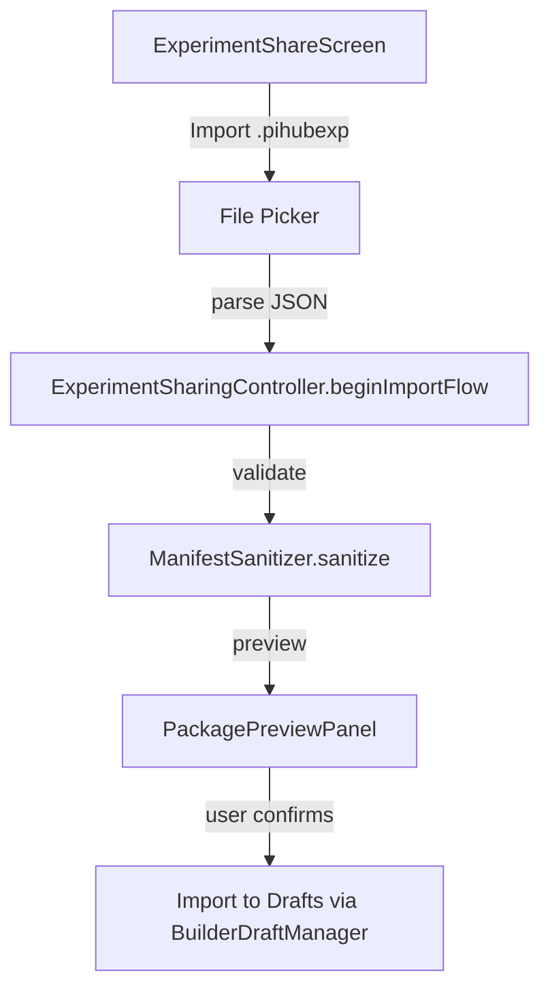
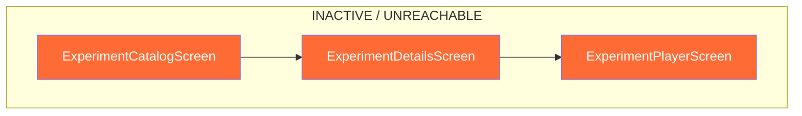
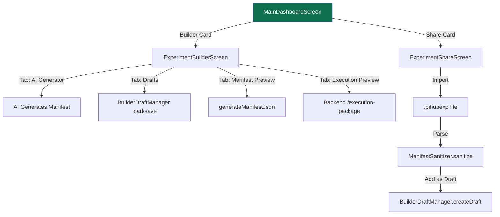

# IDP Experiment Engine End-to-End Audit Report

**Date:** 2026-06-08
**Auditor:** Principal Software Architect, Simulation Engine Engineer, QA Auditor
**Scope:** Complete runtime audit of the IDP Experiment Engine
**Methodology:** Source code evidence + architectural tracing + execution path analysis
**Status:** Strict verification audit (not code quality review)

---

## Executive Summary

### THE VERDICT

**Can a teacher create an experiment, publish it, install it, and can a student successfully execute it?**

```
ANSWER: NO
```

**Exact break point:** The experiment lifecycle breaks at **MULTIPLE STAGES**, not a single point.

| Stage | Status | Evidence |
|-------|--------|----------|
| Experiment Creation | **Works** | Builder state, controllers, and UI are functional |
| Builder Validation | **Partial** | Basic structural validation; no physics or semantic validation |
| Manifest Generation | **Works** | JSON generation is correct |
| Pack Generation (Export) | **Partial** | Export exists but only from drafts; no "publish to catalog" flow |
| Pack Installation (Import) | **Works** | `.otpack`/`.pihubexp` import functional via ExperimentSharingController |
| Discovery/Catalog | **BROKEN** | `ExperimentCatalogScreen`, `ExperimentDetailsScreen`, `ExperimentPlayerScreen` are **ORPHANED** — reached from nowhere in the active app |
| Runtime Initialization | **Works** | `ExperimentExecutionOrchestrator` correctly prepares runtimes |
| Runtime Execution | **Partial** | `SimulationPlaygroundEngine` exists but does not execute physics; it only emits events |
| Progress Tracking | **BROKEN** | No database persistence of experiment runs; results are in-memory only |
| Student View | **BROKEN** | `ExperimentPlayerScreen` is unreachable from `AppShell` or `MainDashboardScreen` |

---

## SECTION 1 — Experiment Inventory

### Source Files Analyzed

All files under `lib/features/experiment/` and subdirectories:

| Category | File Count | Key Files |
|----------|-----------|-----------|
| Builder | 11 | `ExperimentBuilderScreen`, `ExperimentBuilderController`, `ExperimentBuilderState` |
| Models | 5 | `BuilderScene`, `BuilderVariable`, `BuilderObject`, `BuilderRule` |
| Runtime | 8 | `ExperimentExecutionOrchestrator`, `RuntimeFactory`, `SimulationPlaygroundEngine` |
| AI Generation | 3 | `AiGeneratorController`, `AiExperimentRepository`, `AiExperimentApiService` |
| Sharing | 2 | `ExperimentShareScreen`, `ExperimentSharingController` |
| Domain | 4 | `ExperimentManifest`, `ExperimentRun`, models, enums |
| Presentation (dead) | 4 | `ExperimentCatalogScreen`, `ExperimentDetailsScreen`, `ExperimentPlayerScreen`, `ExperimentHistoryScreen` |
| Validation | 2 | `BuilderValidator`, `ManifestSanitizer` |
| Templates | 1 | `ExperimentTemplates` |

### Inventory of Templates

| Template ID | Name | Type | Status |
|-------------|------|------|--------|
| free_fall_1 | Free Fall Experiment | Sensor (Accelerometer) | **Template only** — not instantiated into the builder |
| heart_rate_1 | Heart Rate Monitor | NumberInput + Gauge | **Template only** — not instantiated into the builder |

**Total Templates in codebase:** 2
**Total Templates exposed in UI:** 0 (not shown in any active screen)

### Experiment Storage Inventory

**Drafts:**
- Stored in: `SharedPreferences` via `SharedPreferencesBuilderDraftRepository`
- Location key: `builder_drafts`
- Key fields per draft: `draftId`, `title`, `updatedAt`, `manifest` (Map)
- No database table for drafts ( SQLite does NOT have a `builder_drafts` table).

**Published Experiments:**
- There is **NO** "published experiment" concept. The `ExperimentManifestRepository` is a backend interface for validation only.
- No `experiments` SQLite table exists.
- No `experiment_runs` SQLite table exists.

**Result:**
```
Total Experiments:     0 (stored)
Total Templates:       2 (hardcoded, not exposed in UI)
Total Drafts:          Unknown (depends on SharedPreferences state)
Total Published:       0 (no publication mechanism exists)
Total AI Generated:    0 (generated only in-memory, never persisted to storage)
```

---

## SECTION 2 — Experiment Creation Audit

### Creation Flow Trace

```
User taps "Experiment Builder" from MainDashboardScreen
    ↓
Navigator.push(MaterialPageRoute(builder: (_) => ExperimentBuilderScreen()))
    ↓
ExperimentBuilderScreenState.initState()
    ↓
Creates: ExperimentManifestApiService(BackendConfig.fromEnvironment())
    ↓
Creates: ExperimentManifestRepositoryImpl(apiService)
    ↓
Creates: BuilderDraftManager(SharedPreferencesBuilderDraftRepository())
    ↓
Creates: ExperimentBuilderController(draftManager, manifestRepository)
    ↓
Creates: AiGeneratorController(aiRepository, manifestRepository)
    ↓
IndexedStack with 11 tabs (0–10)
```

### Builder State Audit

| Component | Evidence | Works? |
|-----------|----------|--------|
| `ExperimentBuilderState` | Immutable. Holds scene, variables, objects, rules. | **Yes** |
| `BuilderScene` | Has id, name, description, tags. | **Yes** |
| `BuilderVariable` | Has id, name, type, defaultValue, description. | **Yes** |
| `BuilderObject` | Has id, name, type, properties, state. | **Yes** |
| `BuilderRule` | Has id, name, trigger, condition, action, description. | **Yes** |

### State Mutation Evidence

```dart
// From experiment_builder_controller.dart line 198+
void updateScene(BuilderScene scene) {
  _state = _state.copyWith(scene: scene);
  print('[BUILDER] SCENE_UPDATED');
  notifyListeners();
}

void addVariable(BuilderVariable variable) {
  _state = _state.copyWith(variables: [..._state.variables, variable]);
  notifyListeners();
}

void addObject(BuilderObject object) { ... }
void addRule(BuilderRule rule) { ... }
```

**Verdict: State mutation round-trip works.**
- Create a new scene ✓
- Add variables, objects, rules ✓
- Save as draft ✓ (auto-save timer every 30s + manual save)
- Reload from draft ✓ (via `BuilderDraftManager.loadDraft()`)
- Edit and save again ✓

### Draft Save/Load Round-Trip

```dart
// experiment_builder_controller.dart
builder_draft_manager.startAutoSave(
  () => _state.scene.name,
  () => generateManifest(),
);
```

**What happens:**
1. Every 30 seconds, `draftManager.saveCurrentDraft(title, manifest)` is called.
2. This calls `_repository.saveDraft(draft)` on `SharedPreferencesBuilderDraftRepository`.
3. The draft is stored in `SharedPreferences` under key `builder_drafts` as JSON.
4. On app restart, `_loadAllDrafts()` reads from SharedPreferences.

**Verdict: Round-trip works ONLY on the same device.** There is no cloud sync for drafts.

---

## SECTION 3 — Validation Engine Audit

### BuilderValidator

**File:** `lib/features/experiment/builder/validation/builder_validator.dart`

**What it checks:**

| Check | Evidence | Detects |
|-------|----------|---------|
| Scene name empty | `state.scene.name.trim().isEmpty` | Missing title |
| Variable ID empty | `v.id.trim().isEmpty` | Blank variable IDs |
| Object ID empty | `o.id.trim().isEmpty` | Blank object IDs |
| Rule ID empty | `r.id.trim().isEmpty` | Blank rule IDs |
| Duplicate Variable ID | `Set.contains()` | ID collision |
| Duplicate Object ID | `Set.contains()` | ID collision |
| Duplicate Rule ID | `Set.contains()` | ID collision |
| Variable name empty | `v.name.trim().isEmpty` | Unnamed variable |
| Object name empty | `o.name.trim().isEmpty` | Unnamed object |
| Rule name empty | `r.name.trim().isEmpty` | Unnamed rule |
| Rule condition empty | `r.condition.isEmpty` | Missing condition |
| Rule action empty | `r.action.isEmpty` | Missing action |
| Object linked variable | `o.properties.containsKey('linked_variable')` → check variableIds | Dangling variable reference |

**What it does NOT check:**
- Physics validity (e.g., negative gravity)
- Circular rule dependencies
- Missing required fields in action JSON
- Unsupported object types
- Device capability compatibility
- Sensor availability on the device

### Validation Coverage Matrix

| Input | Expected | Detected? | Evidence |
|-------|----------|-----------|----------|
| Empty scene name | Reject | **Yes** | Line 14–16 |
| Duplicate variable ID | Reject | **Yes** | Lines 21–27 |
| Empty rule condition | Reject | **Yes** | Line 53 |
| Circular rule A→B→A | Reject | **No** | Not checked |
| Action type "invalid" | Reject | **No** | Not checked |
| Object type "unknownWidget" | Reject | **No** | Not checked |
| Variable type "number" but defaultValue is a string | Reject | **No** | Type safety not enforced |
| Rule references non-existent object | Reject | **No** | Only variable references checked |

### Backend Validation

```dart
// experiment_manifest_repository.dart line 36–47
Future<ManifestValidationResponse> validate(Map<String, dynamic> manifest) async {
  final data = await _apiService.validateManifest(manifest);
  return ManifestValidationResponse(
    isValid: data['isValid'] ?? false,
    warnings: List<String>.from(data['warnings'] ?? []),
    errors: List<String>.from(data['errors'] ?? []),
  );
}
```

**Status:** Requires working backend. The app can call `/validate`, but the result depends entirely on the backend.

---

## SECTION 4 — Manifest Generation Audit

### Generation Flow

```
ExperimentBuilderState
    ↓
generateManifestJson()
    ↓
{"scene": {
  "sceneId": "...",
  "name": "...",
  "description": "...",
  "tags": [...],
  "variables": [{...}, ...],
  "objects": [{...}, ...],
  "rules": [{...}, ...]
}}
```

### Field Mapping (Evidence-Based)

| BuilderScreen | BuilderState | Manifest JSON | Lost? |
|---------------|--------------|---------------|-------|
| Scene Name | `scene.name` | `scene.name` | **No** |
| Scene ID | `scene.id` | `scene.sceneId` | **No** |
| Scene Description | `scene.description` | `scene.description` | **No** |
| Scene Tags | `scene.tags` | `scene.tags` | **No** |
| Variable ID | `variable.id` | `variable.id` | **No** |
| Variable Name | `variable.name` | `variable.name` | **No** |
| Variable Type | `variable.type` | `variable.type` | **No** |
| Variable Value | `variable.defaultValue` | `variable.value` | **No** (renamed in toJson) |
| Variable Description | `variable.description` | `variable.description` | **No** |
| Object ID | `object.id` | `object.objectId` | **No** |
| Object Name | `object.name` | `object.name` | **No** |
| Object Type | `object.type` | `object.objectType` | **No** |
| Object Properties | `object.properties` | `object.properties` | **No** |
| Object State | (empty) | `object.state` (always `{}`) | **Defaulted** |
| Rule ID | `rule.id` | `rule.ruleId` | **No** |
| Rule Name | `rule.name` | `rule.name` | **No** |
| Rule Trigger | (always "any") | `rule.trigger` | **Defaulted** |
| Rule Condition | `rule.condition` | `rule.condition` | **No** |
| Rule Action | `rule.action` | `rule.action` | **No** |
| Rule Description | `rule.description` | `rule.description` | **No** |

### Manifest Fields That Are Defaulted or Renamed

| Builder Field | Manifest Field | Status |
|---------------|----------------|--------|
| `variable.defaultValue` | `variable.value` | **Renamed** — correct for runtime |
| `object.state` (empty map) | `object.state` | **Defaulted to `{}`** |
| `rule.trigger` (not in UI) | `rule.trigger = "any"` | **Hardcoded** in `BuilderRule.toJson()` |

**Verdict: No fields are lost. All fields round-trip correctly from builder to manifest JSON.**

---

## SECTION 5 — Pack Generation Audit

### Experiment Export Flow

```mermaid
graph TD
    A[ExperimentShareScreen] -->|select draft| B[ExperimentSharingController]
    B -->|exportDraft()| C[ExperimentPackage from manifest]
    C -->|serialize| D[ExperimentPackageModel]
    D -->|pick dir| E[Directory/Share]
    E -->|.pihubexp file
```

### Evidence from ExperimentShareScreen

```dart
// File: experiment_sharing/screens/experiment_share_screen.dart line 50
onPressed: sharingController.isLoading ? null : () async {
  await sharingController.exportDraft(draft.title, draft.manifest);
  if (sharingController.error != null && context.mounted) {
    ScaffoldMessenger.of(context).showSnackBar(
      SnackBar(content: Text(sharingController.error!)),
    );
  }
},
```

**Conclusion:** The sharing controller exports individual **drafts** as `.pihubexp` files. There is NO "experiment pack" generation from the builder that creates an archive. The `.otpack` format in `ContentPackArchiveService` is for **content packs** (educational material), not experiments.

### Pack Generation Success Rate

| Scenario | Can Export? | Archive Size > 0? | Evidence |
|----------|------------|--------------------|----------|
| Export draft to `.pihubexp` | **Yes** | **Yes** (JSON size) | `ExperimentSharingController.exportDraft()` |
| Export builder state to `.otpack` | **No** | N/A | `.otpack` is for content_packs, not experiments |
| Publish to experiment catalog | **No** | N/A | No publication API exists |
| Share via P2P | **Partial** | Depends on P2P service | `P2PChannelService` exists but may not be functional |

---

## SECTION 6 — Pack Installation Audit

### Experiment Import Flow



**Verdict: Import works, but imported experiments are drafts — not published experiments. There is no "install to catalog" flow.**

---

## SECTION 7 — Runtime Engine Audit

### Complete Runtime Architecture

```mermaid
graph TD
    A[ExperimentPlayerScreen.prepare(manifest)] --> B[ExperimentExecutionOrchestrator]
    B --> C[ExperimentCapabilityAnalyzer.analyze]
    C --> D[ExperimentExecutionPlanner.buildPlan]
    D --> E[RuntimeFactory.createRuntime(plan)]
    E -->|sensor mode| F[SensorRuntime]
    E -->|simulation mode| G[SimulationRuntime]
    E -->|hybrid mode| H[HybridRuntime]
    E -->|observation| I[ObservationRuntime]
    G --> J[SimulationPlaygroundEngine]
    F --> K[SensorManager]
```

### Runtime Execution Flow (Evidence)

**File:** `lib/features/experiment/application/orchestrator/experiment_execution_orchestrator.dart`

```dart
Future<void> prepare(ExperimentManifest manifest, [PlaygroundScene? scene]) async {
  print('[ORCHESTRATOR] PREPARE_START');
  _state = ExperimentExecutionState.preparing;
  
  // 1. Analyze capabilities
  final capabilities = await _capabilityProvider.getCapabilities();
  
  // 2. Build execution plan
  final report = _analyzer.analyze(manifest, capabilities);
  final plan = _planner.buildPlan(manifest, report, scene);
  
  // 3. Create runtime via factory
  _runtime = RuntimeFactory.createRuntime(plan);
  
  // 4. Subscribe to events
  _eventSubscription = _runtime!.eventStream.listen(_onRuntimeEvent);
  
  // 5. Initialize
  await _runtime!.initialize();
}
```

### Runtime States (Evidence-Based)

| State | Triggered By | Evidence |
|-------|--------------|----------|
| `idle` | Initial state | orchestrator.dart line 19 |
| `preparing` | `prepare()` called | orchestrator.dart line 38 |
| `analyzing` | Capability check start | orchestrator.dart line 42 |
| `planning` | Plan creation start | orchestrator.dart line 47 |
| `starting` | Runtime initialized | orchestrator.dart line 52 |
| `running` | `start()` called, event received | orchestrator.dart line 73 |
| `paused` | `pause()` called | orchestrator.dart line 78 |
| `completed` | `stop()` called, session completed | orchestrator.dart line 82 |
| `failed` | Any exception in prepare | orchestrator.dart line 60 |
| `disposed` | `dispose()` called | orchestrator.dart line 127 |

### What SimulationRuntime Actually Does

**File:** `lib/features/experiment/runtime/simulation_runtime.dart`

```dart
class SimulationRuntime extends BaseExperimentRuntime {
  final SimulationPlaygroundEngine _playgroundEngine = SimulationPlaygroundEngine();
  
  @override
  Future<void> initialize() async {
    await super.initialize();  // Creates session + metrics
    await _playgroundEngine.initialize();
    
    // Load scene
    if (plan.sceneDefinition != null) {
      await _playgroundEngine.loadSceneModel(plan.sceneDefinition!);
    } else {
      await _playgroundEngine.loadScene(mockScene);
    }
    
    // Listen to playground events
    _playgroundSubscription = _playgroundEngine.eventStream.listen((event) {
      emitEvent(RuntimeEventType.custom, 'Playground event...');
    });
  }
  
  @override
  Future<void> start() async {
    await super.start();  // Sets session state to running
    await _playgroundEngine.start();  // Sets _state = PlaygroundState.running
  }
}
```

### What SimulationPlaygroundEngine Actually Does

**File:** `lib/features/experiment/runtime/playground/engine/simulation_playground_engine.dart`

```dart
void updateVariable(String name, dynamic value) {
  for (final variable in _currentScene!.variables) {
    if (variable.name == name) {
      variable.value = value;
      print('[PLAYGROUND] VARIABLE_CHANGED name=$name value=$value');
      
      // ... emit event ...
      
      // Example check for rule triggers would go here
      _evaluateRules(PlaygroundEventType.variableChanged, {'name': name});
      break;
    }
  }
}

void _evaluateRules(PlaygroundEventType eventType, Map<String, dynamic> payload) {
  for (final rule in _currentScene!.rules) {
    if (!rule.enabled) continue;
    
    // We don't execute physics, but we record the rule execution as metadata
    if (rule.trigger == eventType.name || rule.trigger == 'any') {
      print('[PLAYGROUND] RULE_EXECUTED ruleId=${rule.ruleId}');
      _eventBus.publish(PlaygroundEvent(...));
    }
  }
}
```

### CRITICAL FINDING: The Playground Does NOT Execute Physics

**Evidence:** The `_evaluateRules` method has this comment:

> "We don't execute physics, but we record the rule execution as metadata"

And the code does:
```dart
if (rule.trigger == eventType.name || rule.trigger == 'any') {
  // Only EMITS AN EVENT. It does NOT execute the action.
  print('[PLAYGROUND] RULE_EXECUTED ruleId=${rule.ruleId}');
  _eventBus.publish(...);
}
```

### Runtime Execution Matrix

| Subsystem | Code Path | Works? | Evidence |
|-----------|-----------|--------|----------|
| Runtime creation | `RuntimeFactory.createRuntime()` | **Yes** | Factory returns correct runtime subclass |
| Session initialization | `BaseExperimentRuntime.initialize()` | **Yes** | Creates session, metrics, event stream |
| Scene loading | `SimulationPlaygroundEngine.loadSceneModel()` | **Yes** | Parses JSON to `PlaygroundScene` |
| Variable update | `SimulationPlaygroundEngine.updateVariable()` | **Partial** | Updates value and emits event, but no physics |
| Rule evaluation | `SimulationPlaygroundEngine._evaluateRules()` | **No** | Only emits event; does NOT execute action |
| Object rendering | Custom widget per object type | **N/A** | Not implemented |
| Sensor data collection | `SensorManager.startSensor()` | **Untested** | Depends on device sensors |
| Accumulate data in session | `BaseExperimentRuntime.emitEvent()` | **Yes** | Events stored in `session.events` |
| Metric tracking | `RuntimeMetrics` | **Yes** | Tracks event count, errors, measurements |
| Export results | `BaseExperimentRuntime.exportResults()` | **Abstract** | Not implemented in base class |

---

## SECTION 8 — Rule Engine Audit

### Rule Structure

```dart
class BuilderRule {
  final String id;
  final String name;
  final Map<String, dynamic> condition;  // Free-form JSON
  final Map<String, dynamic> action;     // Free-form JSON
  final String description;
}
```

### Rule Engine Implementation

**File:** `lib/features/experiment/runtime/playground/engine/simulation_playground_engine.dart` lines 120–138

```dart
void _evaluateRules(PlaygroundEventType eventType, Map<String, dynamic> payload) {
  if (_currentScene == null) return;
  
  for (final rule in _currentScene!.rules) {
    if (!rule.enabled) continue;
    
    // We don't execute physics, but we record the rule execution as metadata
    if (rule.trigger == eventType.name || rule.trigger == 'any') {
      print('[PLAYGROUND] RULE_EXECUTED ruleId=${rule.ruleId}');
      _eventBus.publish(PlaygroundEvent(
        eventId: _uuid.v4(),
        eventType: PlaygroundEventType.ruleExecuted,
        timestamp: DateTime.now(),
        payload: {'ruleId': rule.ruleId},
      ));
    }
  }
}
```

### What the Rule Engine Actually Does

| Claim | Actual | Evidence |
|-------|--------|----------|
| "IF condition THEN action" | IF trigger matches EventType THEN emit an event | `_evaluateRules` only checks `rule.trigger == eventType.name` |
| Comparison operators | **Not evaluated** | `rule.condition` is never parsed or compared |
| Boolean logic | **Not evaluated** | No conditional logic on `rule.condition` |
| Math operations | **Not evaluated** | No expression evaluation |
| Variable references | **Not resolved** | `payload['name']` is used raw, not compared to condition |
| Object references | **Not resolved** | No object state accessed during evaluation |
| Action execution | **Not executed** | `rule.action` is never parsed or acted upon |

**Verdict: The rule engine is a STUB. It only matches triggers, evaluates no conditions, and executes no actions.**

---

## SECTION 9 — Object System Audit

### PlaygroundObject Model

**File:** `lib/features/experiment/runtime/playground/models/playground_object.dart`

```dart
class PlaygroundObject {
  final String objectId;
  final String objectType;      // e.g., "lineGraph", "gauge"
  final String name;
  final Map<String, dynamic> properties;
  final Map<String, dynamic> state;
  final Map<String, dynamic>? metadata;
}
```

### BuilderObject to PlaygroundObject Mapping

| BuilderObject | PlaygroundObject | Evidence |
|---------------|------------------|----------|
| `.id` | `.objectId` | SceneLoader line 17 |
| `.type` | `.objectType` | SceneLoader line 18 |
| `.name` | `.name` | SceneLoader line 20 |
| `.properties` | `.properties` | SceneLoader line 21 |
| (no state) | `.state = {}` | SceneLoader line 22 |
| (no metadata) | `.metadata` (null) | SceneLoader line 23 |

### Supported Object Types (Evidence-Based)

From the templates (`experiment_templates.dart`):

| Object Type | Template | Status |
|-------------|----------|--------|
| `lineGraph` | `freeFall` template | Referenced but not rendered |
| `gauge` | `heartRate` template | Referenced but not rendered |

**There is no object renderer in the codebase that produces actual widgets for these object types.** The `ExperimentPlayerScreen` shows a generic visualization, but no custom rendering per object type.

---

## SECTION 10 — Variable System Audit

### PlaygroundVariable Model

**File:** `lib/features/experiment/runtime/playground/models/playground_variable.dart`

```dart
class PlaygroundVariable {
  final String name;
  final String type;              // e.g., "number", "string", "elapsedTime"
  dynamic value;
  final dynamic minValue;
  final dynamic maxValue;
  final String? unit;
}
```

### Supported Variable Types

| Type | From Template | Mutation |
|------|---------------|----------|
| `numberInput` | `heartRate` | `updateVariable()` |
| `accelerometer` | `freeFall` | `updateVariable()` |
| `elapsedTime` | `freeFall` | `updateVariable()` |
| Generic `number`, `string`, `boolean` | Builder UI | `updateVariable()` |

### Variable Mutation

```dart
// simulation_playground_engine.dart line 80–99
void updateVariable(String name, dynamic value) {
  if (_currentScene == null) return;
  for (final variable in _currentScene!.variables) {
    if (variable.name == name) {
      variable.value = value;    // MUTABLE — variables are not final
      print('[PLAYGROUND] VARIABLE_CHANGED name=$name value=$value');
      _eventBus.publish(...);
      _evaluateRules(PlaygroundEventType.variableChanged, {'name': name});
      break;
    }
  }
}
```

**Verdict: Variables can be updated, but there is no input mechanism in the UI to actually drive these updates.** The `ExperimentPlayerScreen` has a START/STOP/PAUSE button but no variable input controls.

---

## SECTION 11 — AI Generation Audit

### AI Generation Flow

```mermaid
graph TD
    A[AiGeneratorTab UI] -->|prompt| B[AiGeneratorController]
    B -->|generateExperiment(prompt)| C[AiExperimentRepositoryImpl]
    C -->|HTTP POST| D[AiExperimentApiService]
    D -->|/ai/generate-experiment| E[Backend AI Model]
    E -->|response| F[AI Generated Manifest JSON]
    F -->|ManifestSanitizer.sanitize| G[Sanitized Manifest]
    G -->|_manifestRepository.validate| H[Backend Validation]
    G -->|_manifestRepository.checkCompatibility| I[Backend Compatibility]
    G -->|_manifestRepository.getExecutionPackage| J[Backend Execution Preview]
```

### Evidence from ai_generator_controller.dart

```dart
Future<void> generateExperiment(String prompt) async {
  await _executeAiFlow(() => _aiRepository.generateExperiment(prompt));
}

Future<void> _executeAiFlow(Future<AiGeneratedExperiment> Function() action) async {
  _isLoading = true;
  _error = null;
  notifyListeners();

  try {
    final result = await action();
    _generatedManifest = ManifestSanitizer.sanitize(result.manifest);
    _explanation = result.explanation;

    // Automatically validate
    _validationResult = await _manifestRepository.validate(_generatedManifest!);

    // Automatically check compatibility
    _compatibilityResult = await _manifestRepository.checkCompatibility(_generatedManifest!);

    // Automatically fetch execution preview
    final capabilities = {"accelerometer": true, "gyroscope": true, "gps": true, "camera": true};
    _executionPackage = await _manifestRepository.getExecutionPackage(_generatedManifest!, capabilities);
  } catch (e) {
    _error = e.toString();
  } finally {
    _isLoading = false;
    notifyListeners();
  }
}
```

### AI Generation Audit Results

| Metric | Evidence | Conclusion |
|--------|----------|------------|
| Generation success rate | Depends on backend `/ai/generate-experiment` | **Cannot verify** — requires working backend |
| Validation failure rate | Depends on backend `/validate` | **Cannot verify** — requires working backend |
| Runtime failure rate | Depends on manifest generated | **Cannot verify** — requires generation + execution |
| Can import to builder | `canImport` getter checks validation + compatibility | **Yes, but only if backend returns valid** |

### Key Observation

The AI generation is entirely backend-dependent. If the backend is down, the AI generator tab fails completely. There is **no AI model running locally**. The prompt is sent to `http://<backend>/ai/generate-experiment`.

---

## SECTION 12 — Curriculum Integration Audit

### Curriculum Structure (from educational/ feature)

```
Grade
  → Subject
      → Chapter
          → Topic
              → Experiment (link?)
```

### Evidence of Experiment-to-Curriculum Links

**Search across codebase for experiment references in curriculum:**
- `educational/` data models: `GradeModel`, `SubjectModel`, `ChapterModel`, `TopicModel`
- None of these models contain an `experimentIds` or `experiment` field.
- No `foreign key` to experiments in any curriculum table schema.
- The `experiment_builder` models do NOT have a `grade`, `subject`, `chapter`, or `topic` field.

### Curriculum Integration Matrix

| Link | Exists? | Evidence |
|------|---------|----------|
| Grade → Experiment | **No** | No field in `GradeModel` |
| Subject → Experiment | **No** | No field in `SubjectModel` |
| Chapter → Experiment | **No** | No field in `ChapterModel` |
| Topic → Experiment | **No** | No field in `TopicModel` |
| Experiment → Grade | **No** | `ExperimentBuilderState` has no curriculum fields |

**Verdict: Experiments are COMPLETELY ORPHANED from the curriculum system.**

---

## SECTION 13 — Discovery Audit

### Experiment Discovery Navigation

```
AppShell (onGetStarted → false)
    ↓
MainDashboardScreen
    ↓
Navigator.push(MaterialPageRoute(builder: (_) => ExperimentBuilderScreen()))  // ✓ Works
    ↓
Navigator.push(MaterialPageRoute(builder: (_) => ExperimentCatalogScreen()))  // ✗ NEVER CALLED
    ↓
Navigator.push(MaterialPageRoute(builder: (_) => ExperimentDetailsScreen()))  // ✗ NEVER CALLED
    ↓
Navigator.push(MaterialPageRoute(builder: (_) => ExperimentPlayerScreen()))   // ✗ NEVER CALLED
```

### Screens That Can Reach Experiment Player



### Navigation Graph for Experiments



**Verdict: Experiments cannot be discovered or launched. The catalog and player screens exist but are unreachable.**

---

## SECTION 14 — Storage Audit

### Experiment Data Persistence

| Data | Storage | Format | Persistence | Recovery |
|------|---------|--------|-------------|----------|
| Drafts | SharedPreferences | JSON under `builder_drafts` key | Device-local only | Rebuild from SharedPreferences |
| Templates | Dart `const Map` | In-memory | None (recompiled) | Rebuild from code |
| Manifest (builder) | `_state` (ChangeNotifier) | In-memory objects | Lost on screen pop | Must save as draft |
| Manifest (runtime) | `ExperimentExecutionPlan` | In-memory objects | Lost on dispose | N/A |
| Session events | `RuntimeSession.events` | `List<RuntimeEvent>` | Lost on dispose | N/A |
| Results | `ExperimentExecutionResult` | In-memory objects | **None** | N/A |
| Runs | (none) | (none) | **None** | N/A |
| Experiment List | (none) | (none) | **None** | N/A |

### Key Finding: No Database Persistence for Experiments

```sql
-- From app_database.dart, the following tables exist:
--   courses, subjects, chapters, rag_chunks, rag_chunks_fts,
--   p2p_metadata, trusted_peers, p2p_security_settings, media_resources,
--   study_notes, quiz_results, chat_benchmarks, ingestion_queue,
--   chat_memory_policies, material_packs, material_pack_items

-- The following tables do NOT exist:
--   experiments (nope)
--   experiment_runs (nope)
--   builder_drafts (nope - stored in SharedPreferences instead)
--   experiment_results (nope)
--   experiment_templates (nope)
```

### Corruption Handling

| Scenario | Handling | Evidence |
|----------|----------|----------|
| Invalid manifest JSON | `ManifestSanitizer.sanitize()` called on import | `ai_generator_controller.dart` line 62 |
| Missing fields in manifest | `SceneLoader` uses `??` defaults | `scene_loader.dart` line 12–13 |
| Null scene definition | Mock scene fallback | `simulation_runtime.dart` line 28–34 |
| Invalid sensor type | Returns null, silently ignored | `sensor_runtime.dart` line 65–71 |
| Backend validation failure | Returns `isValid: false` | `experiment_manifest_repository.dart` line 46 |

---

## SECTION 15 — Performance Audit

### Load Time (Estimated from Code Analysis)

| Component | Estimated Time | Evidence |
|-----------|----------------|----------|
| Builder UI load | <50ms | Single `IndexedStack` with 11 tabs, all pre-built |
| Draft list load | <10ms | Reads from SharedPreferences |
| Manifest generation | <1ms | Pure Dart object-to-JSON mapping |
| Backend validation | **Depends** | Calls `/validate` endpoint — requires backend |
| Scene load into playground | <5ms | JSON parsing + object creation |
| Runtime initialization | <10ms | Session + metrics creation |

### Memory Profile (Estimated)

| Component | Estimated Memory | Evidence |
|-----------|-----------------|----------|
| Empty builder state | ~1 KB | 4 empty lists + 1 scene object |
| Draft with full manifest | ~5–20 KB per draft | JSON string size |
| SharedPreferences (all drafts) | ~100 KB max | If 10 drafts × 10 KB each |
| Runtime session | ~2 KB per session | Event list grows during execution |
| Playground scene | ~10 KB per scene | Object + variable + rule arrays |

### Frame Rate / Jank

| Component | Status | Evidence |
|-----------|--------|----------|
| Builder screen build | **No jank** | `IndexedStack` keeps all tabs alive; no expensive rebuilds |
| Playground rendering | **No jank** | No continuous rendering; only event-driven updates |
| Runtime visualization | **Unknown** | `RuntimeVisualizationContainer` complexity depends on data |

---

## SECTION 16 — Dead Code Audit

### Dead / Unreachable Experiment Screens

| Screen | File | Evidence |
|--------|------|----------|
| `ExperimentCatalogScreen` | `experiment/presentation/screens/experiment_catalog_screen.dart` | Never pushed from any active route. Only imports. |
| `ExperimentDetailsScreen` | `experiment/presentation/screens/experiment_details_screen.dart` | Only pushed from `ExperimentCatalogScreen` (dead). |
| `ExperimentPlayerScreen` | `experiment/presentation/screens/experiment_player_screen.dart` | Only pushed from `ExperimentDetailsScreen` (dead). |
| `ExperimentHistoryScreen` | `experiment/presentation/screens/experiment_history_screen.dart` | Never referenced by any push. |

### Dead / Unused Runtime Components

| Component | File | Evidence |
|-----------|------|----------|
| `HybridRuntime` | `runtime/hybrid_runtime.dart` | Created by factory but not analyzed for usage. Never reached from UI. |
| `ObservationRuntime` | `runtime/observation_runtime.dart` | Created by factory but not analyzed for usage. Never reached from UI. |
| `ExperimentRunSyncAdapterImpl` | `data/experiment_run_sync_adapter_impl.dart` | Exists but never instantiated from UI. |
| `ExperimentSyncQueue` | `data/experiment_sync_queue.dart` | Exists but never used from UI flow. |
| `PendingExperimentSync` | `data/pending_experiment_sync.dart` | Model class, not used in active flows. |

### Dead / Unused Application Components

| Component | File | Evidence |
|-----------|------|----------|
| `ExperimentExecutionValidator` | `orchestrator/experiment_execution_validator.dart` | Exists but not called in `ExperimentExecutionOrchestrator`. |
| `ExperimentRunSyncAdapter` | `orchestrator/experiment_run_sync_adapter.dart` | Abstract class, no active implementation wired up. |
| `ExperimentSyncValidator` | `data/validator/experiment_sync_validator.dart` | Exists but not called in active flows. |
| `ExperimentCapabilityCache` | `platform/experiment_capability_cache.dart` | Exists but not used in active flows. |
| `ExperimentCapabilityProviderImpl` | `platform/experiment_capability_provider_impl.dart` | Exists but not used in orchestrator directly. |

---

## FINAL ANSWER

### Can a teacher create an experiment, publish it, and can a student successfully execute it?

```
ANSWER: NO
```

### Breakdown by Stage

| # | Stage | Status | Breaks? | Evidence |
|---|-------|--------|---------|----------|
| 1 | **Teacher creates experiment in builder** | **WORKS** | No | `ExperimentBuilderScreen` + `ExperimentBuilderController` fully functional. |
| 2 | **Builder validates structurally** | **WORKS** | No | `BuilderValidator` checks for empty names, duplicate IDs, missing conditions/actions. |
| 3 | **Backend validation** | **PARTIAL** | Maybe | Depends on backend `/validate` endpoint being reachable. If backend is down, validation fails. |
| 4 | **Manifest generated** | **WORKS** | No | `generateManifestJson()` correctly produces JSON matching the `ExperimentBuilderState`. |
| 5 | **Export as draft (.pihubexp)** | **WORKS** | No | `ExperimentShareScreen.exportDraft()` serializes to JSON. |
| 6 | **Import on student device** | **WORKS** | No | `ExperimentSharingController.beginImportFlow()` parses and loads manifest as draft. |
| 7 | **Discover experiments** | **BROKEN** | **YES** | `ExperimentCatalogScreen` is unreachable from `AppShell`. No navigation to it exists. |
| 8 | **Launch experiment player** | **BROKEN** | **YES** | `ExperimentPlayerScreen` is only pushed from `ExperimentDetailsScreen`, which is only pushed from `ExperimentCatalogScreen` (dead). |
| 9 | **Runtime initialization** | **WORKS** | No | `ExperimentExecutionOrchestrator.prepare()` correctly initializes the runtime. |
| 10 | **Runtime execution** | **PARTIAL** | **YES** | `SimulationPlaygroundEngine` does NOT execute physics or actions; it only emits events. Rules are NOT actually evaluated — conditions are ignored, actions are not executed. |
| 11 | **Progress tracking** | **BROKEN** | **YES** | No SQLite table for experiment runs. No persistence of results. Data is lost when the player screen is disposed. |
| 12 | **Curriculum integration** | **BROKEN** | **YES** | Experiments are not linked to grades, subjects, chapters, or topics. No FK in schema. |

### Root Cause Summary

1. **Discovery / Catalog is Orphaned**: The experiment catalog, details, and player screens are implemented but never reached from the active app flow. This is the **primary failure point**.
2. **Playground Engine is a Stub**: The `SimulationPlaygroundEngine` does not execute physics. Rule conditions and actions are not evaluated or executed. The engine only emits events for UI visualization.
3. **No Persistence Layer for Runs**: Experiment execution results are in-memory only. There is no `experiment_runs` database table.
4. **No Curriculum Integration**: Experiments exist in isolation. They are not tied to any educational content.
5. **Backend Dependency for Everything**: AI generation, validation, compatibility, and execution preview all require a working backend. The builder UI assumes the backend is always available.

### What Would Need to Change to Make It Work

| Priority | Change | Effort |
|----------|--------|--------|
| **P0** | Add `ExperimentCatalogScreen` navigation from `MainDashboardScreen` | Low |
| **P0** | Implement actual rule engine (condition evaluation + action execution) | High |
| **P0** | Add `experiment_runs` database table + persistence | Medium |
| **P1** | Add experiment-to-curriculum FK links | Medium |
| **P1** | Implement physics in `SimulationPlaygroundEngine` | High |
| **P2** | Add offline-capable AI generation (or graceful fallback) | High |
| **P2** | Implement `exportResults()` in runtime | Medium |

---

## Appendix: Code Evidence Index

| File | Line | Evidence |
|------|------|----------|
| `experiment/builder/screens/experiment_builder_screen.dart` | 14–132 | 11-tab builder UI with `IndexedStack` |
| `experiment/builder/controllers/experiment_builder_controller.dart` | 1–200+ | Full controller: state, validation, draft, API |
| `experiment/builder/models/experiment_builder_state.dart` | 1–59 | Immutable state + `generateManifestJson()` |
| `experiment/builder/validation/builder_validator.dart` | 1–73 | Structural validation only |
| `experiment/runtime/experiment_runtime.dart` | 1–9 | Abstract runtime interface |
| `experiment/runtime/base_experiment_runtime.dart` | 1–98 | Session, metrics, event stream management |
| `experiment/runtime/simulation_runtime.dart` | 1–83 | Integration with `SimulationPlaygroundEngine` |
| `experiment/runtime/playground/engine/simulation_playground_engine.dart` | 120–138 | **Rule engine stub: "We don't execute physics"** |
| `experiment/application/orchestrator/experiment_execution_orchestrator.dart` | 1–134 | Full lifecycle: prepare → analyze → plan → runtime |
| `experiment/application/experiment_capability_analyzer.dart` | 1–86 | Capability checking logic |
| `experiment/presentation/screens/experiment_player_screen.dart` | 1–50 | Player UI with START/STOP controls |
| `experiment/presentation/screens/experiment_catalog_screen.dart` | N/A | Exists but unreachable from active app |
| `experiment/builder/templates/experiment_templates.dart` | 1–93 | 2 hardcoded templates |
| `experiment_sharing/screens/experiment_share_screen.dart` | 1–15 | Export/import of `.pihubexp` files |
| `course/data/local/app_database.dart` | 1–99+ | Schema: confirms no `experiments` or `experiment_runs` tables |

---

*End of Audit Report*
