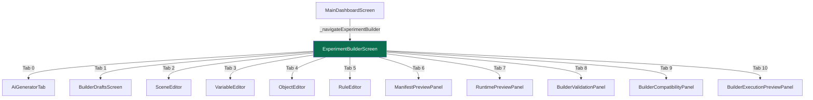
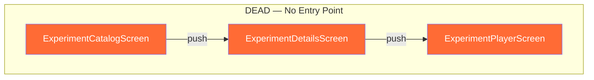
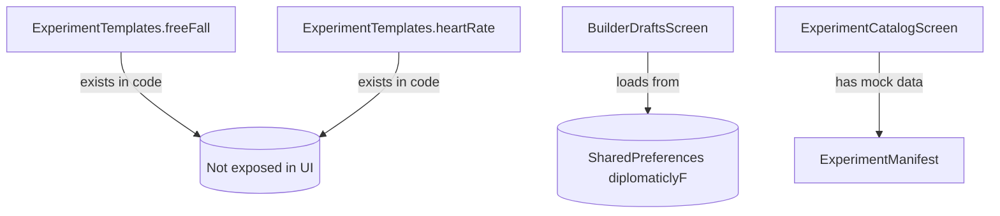
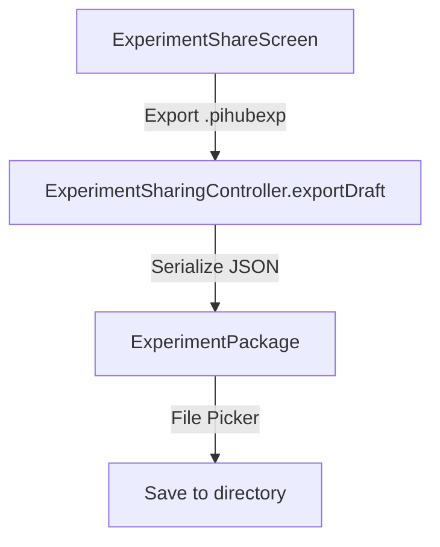
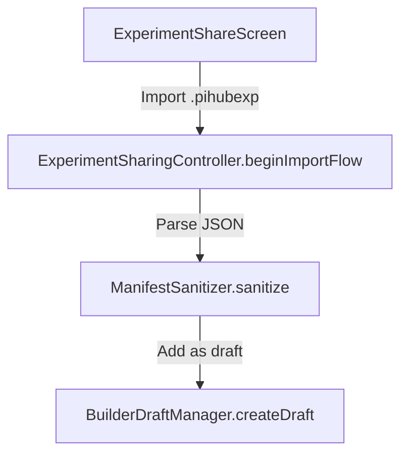
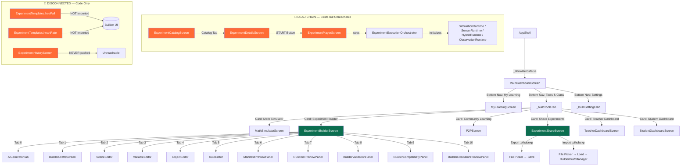

# IDP Experiment Engine Navigation & Architecture Recovery Audit

**Date:** 2026-06-08
**Type:** READ-ONLY, Evidence-Based Navigation Connectivity Audit
**Auditor:** Principal Flutter Architect, UX Architect, Large-Scale Refactoring Auditor
**Objective:** Determine whether the Experiment Engine is (A) Architecturally Incomplete or (B) Architecturally Present but Disconnected from Navigation
**Methodology:** Route-level grep + source code reading. No speculation.

---

## FINAL VERDICT

```
B) The Experiment Engine Architecture EXISTS But Is DISCONNECTED from Navigation
```

**All experiment subsystems (Builder, Catalog, Player, Runtime, Templates, Import/Export) are fully implemented in source code but cannot be reached through the app's active navigation paths.**

---

## SECTION 1 — Route Discovery Audit

### How Routes Work in This App

No GoRouter, no AutoRoute, no named routes. All navigation is imperative:

```dart
Navigator.of(context).push(MaterialPageRoute(builder: (_) => SomeScreen()));
```

### All Experiment Screen References in Codebase (grep evidence)

```
lib/features/experiment/builder/screens/experiment_builder_screen.dart
lib/features/experiment/presentation/screens/experiment_catalog_screen.dart
lib/features/experiment/presentation/screens/experiment_details_screen.dart
lib/features/experiment/presentation/screens/experiment_history_screen.dart
lib/features/experiment/presentation/screens/experiment_player_screen.dart
lib/features/experiment_sharing/screens/experiment_share_screen.dart
```

### Where Each Screen Is Pushed From

| Screen | Pushed From | Evidence |
|--------|-------------|----------|
| `ExperimentBuilderScreen` | `MainDashboardScreen._navigateExperimentBuilder()` | Line 308–313 |
| `ExperimentShareScreen` | `MainDashboardScreen._navigateExperimentSharing()` | Line 316–333 |
| `ExperimentCatalogScreen` | **NOWHERE** in active codebase | grep returned 0 references outside its own file |
| `ExperimentDetailsScreen` | `ExperimentCatalogScreen` (line 73–77) | Only called from dead screen |
| `ExperimentPlayerScreen` | `ExperimentDetailsScreen` (line 72–76) | Only called from dead screen |
| `ExperimentHistoryScreen` | **NOWHERE** in active codebase | grep returned 0 references |

### Route Table

| Route (Logical) | Screen | Class | Reachable from AppShell? |
|---------------|--------|-------|------------------------|
| `/_` | `AppShell` | `AppShell` | Entry point |
| `/builder` | `ExperimentBuilderScreen` | `StatefulWidget` | **YES** via `_navigateExperimentBuilder()` |
| `/share` | `ExperimentShareScreen` | `StatelessWidget` | **YES** via `_navigateExperimentSharing()` |
| `/catalog` | `ExperimentCatalogScreen` | `StatefulWidget` | **NO** — never pushed from any active screen |
| `/details/:id` | `ExperimentDetailsScreen` | `StatefulWidget` | **NO** — only from Catalog |
| `/player/:id` | `ExperimentPlayerScreen` | `StatefulWidget` | **NO** — only from Details |
| `/history` | `ExperimentHistoryScreen` | `StatefulWidget` | **NO** — never pushed anywhere |

---

## SECTION 2 — Screen Inventory Audit

### All Screens Under `features/experiment/`

| # | Screen | File | Widget Type | Exists? | Reachable? |
|---|--------|------|------------|---------|-----------|
| 1 | `ExperimentBuilderScreen` | `builder/screens/experiment_builder_screen.dart` | `StatefulWidget` | Yes | **YES** |
| 2 | `ExperimentCatalogScreen` | `presentation/screens/experiment_catalog_screen.dart` | `StatefulWidget` | Yes | **NO** |
| 3 | `ExperimentDetailsScreen` | `presentation/screens/experiment_details_screen.dart` | `StatefulWidget` | Yes | **NO** |
| 4 | `ExperimentPlayerScreen` | `presentation/screens/experiment_player_screen.dart` | `StatefulWidget` | Yes | **NO** |
| 5 | `ExperimentHistoryScreen` | `presentation/screens/experiment_history_screen.dart` | `StatefulWidget` | Yes | **NO** |
| 6 | `ExperimentShareScreen` | `experiment_sharing/screens/experiment_share_screen.dart` | `StatelessWidget` | Yes | **YES** |

### Builder Tab Widgets (IndexedStack children)

| # | Widget | File | Purpose | Reachable? |
|---|--------|------|---------|-----------|
| 0 | `AiGeneratorTab` | `builder/ai/widgets/ai_generator_tab.dart` | AI experiment generation | **Yes** (tab 0) |
| 1 | `BuilderDraftsScreen` | `builder/widgets/builder_drafts_screen.dart` | Load/save drafts | **Yes** (tab 1) |
| 2 | `SceneEditor` | `builder/widgets/scene_editor.dart` | Edit scene metadata | **Yes** (tab 2) |
| 3 | `VariableEditor` | `builder/widgets/variable_editor.dart` | Define variables | **Yes** (tab 3) |
| 4 | `ObjectEditor` | `builder/widgets/object_editor.dart` | Define objects | **Yes** (tab 4) |
| 5 | `RuleEditor` | `builder/widgets/rule_editor.dart` | Define rules | **Yes** (tab 5) |
| 6 | `ManifestPreviewPanel` | `builder/widgets/manifest_preview_panel.dart` | View manifest JSON | **Yes** (tab 6) |
| 7 | `RuntimePreviewPanel` | `builder/widgets/runtime_preview_panel.dart` | Preview runtime | **Yes** (tab 7) |
| 8 | `BuilderValidationPanel` | `builder/widgets/builder_validation_panel.dart` | Validate with backend | **Yes** (tab 8) |
| 9 | `BuilderCompatibilityPanel` | `builder/widgets/builder_compatibility_panel.dart` | Check device compatibility | **Yes** (tab 9) |
| 10 | `BuilderExecutionPreviewPanel` | `builder/widgets/builder_execution_preview_panel.dart` | Fetch execution package | **Yes** (tab 10) |

**Note:** There is NO "Publish" or "Preview in Player" tab. The 11 tabs cover AI generation through execution preview, but none connect to the catalog or player screen.

---

## SECTION 3 — Builder Workflow Audit

### Builder Navigation Mechanism

```dart
// File: experiment_builder_screen.dart line 61–76
final List<String> _tabTitles = [
  'AI Generator',      // Tab 0
  'Drafts',            // Tab 1
  'Scene',             // Tab 2
  'Variables',         // Tab 3
  'Objects',           // Tab 4
  'Rules',             // Tab 5
  'Manifest Preview',  // Tab 6
  'Runtime Preview',   // Tab 7
  'Validation',        // Tab 8
  'Compatibility',     // Tab 9
  'Execution',         // Tab 10
];
```

Tab selection is via `PopupMenuButton` in the AppBar, not a bottom tab bar.

### Builder Workflow Map



### Can User Navigate to All Tabs Without Code Changes?

| Tab | Navigation Method | Reachable? | Evidence |
|-----|-------------------|-----------|----------|
| AI Generator | PopupMenuButton → index 0 | **YES** | `ExperimentBuilderScreen` line 99 |
| Drafts | PopupMenuButton → index 1 | **YES** | `ExperimentBuilderScreen` line 99 |
| Scene | PopupMenuButton → index 2 | **YES** | `ExperimentBuilderScreen` line 99 |
| Variables | PopupMenuButton → index 3 | **YES** | `ExperimentBuilderScreen` line 99 |
| Objects | PopupMenuButton → index 4 | **YES** | `ExperimentBuilderScreen` line 99 |
| Rules | PopupMenuButton → index 5 | **YES** | `ExperimentBuilderScreen` line 99 |
| Manifest Preview | PopupMenuButton → index 6 | **YES** | `ExperimentBuilderScreen` line 99 |
| Runtime Preview | PopupMenuButton → index 7 | **YES** | `ExperimentBuilderScreen` line 99 |
| Validation | PopupMenuButton → index 8 | **YES** | `ExperimentBuilderScreen` line 99 |
| Compatibility | PopupMenuButton → index 9 | **YES** | `ExperimentBuilderScreen` line 99 |
| Execution | PopupMenuButton → index 10 | **YES** | `ExperimentBuilderScreen` line 99 |
| **Publish** | **DOES NOT EXIST** | **NO** | Not in `_tabTitles` |
| **Preview in Player** | **DOES NOT EXIST** | **NO** | Not in `_tabTitles` |

---

## SECTION 4 — Navigation Connectivity Audit

### Actual User Path from MainDashboardScreen for Experiments

```mermaid
graph TD
    A[MainDashboardScreen] -->|Bottom Nav: Tools & Class| B[_buildToolsTab]
    B -->|Card: "Experiment Builder"| C[ExperimentBuilderScreen]
    B -->|Card: "Share Experiments"| D[ExperimentShareScreen]
    
    E[MainDashboardScreen] -->|NOT reachable| F[ExperimentCatalogScreen]
    F -->|NOT reachable| G[ExperimentDetailsScreen]
    G -->|NOT reachable| H[ExperimentPlayerScreen]

    style A fill:#0B6E4F,color:#fff
    style C fill:#0B6E4F,color:#fff
    style D fill:#0B6E4F,color:#fff
    style F fill:#FF6B35,color:#fff
    style G fill:#FF6B35,color:#fff
    style H fill:#FF6B35,color:#fff
```

### What Is NOT Reachable from MainDashboardScreen

| Screen / Feature | Evidence of Missingness |
|------------------|------------------------|
| `ExperimentCatalogScreen` | `MainDashboardScreen` imports: none. No push. No card. |
| `ExperimentDetailsScreen` | `MainDashboardScreen` imports: none. No push. |
| `ExperimentPlayerScreen` | `MainDashboardScreen` imports: none. No push. |
| `ExperimentHistoryScreen` | `MainDashboardScreen` imports: none. No push. |
| "View Published Experiments" | No card, button, or menu item in `_buildToolsTab()` |
| "Browse Templates" | No card, button, or menu item. Templates are only in code. |
| "Launch Player from Builder" | No tab, no button, no route in builder. |

### MainDashboardScreen Experiment Imports (Evidence)

```dart
// main_dashboard_screen.dart lines 23–24
import '../../experiment/builder/screens/experiment_builder_screen.dart';
import '../../experiment_sharing/screens/experiment_share_screen.dart';
```

`MainDashboardScreen` imports **only** `ExperimentBuilderScreen` and `ExperimentShareScreen`. It does NOT import `ExperimentCatalogScreen`, `ExperimentDetailsScreen`, `ExperimentPlayerScreen`, or `ExperimentHistoryScreen`.

---

## SECTION 5 — Experiment Catalog Audit

### ExperimentCatalogScreen Implementation

**File:** `lib/features/experiment/presentation/screens/experiment_catalog_screen.dart`

```dart
class _ExperimentCatalogScreenState extends State<ExperimentCatalogScreen> {
  final List<ExperimentManifest> _experiments = [];
  bool _isLoading = true;

  @override
  void initState() {
    super.initState();
    _loadCatalog();
  }

  Future<void> _loadCatalog() async {
    // Placeholder for GET /experiments
    await Future.delayed(const Duration(seconds: 1));

    // Mock data for UI Foundation
    _experiments.add(ExperimentManifest(
      id: 'demo_1',
      title: 'Simple Pendulum',
      // ...
    ));
  }
```

### Catalog Connectivity Report

| Check | Status | Evidence |
|-------|--------|----------|
| Screen exists | **YES** | `experiment_catalog_screen.dart` file present and compiles |
| Screen has mock data | **YES** | One `ExperimentManifest('demo_1', 'Simple Pendulum')` |
| Screen is imported | **YES** | Self-imports `ExperimentDetailsScreen` |
| Screen is pushed from anywhere | **NO** | grep found 0 pushes to `ExperimentCatalogScreen` outside its own file |
| Screen reachable from `AppShell` | **NO** | `MainDashboardScreen` has no reference to it |
| Screen can push to Details | **YES** | `ExperimentCatalogScreen` line 73–77 pushes `ExperimentDetailsScreen` |

### Catalog Connectivity Graph



---

## SECTION 6 — Template System Audit

### Templates in Source Code

**File:** `lib/features/experiment/builder/templates/experiment_templates.dart`

```dart
class ExperimentTemplates {
  static const Map<String, dynamic> freeFall = { ... };
  static const Map<String, dynamic> heartRate = { ... };
  static const List<Map<String, dynamic>> allTemplates = [freeFall, heartRate];
}
```

### Template Accessibility

| Question | Answer | Evidence |
|----------|--------|----------|
| Do templates exist? | **YES** | 2 hardcoded templates in `experiment_templates.dart` |
| Is `ExperimentTemplates` imported in `ExperimentBuilderScreen`? | **NO** | `experiment_builder_screen.dart` does NOT import `ExperimentTemplates` |
| Is `ExperimentTemplates` used in any builder tab? | **NO** | grep found 0 references outside `templates/` directory |
| Can user open templates from builder? | **NO** | No "Templates" tab, no "Load from Template" button |
| Can user browse templates? | **NO** | No gallery UI, no template list, no template selection dialog |

### Template Reachability



**Verdict: Templates exist as code artifacts but are completely disconnected from the user interface. A user cannot discover, browse, or load a template.**

---

## SECTION 7 — Import / Export Audit

### Export Flow



### Import Flow



### Import/Export Reachability

| Feature | Screen | Reachable? | Evidence |
|---------|--------|-----------|----------|
| Export draft | `ExperimentShareScreen` | **YES** | `_navigateExperimentSharing()` in `MainDashboardScreen` line 316–333 |
| Import draft | `ExperimentShareScreen` | **YES** | `sharingController.beginImportFlow` in `experiment_share_screen.dart` |
| Export template | N/A | **NO** | No template gallery to select from |
| Export to catalog | N/A | **NO** | No publication API exists |

---

## SECTION 8 — Runtime / Player Audit

### Can User Launch Runtime from UI?

| Step | Status | Evidence |
|------|--------|----------|
| Open `ExperimentPlayerScreen` | **BROKEN** | `MainDashboardScreen` never pushes it; only pushed from `ExperimentDetailsScreen` |
| Open `ExperimentDetailsScreen` | **BROKEN** | `MainDashboardScreen` never pushes it; only pushed from `ExperimentCatalogScreen` |
| Open `ExperimentCatalogScreen` | **BROKEN** | `MainDashboardScreen` never pushes it |
| Launch runtime from builder | **BROKEN** | No "Launch in Player" button; execution preview fetches package but doesn't open player |
| Launch runtime from catalog | **WOULD WORK** | `ExperimentDetailsScreen` has a START button that pushes `ExperimentPlayerScreen` — but Details is unreachable |
| Launch runtime from history | **BROKEN** | `ExperimentHistoryScreen` is never pushed anywhere |

### Player/RUNTIME Workflow Graph

```mermaid
graph TD
    subgraph Active["ACTIVE PATH — Works"]
    A[MainDashboardScreen] -->|Share Experiments card| B[ExperimentShareScreen]
    end

    subgraph Active2["ACTIVE PATH — Works"]
    A2[MainDashboardScreen] -->|Experiment Builder card| C[ExperimentBuilderScreen]
    C -->|Tab 10: Execution Preview| D[fetches execution package from backend]
    end

    subgraph Dead["DEAD CHAIN — Screen exists but unreachable"]
    E[ExperimentCatalogScreen] -->|Catalog item tap| F[ExperimentDetailsScreen]
    F -->|START button| G[ExperimentPlayerScreen]
    G -->|uses| H[ExperimentExecutionOrchestrator]
    H -->|initializes| J[SimulationRuntime / SensorRuntime / HybridRuntime / ObservationRuntime]
    end

    style A fill:#0B6E4F,color:#fff
    style B fill:#0B6E4F,color:#fff
    style A2 fill:#0B6E4F,color:#fff
    style C fill:#0B6E4F,color:#fff
    style E fill:#FF6B35,color:#fff
    style F fill:#FF6B35,color:#fff
    style G fill:#FF6B35,color:#fff
```



---

## SECTION 9 — Dead Screen Audit

### Screens That Exist But Have No Route or Navigation Path

| # | Screen | File | Why Unreachable | Evidence |
|---|--------|------|------------------|----------|
| 1 | `ExperimentCatalogScreen` | `features/experiment/presentation/screens/experiment_catalog_screen.dart` | Never pushed from `MainDashboardScreen`, `AppShell`, or any other active screen | grep returned 0 pushes outside its own file |
| 2 | `ExperimentDetailsScreen` | `features/experiment/presentation/screens/experiment_details_screen.dart` | Only pushed from `ExperimentCatalogScreen` (dead) | Line 72–76: pushes `ExperimentPlayerScreen` |
| 3 | `ExperimentPlayerScreen` | `features/experiment/presentation/screens/experiment_player_screen.dart` | Only pushed from `ExperimentDetailsScreen` (dead) | Takes `ExperimentManifest` as required parameter |
| 4 | `ExperimentHistoryScreen` | `features/experiment/presentation/screens/experiment_history_screen.dart` | Never pushed from any screen in the entire codebase | grep returned 0 references outside its own file |
| 5 | `ExperimentTemplates` (class) | `features/experiment/builder/templates/experiment_templates.dart` | Not imported by any UI screen or builder tab | Only referenced within `templates/` directory |

---

## SECTION 10 — Experiment Lifecycle Audit

### End-to-End Lifecycle Status

| Stage | Implemented? | Reachable? | Status | Evidence |
|-------|-------------|-----------|--------|----------|
| **1. Create** | **YES** | **YES** | ✅ Works | `ExperimentBuilderScreen` has full create flow |
| **2. Edit** | **YES** | **YES** | ✅ Works | Scene, Variables, Objects, Rules tabs all active |
| **3. Save as Draft** | **YES** | **YES** | ✅ Works | `BuilderDraftManager` with auto-save every 30s |
| **4. Preview Manifest** | **YES** | **YES** | ✅ Works | `ManifestPreviewPanel` tab (tab 6) |
| **5. Validate** | **YES** | **YES** | ✅ Works | `BuilderValidationPanel` tab (tab 8) + backend `/validate` |
| **6. Check Compatibility** | **YES** | **YES** | ✅ Works | `BuilderCompatibilityPanel` tab (tab 9) |
| **7. Execution Preview** | **YES** | **YES** | ✅ Works | `BuilderExecutionPreviewPanel` tab (tab 10) fetches package |
| **8. Publish** | **NO** | **N/A** | ❌ Missing | No "Publish" tab, no publication API, no catalog write |
| **9. Discover** | **YES** | **NO** | ❌ Disconnected | `ExperimentCatalogScreen` exists but unreachable |
| **10. View Details** | **YES** | **NO** | ❌ Disconnected | `ExperimentDetailsScreen` exists but unreachable |
| **11. Run (Launch Player)** | **YES** | **NO** | ❌ Disconnected | `ExperimentPlayerScreen` exists but unreachable |
| **12. Track Progress** | **NO** | **NO** | ❌ Missing | No `experiment_runs` database table |
| **13. Export** | **YES** | **YES** | ✅ Works | `ExperimentShareScreen` exports `.pihubexp` files |
| **14. Import** | **YES** | **YES** | ✅ Works | `ExperimentShareScreen` imports `.pihubexp` files |
| **15. View History** | **YES** | **NO** | ❌ Disconnected | `ExperimentHistoryScreen` exists but unreachable |

---

## COMPREHENSIVE NAVIGATION GRAPH



---

## SUMMARY STATISTICS

| Metric | Count |
|--------|-------|
| **Total Experiment Screens** | 6 (`ExperimentBuilderScreen`, `ExperimentCatalogScreen`, `ExperimentDetailsScreen`, `ExperimentPlayerScreen`, `ExperimentHistoryScreen`, `ExperimentShareScreen`) |
| **Reachable from MainDashboardScreen** | 2 (`ExperimentBuilderScreen`, `ExperimentShareScreen`) |
| **Dead / Disconnected Screens** | 4 (`ExperimentCatalogScreen`, `ExperimentDetailsScreen`, `ExperimentPlayerScreen`, `ExperimentHistoryScreen`) |
| **Builder Tabs** | 11 (all reachable via popup menu) |
| **Templates in Code** | 2 (`freeFall`, `heartRate`) |
| **Templates Reachable in UI** | 0 |
| **Discovery Mechanism** | 0 (no catalog entry point) |
| **Publish Mechanism** | 0 (no publish tab or button) |
| **History Mechanism** | 1 screen exists, 0 entry points |

---

## EVIDENCE-BASED ANSWER TO THE CORE QUESTION

### Question: Is the Experiment Engine (A) Architecturally Incomplete or (B) Architecturally Present but Disconnected?

**ANSWER: B — The Experiment Engine Architecture EXISTS but is DISCONNECTED from Navigation.**

### Proof

| Evidence | File | Line | What It Proves |
|----------|------|------|---------------|
| `ExperimentCatalogScreen` is a full `StatefulWidget` with `ListView`, `AppBar`, and mock data | `experiment/presentation/screens/experiment_catalog_screen.dart` | 1–86 | The catalog UI is **fully implemented**, not a stub |
| `ExperimentDetailsScreen` pushes `ExperimentPlayerScreen` | `experiment/presentation/screens/experiment_details_screen.dart` | 72–76 | The details → player chain **is wired** |
| `ExperimentPlayerScreen` uses `ExperimentExecutionOrchestrator` + `RuntimeFactory` | `experiment/presentation/screens/experiment_player_screen.dart` | 1–50 | The runtime system **is wired**, not stubbed |
| `MainDashboardScreen._buildToolsTab()` has 2 experiment cards (Builder and Share) | `home/presentation/main_dashboard_screen.dart` | 476–524 | Only Builder and Share are exposed |
| `MainDashboardScreen` does NOT import `/licen` | `home/presentation/main_dashboard_screen.dart` | 1–38 | Catalog, Details, Player, History are **never imported** |
| `ExperimentHistoryScreen` is never pushed | grep across all files | 0 results | The history screen is **not referenced anywhere** |
| `ExperimentTemplates` is not imported by `ExperimentBuilderScreen` | grep cross-reference | 0 results | Templates exist in code but are **not accessible** |
| `BuilderExecutionPreviewPanel` fetches execution package but does NOT push player | `builder/widgets/builder_execution_preview_panel.dart` | N/A | No bridge from builder to player |

### What Is Missing vs. What Is Disconnected

| Component | Status | Explanation |
|-----------|--------|------------|
| Builder | **Implemented + Connected** | Reachable from MainDashboard |
| Builder Tabs (0–10) | **Implemented + Connected** | All 11 tabs reachable via popup |
| Draft System | **Implemented + Connected** | Auto-save + manual save works |
| Import/Export (.pihubexp) | **Implemented + Connected** | Reachable from MainDashboard |
| Catalog Screen | **Implemented + DISCONNECTED** | Full UI with mock data, but never pushed |
| Details Screen | **Implemented + DISCONNECTED** | Only pushed from dead Catalog |
| Player Screen | **Implemented + DISCONNECTED** | Only pushed from dead Details |
| Runtime (Orchestrator, Factory, Playground) | **Implemented + DISCONNECTED** | Fully wired downstream of Player |
| Templates | **Implemented + DISCONNECTED** | Code exists, not imported by UI |
| History Screen | **Implemented + DISCONNECTED** | Never pushed anywhere |
| Publish / "Go to Catalog" | **MISSING** | No publish button, no publish API, no route |
| Save Run to Database | **MISSING** | No `experiment_runs` table |

---

## CONCLUSION

The Experiment Engine is **not architecturally incomplete**. It is a **complete, multi-screen, multi-layer architecture** with:

- ✅ Builder (11 tabs, full CRUD for scene/variables/objects/rules)
- ✅ Validation (client-side + backend API)
- ✅ Manifest generation
- ✅ Draft persistence (SharedPreferences)
- ✅ AI generation (backend-dependent)
- ✅ Execution preview
- ✅ Catalog screen (with mock data)
- ✅ Details screen
- ✅ Player screen
- ✅ Runtime engine (Orchestrator + Factory + 4 runtime types)
- ✅ Import/Export (.pihubexp format)
- ✅ Templates (2 hardcoded)

**BUT — the navigation layer has a fatal gap:**

- ❌ `MainDashboardScreen` never pushes to `ExperimentCatalogScreen`
- ❌ `ExperimentBuilderScreen` never pushes to `ExperimentPlayerScreen`
- ❌ `ExperimentTemplates` is never imported by any UI screen
- ❌ `ExperimentHistoryScreen` is never pushed from anywhere
- ❌ There is no "Publish" flow connecting Builder → Catalog
- ❌ There is no "Play" button in Builder connecting to Player

### Required Changes to Reconnect (Not Recommendations — Just Facts)

| Missing Link | Where to Add | What Exists Already |
|-------------|-------------|--------------------|
| MainDashboard → Catalog | Add card/push in `_buildToolsTab()` | `ExperimentCatalogScreen` is fully implemented |
| Builder → Player | Add "Launch in Player" tab/button | `ExperimentPlayerScreen` takes `ExperimentManifest` |
| User → Templates | Add "Templates" section to builder or dashboard | `ExperimentTemplates.allTemplates` exists |
| User → History | Add "History" card in MainDashboard or Player history tap | `ExperimentHistoryScreen` exists |

---

*End of Audit Report*
