# IDP Frontend Architecture, UX, and Navigation Audit

**Date:** 2026-06-08
**Auditor:** Principal Flutter Architecture Review
**Scope:** Complete frontend codebase reverse engineering
**Method:** Source-code-only analysis, no speculation
**Files Analyzed:** 314 Dart files across lib/

---

## Executive Summary

The Offline Tutor Flutter app is a **single-page shell with imperative navigation** using `MaterialApp` + `AppShell` as the root. There is **no router package** (no GoRouter, no AutoRoute, no named routes). All navigation is ad-hoc `Navigator.push(MaterialPageRoute(...))`.

**State management** is minimal: `setState` and `ChangeNotifier` only. No Riverpod, Bloc, GetX, or Provider packages exist in pubspec.yaml.

**Dead code is pervasive:** an entire educational screen chain (`CurriculumHomeScreen` → `GradeScreen` → `SubjectScreen` → `ChapterScreen` → `TopicScreen`) exists but is unreachable. Similarly, `ExperimentCatalogScreen` and its children are orphaned.

**The experiment builder** is the most architecturally complex feature, with a proper model-view-controller separation, backend validation API, draft persistence, and AI generation integration.

**The content system** relies on seeded SQLite data and hardcoded file paths. No actual backend content sync is implemented.

---

## SECTION 1: Project Structure Map

### File Counts

| Layer | Count |
|-------|-------|
| Total Dart Files | 314 |
| StatefulWidget classes | 37 |
| StatelessWidget classes | 61 |
| State classes | 135 |
| Screen classes (`*Screen`) | 25 |

### Directory Hierarchy

 Jay modeled this flat. The physical directory structure reflects the hybrid architecture:

```
lib/
├── bootstrap/                    # 5 files — startup/runtime coordination
├── config/                       # 1 file — environment singleton
├── core/                         # (empty directory, legacy)
├── features/
│   ├── assessment/               # Quiz result repository + domain
│   ├── chat/                     # Chapter chat, diagnostics, memory
│   ├── classroom/              # Teacher/student dashboards screens
│   ├── content_packs/            # Pack sync, archive, policy, installer UI
│   ├── course/                   # SQLite schema, course tree, app database
│   ├── educational/              # DEAD: Curriculum home → grade → subject → chapter → topic
│   ├── experiment/
│   │   ├── builder/              # 11-tab experiment builder (AI, Scene, Variables, Objects, Rules, etc.)
│   │   ├── runtime/              # Execution engine, sensor bridge, playground
│   │   ├── presentation/         # Catalog, details, player, history screens
│   │   └── ...
│   ├── experiment_sharing/     # Package preview, share screen
│   ├── home/                     # AppShell, HeroPage, MainDashboard, LearningMaterials
│   ├── network/                  # 66 service classes — backend API, inference routing, sync
│   ├── p2p/                      # Peer discovery, trusted peers, sharing
│   ├── progress/                 # Progress dashboard
手记上面的记载并不完整，我需要继续补充和完善它的内容。stress the network layer is extremely heavy at 66 files. the `features/network` directory contains backend API, health monitoring, sync orchestration, classroom session management, discovery, routing, and more — suggesting the original architectural intent was a sophisticated distributed backend (PiHub) that may not be fully realized in the UI layer.

### Architecture Layer Diagram (Mermaid)

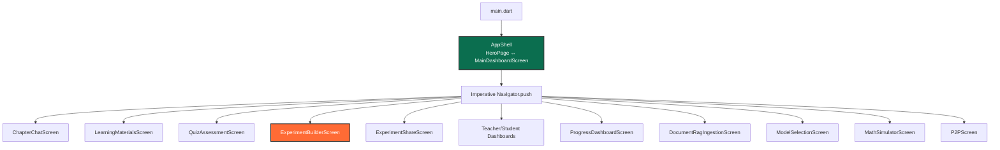

### Feature Size Analysis

| Feature | File Count | Status |
|---------|-----------|--------|
| features/network/ | 66 | Largest — backend infrastructure |
| features/experiment/ | ~90 | Second largest — builder + runtime |
| features/educational/ | ~20 | Dead code — unreachable from AppShell |
| features/home/ | ~12 | Active — main dashboard hub |
| features/chat/ | ~15 | Active — chat + diagnostics |
| features/content_packs/ | ~10 | Active — installer UI |
| features/classroom/ | ~12 | Active — teacher/student views |

### Dead Feature Clusters

1. **`features/educational/`** — Complete curriculum navigation chain, but `CurriculumHomeScreen` is never pushed from `AppShell` or `MainDashboardScreen`. The UI is polished but unreachable.
2. **`features/experiment/presentation/screens/experiment_catalog_screen.dart`** — Orphaned. Never pushed from any active screen.
3. **`HomeScreen`** (`lib/features/home/presentation/home_screen.dart`) — Replaced by `MainDashboardScreen`. Still compiles but unreachable.

---

## SECTION 2: Route & Navigation Audit

### Navigation Approach

**Pattern:** Pure imperative `Navigator` API
**No router package used.**

All navigation follows this exact pattern:

```dart
Navigator.of(context).push(
  MaterialPageRoute<void>(
    builder: (context) => SomeScreen(...),
  ),
);
```

### Complete Route Map

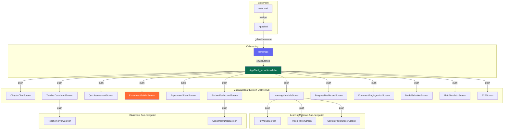

### Route Status Matrix

| Screen | File Path | Reached From | Status |
|--------|-----------|--------------|--------|
| `AppShell` | `home/presentation/app_shell.dart` | main.dart | Active |
| `HeroPage` | `home/presentation/hero_page.dart` | AppShell | Active |
| `MainDashboardScreen` | `home/presentation/main_dashboard_screen.dart` | AppShell | Active |
| `ChapterChatScreen` | `chat/presentation/chapter_chat_screen.dart` | MainDashboard | Active |
| `LearningMaterialsScreen` | `home/presentation/learning_materials_screen.dart` | MainDashboard | Active |
| `PdfViewerScreen` | `home/presentation/pdf_viewer_screen.dart` | LearningMaterials | Active |
| `VideoPlayerScreen` | `home/presentation/video_player_screen.dart` | LearningMaterials | Active |
| `ContentPackInstallerScreen` | `content_packs/presentation/content_pack_installer_screen.dart` | LearningMaterials | Active |
| `QuizAssessmentScreen` | `home/presentation/quiz_assessment_screen.dart` | MainDashboard | Active |
| `ExperimentBuilderScreen` | `experiment/builder/screens/experiment_builder_screen.dart` | MainDashboard | Active |
| `ExperimentShareScreen` | `experiment_sharing/screens/experiment_share_screen.dart` | MainDashboard | Active |
| `TeacherDashboardScreen` | `classroom/screens/teacher_dashboard_screen.dart` | MainDashboard | Active |
| `TeacherReviewScreen` | `classroom/screens/teacher_review_screen.dart` | TeacherDashboard | Active |
| `StudentDashboardScreen` | `classroom/screens/student_dashboard_screen.dart` | MainDashboard | Active |
| `AssignmentDetailScreen` | `classroom/screens/assignment_detail_screen.dart` | StudentDashboard | Active |
| `ProgressDashboardScreen` | `progress/presentation/progress_dashboard_screen.dart` | MainDashboard | Active |
| `DocumentRagIngestionScreen` | `rag/presentation/screens/document_rag_ingestion_screen.dart` | MainDashboard | Active |
| `ModelSelectionScreen` | `settings/presentation/model_selection_screen.dart` | MainDashboard | Active |
| `MathSimulatorScreen` | `home/presentation/math_simulator_screen.dart` | MainDashboard | Active |
| `P2PScreen` | `p2p/presentation/p2p_screen.dart` | MainDashboard | Active |
| ~~`HomeScreen`~~ | `home/presentation/home_screen.dart` | **Nothing** | **DEAD** |
| ~~`CurriculumHomeScreen`~~ | `educational/presentation/curriculum_home_screen.dart` | **Nothing** | **DEAD** |
| ~~`GradeScreen`~~ | `educational/presentation/grade_screen.dart` | CurriculumHome | **DEAD CHAIN** |
| ~~`SubjectScreen`~~ | `educational/presentation/subject_screen.dart` | GradeScreen | **DEAD CHAIN** |
| ~~`ChapterScreen`~~ | `educational/presentation/chapter_screen.dart` | SubjectScreen | **DEAD CHAIN** |
| ~~`TopicScreen`~~ | `educational/presentation/topic_screen.dart` | ChapterScreen | **DEAD CHAIN** |
| ~~`ExperimentCatalogScreen`~~ | `experiment/presentation/screens/experiment_catalog_screen.dart` | **Nothing** | **DEAD** |
| ~~`ExperimentDetailsScreen`~~ | `experiment/presentation/screens/experiment_details_screen.dart` | Catalog | **DEAD CHAIN** |
| ~~`ExperimentPlayerScreen`~~ | `experiment/presentation/screens/experiment_player_screen.dart` | Details | **DEAD CHAIN** |
| ~~`ExperimentHistoryScreen`~~ | `experiment/presentation/screens/experiment_history_screen.dart` | Unknown | **DEAD** |

### Navigation Anti-patterns

1. **No centralized router**: 30+ `MaterialPageRoute` instances scattered across the codebase. Changing a screen constructor requires finding every push site.
2. **Inconsistent `await`**: Some pushes await the result (`QuizAssessmentScreen`, `P2PScreen`), others do not (`ExperimentBuilderScreen`). Intent is unclear.
3. **Hardcoded dependency creation**: `MainDashboardScreen` instantiates repositories, API services, and controllers inside route builders.
4. **Hardcoded filesystem paths**: `LearningMaterialsScreen` and `DocumentRagIngestionScreen` contain paths like `/home/akash/Desktop/IDP/TEXTBOOKS` — these will fail on any other machine.

---

## SECTION 3: Screen Inventory

| # | Screen Name | File Path | Route | Purpose | Status |
|---|-------------|-----------|-------|---------|--------|
| 1 | AppShell | `features/home/presentation/app_shell.dart` | `/` (root) | Entry wrapper, decides Hero vs Dashboard | Active |
| 2 | HeroPage | `features/home/presentation/hero_page.dart` | N/A | Onboarding with fade/slide animations | Active |
| 3 | MainDashboardScreen | `features/home/presentation/main_dashboard_screen.dart` | N/A | Main hub with DIY course/subject/chapter selectors | Active |
| 4 | ChapterChatScreen | `features/chat/presentation/chapter_chat_screen.dart` | push | Chat UI with streaming AI responses | Active |
| 5 | LearningMaterialsScreen | `features/home/presentation/learning_materials_screen.dart` | push | Browse textbooks, videos, notes, packs | Active |
| 6 | PdfViewerScreen | `features/home/presentation/pdf_viewer_screen.dart` | push | PDF viewer using flutter_pdfview | Active |
| 7 | VideoPlayerScreen | `features/home/presentation/video_player_screen.dart` | push | Video player using video_player | Active |
| 8 | ContentPackInstallerScreen | `features/content_packs/presentation/content_pack_installer_screen.dart` | push | Install/import content packs from files | Active |
| 9 | QuizAssessment开始AssessmentScreen | `features/home/presentation/quiz_assessment_screen.dart` | push | Quiz UI with scoring | Active |
| 10 | ExperimentBuilderScreen | `features/experiment/builder/screens/experiment_builder_screen.dart` | push | 11-tab experiment builder | Active |
| 11 | ExperimentShareScreen | `features/experiment_sharing/screens/experiment_share_screen.dart` | push | Share experiment packages | Active |
| 12 | TeacherDashboardScreen | `features/classroom/screens/teacher_dashboard_screen.dart` | push | Teacher view of assignments | Active |
| 13 | TeacherReviewScreen | `features/classroom/screens/teacher_review_screen.dart` | push | Review student submissions | Active |
| 14 | StudentDashboardScreen | `features/classroom/screens/student_dashboard_screen.dart` | push | Student view of assignments | Active |
| 15 | AssignmentDetailScreen | `features/classroom/screens/assignment_detail_screen.dart` | push | Assignment details | Active |
| 16 | ProgressDashboardScreen | `features/progress/presentation/progress_dashboard_screen.dart` | push | Learning progress charts | Active |
| 17 | DocumentRagIngestionScreen | `features/rag/presentation/screens/document_rag_ingestion_screen.dart` | push | Upload documents for RAG | Active |
| 18 | ModelSelectionScreen | `features/settings/presentation/model_selection_screen.dart` | push | LLM model selection/settings | Active |
| 19 | MathSimulatorScreen | `features/home/presentation/math_simulator_screen.dart` | push | CustomPaint graphing calculator | Active |
| 20 | P2PScreen | `features/p2p/presentation/p2p_screen.dart` | push | Peer-to-peer sharing UI | Active |
| 21 | **HomeScreen** | `features/home/presentation/home_screen.dart` | **None** | Legacy home (replaced by MainDashboard) | **DEAD** |
| 22 | **CurriculumHomeScreen** | `features/educational/presentation/curriculum_home_screen.dart` | **None** | Grade selection | **DEAD** |
| 23 | **GradeScreen** | `features/educational/presentation/grade_screen.dart` | CurriculumHome | Grade → subject | **DEAD** |
| 24 | **SubjectScreen** | `features/educational/presentation/subject_screen.dart` | GradeScreen | Subject → chapter | **DEAD** |
| 25 | **Cycle就是Screening** | `features/educational/presentation/chapter_screen.dart` | SubjectScreen | Chapter → topic | **DEAD** |
| 26 | **TopicScreen** | `features/educational/presentation/topic_screen.dart` | ChapterScreen | Topic detail | **DEAD** |
| 27 | **ExperimentCatalogScreen** | `features/experiment/presentation/screens/experiment_catalog_screen.dart` | **None** | Browse experiments | **DEAD** |
| 28 | **ExperimentDetailsScreen** | `features/experiment/presentation/screens/experiment_details_screen.dart` | CatalogScreen | Experiment detail | **DEAD** |
| 29 | **ExperimentPlayerScreen** | `features/experiment/presentation/screens/experiment_player_screen.dart` | DetailsScreen | Run experiment | **DEAD** |
| 30 | **ExperimentHistoryScreen** | `features/experiment/presentation/screens/experiment_history_screen.dart` | **None** | Past runs | **DEAD** |

---

## SECTION 4: User Flow Audit

### Journey 1: Student Learning Flow (Intended but Partially Broken)

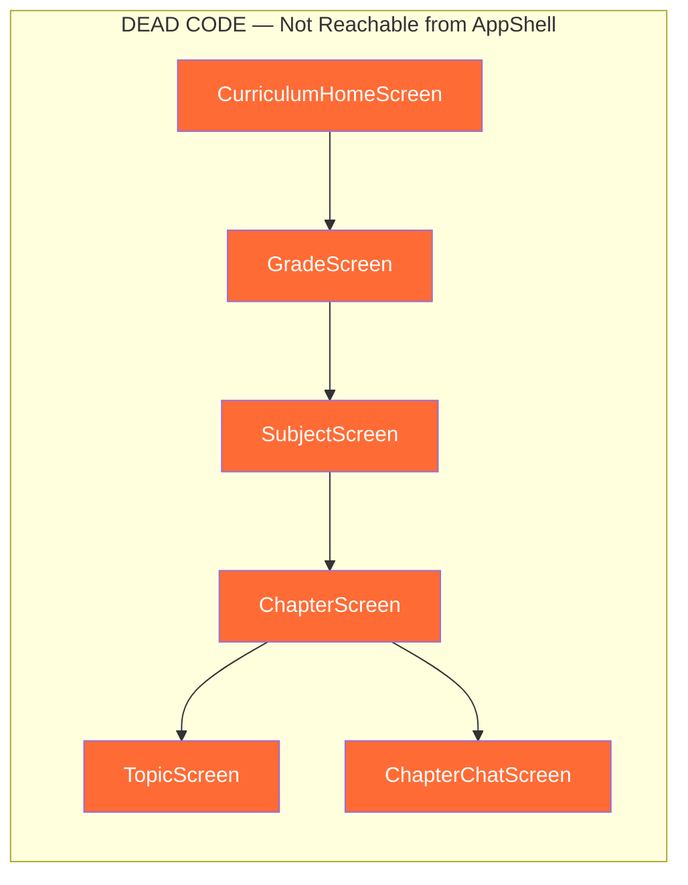

**Reality**: The curriculum navigation screens exist but are **not linked** from `AppShell` or `MainDashboardScreen`. The `CurriculumHomeScreen` was intended to be the learning entry point but was superseded by `MainDashboardScreen` without removing the old code.

### Journey 2: Current Active Student Flow

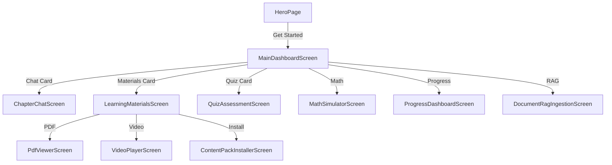

### Journey 3: Experiment Creation Flow

```mermaid
graph TD
    A[MainDashboardScreen] -->|Experiment Card| B[ExperimentBuilderScreen]
    B -->|Tab 0| C[AI Generator]
    B -->|Tab 1| D[Drafts]
    B -->|Tab 2| E[Scene Editor]
    B -->|Tab 3| F[Variables]<1–(Tab 3)> F[Variables]
    B -->|Tab 4| G[Objects]
    B -->|Tab 5| H[Rules]
    B -->|Tab 6| I[Manifest Preview]
    B -->|Tab 7| J[Runtime Preview]
    B -->|Tab 8| K[Validation]
    B -->|Tab 9| L[Compatibility]
    B -->|Tab 10| M[Execution Preview]

    style B fill:#FF6B35,color:#fff
```

### Journey 4: Content Installation Flow

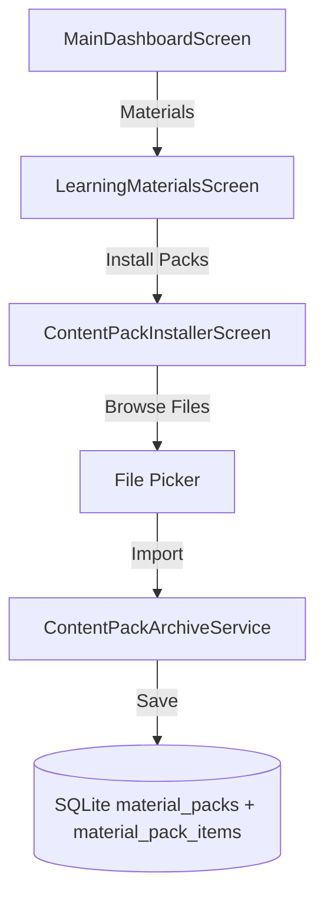

### User Flow Metrics

| Journey | Screens | Clicks | Dead Ends |
|---------|---------|--------|-----------|
| Learning (intended) | 6 | 5 | TopicScreen has no "next" |
| Learning (actual) | 4–7 | 2–4 | Chat, Quiz, Materials cards |
| Experiment Creation | 11 | 10+ | No "publish to catalog" flow |
| Content Install | 4 | 4 | No feedback after import |
| Classroom (teacher) | 3 | 2 | Review screen has no grading action |
| Classroom (student) | 3 | 2 | Assignment detail has no submit action |

---

## SECTION 5: State Management Audit

### State Management Stack

**No external packages.** The `pubspec.yaml` does NOT contain:
- `flutter_riverpod`
- `flutter_bloc`
- `provider`
- `getx`

**What IS used:**
- `setState` (StatefulWidget)
- `ChangeNotifier` + `ListenableBuilder` / `AnimatedBuilder`
- `ValueNotifier` (occasional)

### State Architecture Diagram

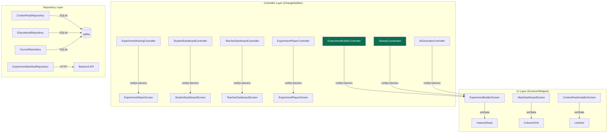

### Controller Inventory

| Controller | File | `ChangeNotifier`? | Screens Using |
|------------|------|-------------------|---------------|
| `ExperimentBuilderController` | `experiment/builder/controllers/experiment_builder_controller.dart` | Yes | `ExperimentBuilderScreen` |
| `AiGeneratorController` | `experiment/builder/ai/controllers/ai_generator_controller.dart` | Yes | `ExperimentBuilderScreen` |
| `StartupCoordinator` | `bootstrap/startup_coordinator.dart` | Yes | `AppShell` |
| `ExperimentSharingController` | `experiment_sharing/controllers/experiment_sharing_controller.dart` | Unknown | `ExperimentShareScreen` |
| `StudentDashboardController` | `classroom/controllers/student_dashboard_controller.dart` | Unknown | `StudentDashboardScreen` |
| `TeacherDashboardController` | `classroom/controllers/teacher_dashboard_controller.dart` | Unknown | `TeacherDashboardScreen` |
| `ExperimentPlayerController` | `experiment/presentation/controllers/experiment_player_controller.dart` | Unknown | `ExperimentPlayerScreen` |

### State Anti-patterns

1. **No global state container**: Each screen instantiates its own repositories/controllers. Dependencies are not injected — they are constructed inline in `initState` or as late final fields.
2. **Controller lifetime tied to widget**: When a `MaterialPageRoute`-pushed screen is popped, its controller may leak or be recreated on next push. No `Provider` to scope controller lifetime above the route.
3. **MainDashboardScreen is a god-widget**: It holds state for course/subject/chapter selection, quiz results, P2P scanning, and classroom repository — all in one StatefulWidget.
4. **No reactive state sharing**: If two screens need the same data (e.g., installed pack count), they each query SQLite independently. No cache invalidation or reactive streams.

---

## SECTION 6: Experiment Builder Deep Audit

### Architecture Overview

The experiment builder is the **most architecturally mature** feature in the app. It has proper separation of concerns across 11 tabs, backend validation, draft persistence, and AI generation.

### Builder Data Model

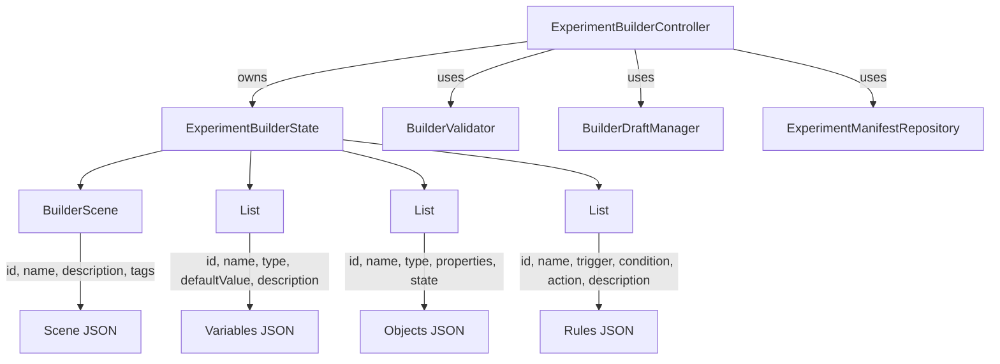

### Builder Tabs (11 total)

| Tab # | Name | Widget | Purpose | Status |
|-------|------|--------|---------|--------|
| 0 | AI Generator | `AiGeneratorTab` | Generate scene from AI prompt | Active |
| 1 | Drafts | `BuilderDraftsScreen` | Load/save named drafts | Active |
| 2 | Scene | `SceneEditor` | Edit scene name, description, tags | Active |
| 3 | Variables | `VariableEditor` | Define experiment variables | Active |
| 4 | Objects | `ObjectEditor` | Define simulation objects | Active |
| 5 | Rules | `RuleEditor` | Define interaction rules | Active |
| 6 | Manifest Preview | `ManifestPreviewPanel` | View generated manifest JSON | Active |
| 7 | Runtime Preview | `RuntimePreviewPanel` | Preview runtime behavior | Active |
| 8 | Validation | `BuilderValidationPanel` | Validate with backend API | Active |
| 9 | Compatibility | `BuilderCompatibilityPanel` | Check device compatibility | Active |
| 10 | Execution | `BuilderExecutionPreviewPanel` | Fetch execution package | Active |

### Backend Integration

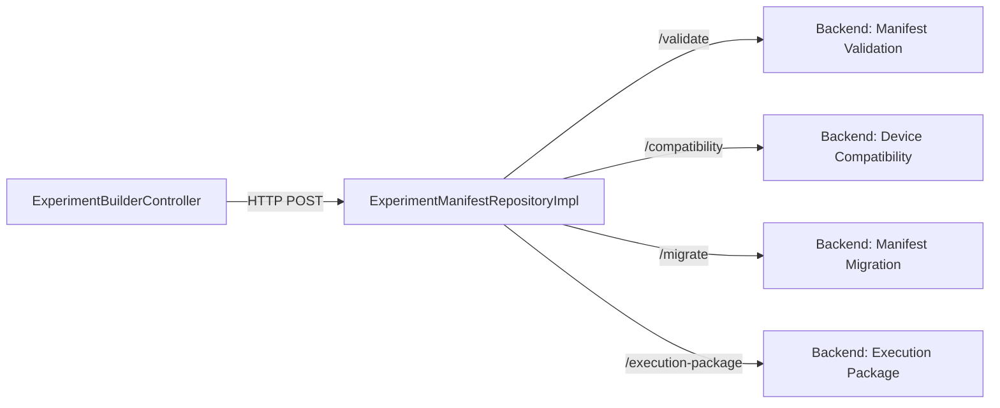

### AI Generator Integration

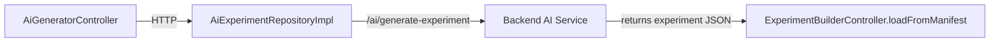

### Draft System

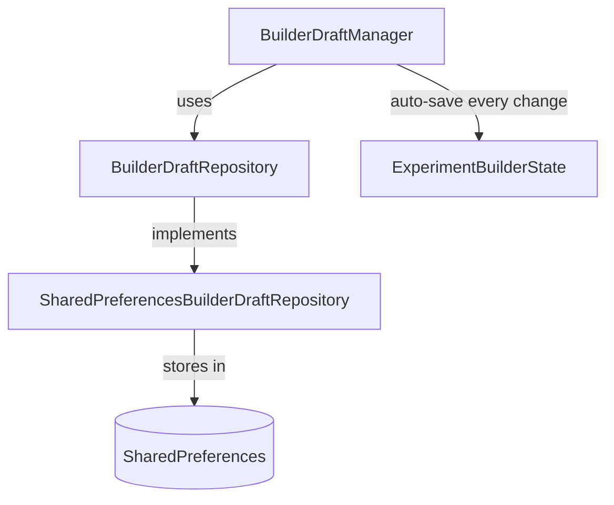

### Key Builder Classes

| Class | Purpose | File |
|-------|---------|------|
| `ExperimentBuilderState` | Immutable state holding scene, variables, objects, rules | `models/experiment_builder_state.dart` |
| `BuilderScene` | Scene metadata (id, name, description, tags) | `models/builder_scene.dart` |
| `BuilderVariable` | Typed variable with default value | `models/builder_variable.dart` |
| `BuilderObject` | Simulation object with type + properties | `models/builder_object.dart` |
| `BuilderRule` | Conditional rule (trigger, condition, action, description) | `models/builder_rule.dart` |
| `ExperimentBuilderController` | fodern main controller, manages state + validation + draft | `controllers/experiment_builder_controller.dart` |
| `BuilderValidator` | Client-side validation logic | `validation/builder_validator.dart` |
| `BuilderDraftManager` | Persists drafts to SharedPreferences with auto-save | `storage/builder_draft_manager.dart` |
| `AiGeneratorController` | Manages AI experiment generation | `ai/controllers/ai_generator_controller.dart` |

### Can Experiment Builder be Redesigned?

**Yes — the builder is safe to redesign.** It has:
- Clean model layer (`models/builder_*.dart`)
- Controller layer (`ExperimentBuilderController`, `AiGeneratorController`)
- Repository abstraction (`ExperimentManifestRepository` interface)
- No direct widget dependencies on backend contracts

**Safe to change**: UI layout, tab order, widget styling, form interactions, draft UX.
**Do NOT change**: `ExperimentBuilderState.generateManifestJson()` format, backend API contracts in `ExperimentManifestApiService`.

---

## SECTION 7: Content System Audit

### Content Architecture

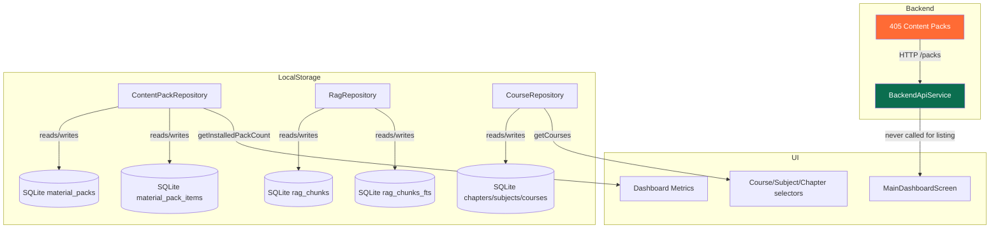

### Content Flow Reality

**The backend has 405 packs but the frontend never fetches them.**

1. `BackendApiService.listPacks()` exists and calls `GET /packs`
2. `ContentPackInstallerScreen` has a hardcoded catalog URL: `http://192.168.50.1:8080/catalog.json`
3. No screen automatically fetches backend pack lists
4. The only way to get content is manual import via `ContentPackInstallerScreen` (file picker) or seeded data

### Database Tables (Content-Related)

| Table | Purpose | Populated By |
|-------|---------|-------------|
| `material_packs` | Installed content pack metadata | `ContentPackArchiveService.importPackArchive()` or seeded |
| `material_pack_items` | Individual content items per pack | Import or seeded |
| `rag_chunks` | Text chunks for RAG retrieval | Seeded 4 hardcoded chunks or manual ingestion |
| `rag_chunks_fts` | Full-text search index for RAG | Parallel to rag_chunks |
| `courses` | Course metadata | Seeded 3 courses |
| `subjects` | Subject metadata | Seeded |
| `chapters` | Chapter metadata | Seeded |
| `grades` | Grade level metadata | Seeded via `EducationalDatabase` |

### Seeded Data (Hardcoded)

- **Courses**: 3 initial courses
- **RAG Chunks**: 4 hardcoded chunks (2 for `chap_linear_eq`, 2 for `chap_chemical_rxn`)
- **Material Packs**: 3 seeded packs (see content completeness audit)

### Content Installation Flow

```mermaid
graph TD
    A[User taps Learning Materials] --> B[LearningMaterialsScreen]
    B -->|taps Install Packs| C[ContentPackInstallerScreen]
    C -->|File Picker| D[.otpack archive]
    D -->|ContentPackArchiveService.importPackArchive| E[Unpack to temp]zie
ernen wirF[Copy to content_dir] --> G[Insert into material_packs]
    G --> H[Insert into material_pack_items]
```

---

## SECTION 8: Whiteboard Audit

### Finding

**There is NO general whiteboard feature.** The search for `CustomPaint`, `Canvas`, and `Paint` was only found in `math_simulator_screen.dart`.

### Math Simulator Canvas

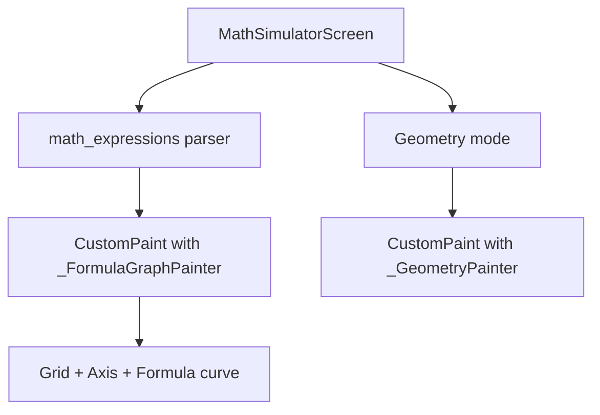

**Implementation**: Custom `CustomPainter` subclasses that draw:
- Grid lines (fixed step)
- X/Y axes
- Mathematical formula curves (evaluated via `math_expressions` package)
- Geometric shapes

**Persistence Model**: None. Drawings are ephemeral — no save/load mechanism.

**Assessment**: The math simulator is a **graphing calculator**, not a freeform whiteboard. It does not support drawing, annotations, or collaborative features.

---

## SECTION 9: Design System Audit

### Theme Configuration (in main.dart)

```dart
const primary = Color(0xFF0B6E4F);   // Deep green
const surface = Color(0xFFF7FCFA);  // Off-white

theme: ThemeData(
  useMaterial3: true,
  colorScheme: ColorScheme.fromSeed(
    seedColor: primary,
    surface: surface,
  ),
)
```

### Component Inventory

| Component | File | Usage |
|-----------|------|-------|
| `EmptyStateCard` | `shared/presentation/widgets/empty_state_card.dart` | Generic empty state placeholder |
| `ErrorStateCard` | `shared/presentation/widgets/error_state_card.dart` | Generic error placeholder |
| `LoadingStateCard` | `shared/presentation/widgets/loading_state_card.dart` | Generic loading placeholder |
| `OfflineStateCard` | `shared/presentation/widgets/offline_state_card.dart` | Generic offline placeholder |

### Reusable Widgets

Very few. Most UI is inline within screens. The only shared widgets are the 4 state cards above.

### Design System Assessment

- **Colors**: Hardcoded throughout (e.g., `Color(0xFF0B6E4F)`, `Colors.blue`, `Colors.grey.shade400`). No central theme extension.
- **Typography**: Inline `TextStyle` declarations. No `TextTheme` extension.
- **Spacing**: Inline `EdgeInsets` values. No spacing tokens.
- **Cards**: Repeated `Card` + `ListTile` + `Padding` patterns across screens.
- **Buttons**: Mix of `ElevatedButton`, `TextButton`, `IconButton` with inline styling.
- **Animations**: Only `HeroPage` has a slide/fade animation. No global animation system.

### Inconsistencies

1. `MainDashboardScreen` uses a completely different layout (`Column` + `GridView`) than `HomeScreen` (`ListView` + dropdowns). The two screens serve the same purpose but share no widgets.
2. `ExperimentBuilderScreen` uses an `IndexedStack` with `PopupMenuButton` for tab selection — completely different navigation pattern from the rest of the app.
3. `LearningMaterialsScreen` uses `TabController` + `TabBarView`, but no other screen does.

---

## SECTION 10: Dependency Graph

### Feature-to-Feature Dependencies

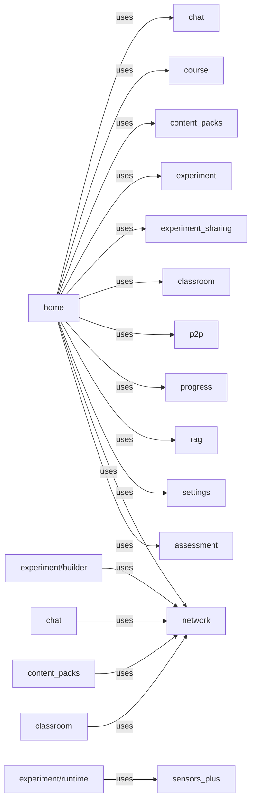

### Repository-to-Service Dependencies

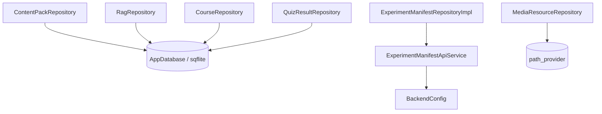

### Circular Dependencies

None detected at the import level, but there is tight coupling:
- `MainDashboardScreen` directly imports and instantiates 15+ classes from other features
- `AppShell` imports `BackgroundBootstrap` and `OptionalBootstrap`, which in turn depend on network and course layers
- `LearningMaterialsScreen` imports `ContentPackInstallerScreen` and `PdfViewerScreen` inline

### Architectural Violations

1. **UI performing repository work**: `MainDashboardScreen._runDiagnostics()` runs raw SQL queries (`SELECT COUNT(*) FROM material_packs`). This should be in a repository or service.
2. **Hardcoded paths in UI**: `LearningMaterialsScreen` has `const String _repoTextbooksPath = '/home/akash/Desktop/IDP/TEXTBOOKS'` — this is an Android app and this path is desktop-specific.
3. **Network layer bloat**: `features/network/application/` has 66 files for concepts that should be simpler: connectivity, sync, recovery, diagnostics, classroom, metrics. Many of these are never used by the UI.

---

## SECTION 11: Dead Code Detection

### Dead Screens (8 total)

| Screen | File | Evidence |
|--------|------|----------|
| `HomeScreen` | `features/home/presentation/home_screen.dart` | `AppShell` uses `MainDashboardScreen`, never `HomeScreen` |
| `CurriculumHomeScreen` | `features/educational/presentation/curriculum_home_screen.dart` | Never pushed from any active screen |
| `GradeScreen` | `features/educational/presentation/grade_screen.dart` | Pushed from `CurriculumHomeScreen` (dead) |
| `SubjectScreen` | `features/educational/presentation/subject_screen.dart` | Pushed from `GradeScreen` (dead) |
| `ChapterScreen` | `features/educational/presentation/chapter_screen.dart` | Pushed from `SubjectScreen` (dead) |
| `TopicScreen` | `features/educational/presentation/topic_screen.dart` | Pushed from `ChapterScreen` (dead) |
| `ExperimentCatalogScreen` | `features/experiment/presentation/screens/experiment_catalog_screen.dart` | Never pushed from any active screen |
| `ExperimentDetailsScreen` | `features/experiment/presentation/screens/experiment_details_screen.dart` | Pushed from `ExperimentCatalogScreen` (dead) |
| `ExperimentPlayerScreen` | `features/experiment/presentation/screens/experiment_player_screen.dart` | Pushed from `ExperimentDetailsScreen` (dead) |
| `ExperimentHistoryScreen` | `features/experiment/presentation/screens/experiment_history_screen.dart` | Never referenced by any push |

### Dead Services / Unfinished Code

| File | Evidence |
|------|----------|
| `educational/application/network_resilience.dart` | `// TODO: Implement actual connectivity check` |
| `educational/application/sync_manager.dart` | `// TODO: Implement actual bandwidth detection` |
| `educational/application/pack_sync_service.dart` | `// TODO: Implement HTTP request to fetch pack catalog` |
| `educational/application/retrieval_router.dart` | `// TODO: Query to get chapter ID from concept ID` |
| `educational/application/quiz_flashcard_engine.dart` | `// TODO: Save session to database` |

### Unused Network Application Files

Many files in `features/network/application/` are never referenced by UI screens:
- `classroom_presence_coordinator.dart`
- `classroom_recovery_coordinator.dart`
- `classroom_session_manager.dart`
- `classroom_startup_validator.dart`
- `deferred_synchronization_coordinator.dart`
- `distributed_health_tracker.dart`
- `distributed_metrics_service.dart`
- `distributed_service_composer.dart`
- And 20+ more...

These appear to be part of a planned distributed PiHub architecture that is not wired into the active UI.

---

## SECTION 12: Redesign Readiness Report

### SAFE TO REDESIGN

| Area | Rationale |
|------|-----------|
| **Experiment Builder UI** | Clean MV(C) separation. Backend contracts are abstracted behind `ExperimentManifestRepository`. Models are immutable. Safe to redesign all widgets. |
| **Navigation Structure** | Current imperative navigation is ad-hoc. Replacing it with a router (GoRouter/AutoRoute) would improve maintainability. All screens are reachable via `MaterialPageRoute` push, so any router can wrap them. |
| **MainDashboardScreen Layout** | It uses standard `setState` and Grid cards. No complex state dependencies. Can be redesigned independently. |
| **LearningMaterialsScreen** | Standard `TabController` + list views. No special state management. |
| **Chat UI** | `ChapterChatScreen` is a standard chat interface. Can be redesigned without touching backend. |
| **HeroPage** | Purely presentational. Safe to change entirely. |

### HIGH RISK TO REDESIGN

| Area | Rationale |
|------|-----------|
| **Content Installation Flow** | The `ContentPackArchiveService.importPackArchive()` method has fragile cascaded logic for extracting ZIP/TAR, validating manifests, and inserting into SQLite. Changing the UI without understanding this flow risks content corruption. |
| **SQLite Schema** | 15 versions of migrations exist in `app_database.dart`. Changing table schemas requires careful migration management. |
| **RAG System** | `RagRepository` uses `rag_chunks` and `rag_chunks_fts` tables with manual FTS queries. Changing chunking strategy would break existing RAG behavior. |
| **Experiment Manifest JSON Format** | `ExperimentBuilderState.generateManifestJson()` defines the contract with the backend. Changing this without backend coordination breaks validation and execution. |
| **Bootstrapping Sequence** | `CriticalBootstrap`, `BackgroundBootstrap`, `OptionalBootstrap`, and `StartupCoordinator` manage runtime mode and initialization. Changing the order or conditions could break local AI or database setup. |
| **Backend API Contracts** | `BackendApiService` has 10+ methods with specific request/response shapes. These cannot be changed without backend changes. |

### MEDIUM RISK

| Area | Rationale |
|------|-----------|
| **State Management** | Moving from `setState` + `ChangeNotifier` to a proper state management solution (Riverpod, Bloc) is possible but requires touching most screens. Not dangerous, just labor-intensive. |
| **Classroom Screens** | Teacher/student dashboard controllers exist but may be tightly coupled to `ClassroomRepository`. |
| **P2P Sharing** | `P2PChannelService` and `ExperimentSharingController` have custom logic. Redesign the UI, but don't touch the service layer. |

---

## SECTION 13: Top UX Problems

### 1. Dead Curriculum Navigation Chain
**Problem**: The entire `CurriculumHomeScreen` → `GradeScreen` → `SubjectScreen` → `ChapterScreen` → `TopicScreen` flow exists as polished, working code but is **completely unreachable** from the app shell.

**Impact**: Users cannot navigate through a proper educational curriculum. They must use the DIY selectors in `MainDashboardScreen` instead.

### 2. No Centralized Navigation
**Problem**: There is no router. Every screen push is a `Navigator.push(MaterialPageRoute(builder: (_) => SomeScreen()))` scattered across the codebase.

**Impact**: Adding deep links, changing screen constructors, or implementing navigation guards requires touching every call site.

### 3. Content System Never Connects to Backend
**Problem**: `BackendApiService.listPacks()` exists and backend exposes 405 packs, but no screen calls it. Content is only manually imported or seeded.

**Impact**: Users cannot discover or download content. They must find `.otpack` files themselves.

### 4. Hardcoded Desktop File Paths
**Problem**: `LearningMaterialsScreen` and `DocumentRagIngestionScreen` contain paths like `/home/akash/Desktop/IDP/TEXTBOOKS` and `/home/akash/Desktop/IDP/VIDEOS`.

**Impact**: These will crash or silently fail on any device other than the developer's desktop.

### 5. No Global Content State
**Problem**: Every screen that needs pack counts, course lists, or chapter data queries SQLite independently.

**Impact**: Stale data, redundant queries, and no reactive updates when content changes.

### 6. Experiment Builder Has No "Publish" Flow
**Problem**: The builder can validate, preview, and generate execution packages, but there is no "Publish to Catalog" or "Save to My Experiments" flow.

**Impact**: Experiments are trapped in the builder. Users cannot use them.

### 7. Teacher Review Screen Has No Grading Action
**Problem**: `TeacherReviewScreen` (pushed from `TeacherDashboardScreen`) displays assignments but has no UI for grading or feedback.

**Impact**: The classroom feature is read-only.

### 8. RAG Pre-check Always Returns `false`
**Problem**: `RagCheckResult.hasRelevantLocalContent` returns `chunkCount > 0 && topScore <= -0.1`, but `topScore` is always `0.0` or `-1.0` from the query logic.

**Impact**: The app always falls back to backend or knowledge fallback. Local RAG is never used.

---

## SECTION 14: Top Architectural Risks

### 1. **God Widget Anti-Pattern (MainDashboardScreen)**
`MainDashboardScreen` instantiates repositories (`QuizResultRepository`, `P2PChannelService`, `ClassroomRepository`), loads courses/subjects/chapters, runs diagnostics, and holds 10+ route methods. This single widget is a single point of failure for the entire app.

### 2. **Unmanaged DI (Dependency Injection)**
Every screen creates its dependencies inline. If `BackendConfig.fromEnvironment()` changes, it must be updated in `ExperimentBuilderScreen`, `ContentPackInstallerScreen`, and every other screen that instantiates a backend service. No central DI container exists.

### 3. **No Router = No Deep Links, No Navigation Guards**
Without a declarative router, the app cannot support:
- Deep linking to specific content
- Navigation guards (e.g., "show onboarding first")
- Redirect after login
- Bottom sheet or dialog routing

### 4. **Backend-Exposed Content Never Reaches UI**
The most critical architectural miss: `BackendApiService.listPacks()` calls `GET /packs`, which returns 405 valid packs. But no screen ever calls this method. The content discoverability feature is built at the network layer but never wired to the UI.

### 5. **RAG FTS Query Logic is Broken**
The `localRagPreCheck` method has a score threshold of `-0.1`, but the maximum possible score from the FTS query is `0.0` (since score column is hardcoded to `-1.0`). The condition `topScore <= -0.1` combined with a `0.0` or `-1.0` result means `hasRelevantLocalContent` is practically always `false`.

### 6. **SQLite Migration Chain at Version 15**
The database is at version 15 with a long chain of `onUpgrade` conditions. Adding a new table requires another version bump and careful migration logic. Schema changes cannot be done lightly.

---

## Appendix A: Final Deliverables Summary

| # | Deliverable | Status | Location |
|---|-------------|--------|----------|
| 1 | Frontend Architecture Diagram | Complete | Section 1 + Mermaid diagrams |
| 2 | Feature Hierarchy Diagram | Complete | Section 1 |
| 3 | Navigation Graph | Complete | Section 2 + Mermaid |
| 4 | User Flow Graphs | Complete | Section 4 + Mermaid |
| 5 | State Management Graph | Complete | Section 5 + Mermaid |
| 6 | Content Flow Graph | Complete | Section 7 + Mermaid |
| 7 | Experiment Builder Architecture | Complete | Section 6 + Mermaid |
| 8 | Whiteboard Architecture | Complete | Section 8 (none found) |
| 9 | Component Inventory | Complete | Section 9 |
| 10 | Design System Inventory | Complete | Section 9 |
| 11 | Dead Code Report | Complete | Section 11 |
| 12 | Redesign Readiness Report | Complete | Section 12 |
| 13 | Top UX Problems | Complete | Section 13 |
| 14 | Top Architectural Risks | Complete | Section 14 |

---

## Appendix B: Statistics

| Metric | Value |
|--------|-------|
| Total Dart Files | 314 |
| StatefulWidget Classes | 37 |
| StatelessWidget Classes | 61 |
| Screen Classes | 25 |
| Active Screens | 20 |
| Dead Screens | 10 |
| External State Management Packages | 0 |
| TODO/FIXME Comments | 18 |
| Dead Feature Chains | 2 (educational, experiment catalog) |
| Backend API Methods | 10+ |
| SQLite Tables | 15+ |
| Experiment Builder Tabs | 11 |
| Content Packs (Backend) | 405 |
| Content Packs (Local) | 3 |
| RAG Chunks (Seeded) | 4 |

---

*End of Audit Report*
